# TripCraft · 旅鸢 — 入境游定制师全流程模拟实战系统

> **让新人在接触真实客户之前，先完成足够次数的实战演练。**
> 13 步状态机 · 8 维 61 技能点原子评分 · 10 类 AI 角色 · 15 门语言 / 23 个客源市场

---

## ▶ 在线体验（点这里直接看）

<!-- LIVE-DEMO:START -->
**https://tin-consequently-tomorrow-remedies.trycloudflare.com**
<!-- LIVE-DEMO:END -->

Chrome / Edge 打开即可，免安装、免注册。首次加载约 3–5 秒（演示隧道在境外中转），之后操作流畅。

在线体验建议按以下顺序进行：**消息中心**刷新并抢单 → **订单管理**逐单推进 13 步（订单详情页可发起语音通话与 AI 客户对话，也可在聊天界面与资源方沟通）→ **学情画像**查看掌握度并执行「更新画像」。
「初始画像测评」只对新账号开放：先在右上角「＋ 新建用户」，再点首页的「画像」。

## ▶ 演示视频

[Bilibili · 全流程演示（抢单 → 通话 → 沟通 → 交付 → 评分 → 画像更新）](https://www.bilibili.com/video/BV1eBpt68ELs)

---

## 一、行业背景与真实痛点

> 本节数据来自一线旅行社定制师调研（问卷 + 线下访谈）。

2025 年全国出入境 **6.97 亿**人次创历史新高，其中免签入境外国人 **3008 万**人次、同比增长 **49.5%**；其中相当比例的游客会通过 Trip.com 对接平台认证的旅行定制师。

行业的缺口不在教材，而在**具备入境游定制能力的从业者**。当前定制师的认证方式为线上课程加一次电话面试，实际培养仍以师傅带教、以真实客户练习为主：新人入职前 3 个月通常无法独立创造价值，人力成本持续投入；而平台派单存在硬性时限——**1 小时内必须致电客户、4 小时内必须上传方案**，新人难以独立承接。行业需要的是一个可以安全试错的训练环境。

### 入境游定制比一般定制游难在四层叠加

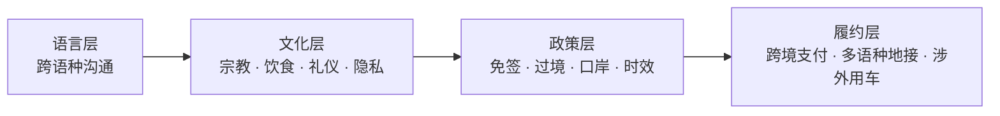
```mermaid
flowchart LR
  L["语言层<br/>跨语种沟通"] --> C["文化层<br/>宗教 · 饮食 · 礼仪 · 隐私"]
  C --> P["政策层<br/>免签 · 过境 · 口岸 · 时效"]
  P --> F["履约层<br/>跨境支付 · 多语种地接 · 涉外用车"]
```

| 层次 | 主要难点 | 系统内的考核方式 |
| --- | --- | --- |
| 语言层 | 英语之外还有日语、韩语、泰语、西语、阿语等，语音与文字都要跨语种 | 15 门语言的客源可生成，客户在语音与群聊里**始终说自己那门语言** |
| 文化层 | 宗教、饮食、礼仪、作息、隐私边界，一句话说错就可能是投诉甚至涉外舆情 | 国别文化红线进 Rubric 与语义拦截网 |
| 政策层 | 免签与过境免签、入境口岸、签证时效随时变动，直接决定行程是否可行 | 签证/证件核验进交付物校验与评分点 |
| 履约层 | 跨境支付、多语种地接、涉外酒店与用车、境外保险，链条比国内游长 | 地接社/酒店/车队/票务/司导五类资源方 Agent + 结算台账 |

### 工作流拆解：13 个可考核步骤

基于对一线定制师的调研与访谈，我们将定制师从接单到复盘的真实工作流拆解为 **13 个可考核步骤**。每一步都定义了输入物、学员动作、应交付的工作物与完成条件；任一环节未达标都无法进入下一步。

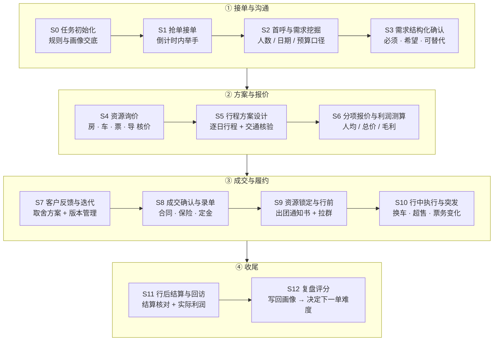
```mermaid
flowchart TB
  subgraph G1["① 接单与沟通"]
    direction LR
    S0["S0 任务初始化<br/>规则与画像交底"] --> S1["S1 抢单接单<br/>倒计时内举手"]
    S1 --> S2["S2 首呼与需求挖掘<br/>人数 / 日期 / 预算口径"]
    S2 --> S3["S3 需求结构化确认<br/>必须 · 希望 · 可替代"]
  end
  subgraph G2["② 方案与报价"]
    direction LR
    S4["S4 资源询价<br/>房 · 车 · 票 · 导 核价"] --> S5["S5 行程方案设计<br/>逐日行程 + 交通核验"]
    S5 --> S6["S6 分项报价与利润测算<br/>人均 / 总价 / 毛利"]
  end
  subgraph G3["③ 成交与履约"]
    direction LR
    S7["S7 客户反馈与迭代<br/>取舍方案 + 版本管理"] --> S8["S8 成交确认与录单<br/>合同 · 保险 · 定金"]
    S8 --> S9["S9 资源锁定与行前<br/>出团通知书 + 拉群"]
    S9 --> S10["S10 行中执行与突发<br/>换车 · 超售 · 票务变化"]
  end
  subgraph G4["④ 收尾"]
    direction LR
    S11["S11 行后结算与回访<br/>结算核对 + 实际利润"] --> S12["S12 复盘评分<br/>写回画像 → 决定下一单难度"]
  end
  G1 --> G2 --> G3 --> G4
```

## 二、解决方案

| 行业痛点 | 对应做法 |
| --- | --- |
| 新人缺少真实接单环境 | 把真实接单的**输入物**仿真出来：派单卡片、客户电话、供应商回执、突发通知 |
| 训练后缺少专业点评与错误反馈 | 按真实**交付物**（需求单、行程方案、报价单、合同与保险、出团通知书、结算单）逐项评分，并生成讲义与学习规划 |
| 能力评价依赖师傅主观判断，缺乏量化标准 | 用**掌握度**把能力变成看得见的数字，把师傅从重复答疑中解放出来 |

## 三、价值测算

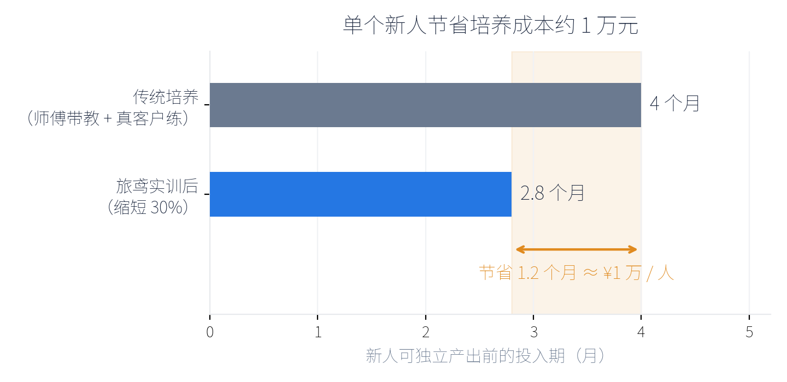

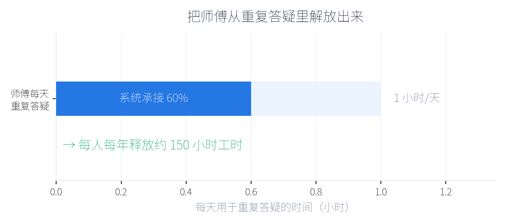

- **单个新人**：调研显示，新人入职 1–3 个月通常只能承接简单订单，师傅繁忙时缺少可及的指导。若将 4 个月的纯投入期缩短 30%（约 1.2 个月），按综合人力成本 8,000 元/月计算，**单个新人可节省培养成本约 1 万元**。
- **师傅工时**：师傅每天约 1 小时用于重复答疑，若其中 60% 由系统承接，**每人每年可释放约 150 小时工时**。
- **对旅行社**：按每年招 5 名新人计算，**年节省约 5 万元量级**——对入驻携程的小微旅行社商户有吸引力。

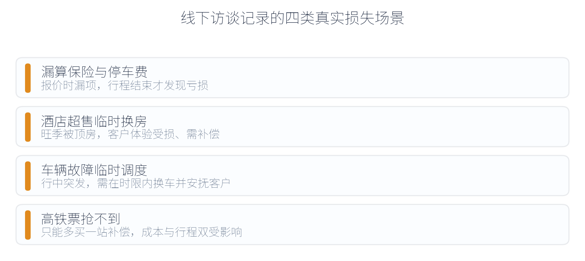

线下访谈记录了四类真实损失场景：漏算保险与停车费导致亏损、酒店超售临时换房引发客户不满、车辆故障导致临时调度、高铁票不足只能多购一站作为补偿。这些高频错误均可在上岗前于系统中反复演练，**无需由真实客户承担试错成本**。

## 四、智能体协同：把幻觉挡在门外

评分、出题与学习资料生成均不依赖单个模型的自由发挥：由编排管家统一调度，经**六帽并行审查**（白帽查事实、黑帽查逻辑、蓝帽总控等）后输出；未通过审查的内容会打回重做，不会直接呈现给学员。

### 智能体分工

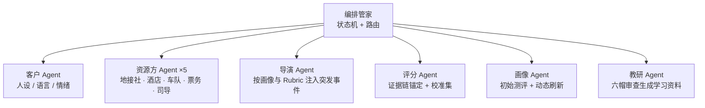
```mermaid
flowchart TB
  O["编排管家<br/>状态机 + 路由"] --> C["客户 Agent<br/>人设 / 语言 / 情绪"]
  O --> R["资源方 Agent ×5<br/>地接社 · 酒店 · 车队 · 票务 · 司导"]
  O --> D["导演 Agent<br/>按画像与 Rubric 注入突发事件"]
  O --> G["评分 Agent<br/>证据链锚定 + 校准集"]
  O --> P["画像 Agent<br/>初始测评 + 动态刷新"]
  O --> K["教研 Agent<br/>六帽审查生成学习资料"]
```

## 五、技术亮点

### 5.1 三条主线能力

| # | 能力主线 | 具体实现 |
| --- | --- | --- |
| 1 | **全链条双向仿真** | 输入物（派单卡片、客户通话、供应商回执、平台与突发事件通知）与输出物（需求确认单、行程方案、分项报价、合同与保险、出团通知书、结算核对单）双向仿真，学员产出的是可交付的工作物，而非答题结果 |
| 2 | **多智能体协同抑制幻觉** | 编排管家调度、六帽并行审查、未通过即打回重做；资源方 Agent 仅依据本单客观事实作答，不会为迎合学员而虚构报价或档期 |
| 3 | **个性化生成与动态难度** | 答错时降维解释并做同题重做，答对后提升难度档位；掌握度分 M1–M5 五档，M1 以补救为主、M2–M5 逐档加压，难度参数由画像直接驱动 |

### 5.2 其他技术亮点

| 亮点 | 机制 |
| --- | --- |
| **证据链锚定的原子评分** | 61 个技能点逐个给分，每一分都必须引用学员原话或交付物片段作为证据坐标，可回放、可反查 |
| **双层拦截网** | 第一层确定性校验（分项加总、毛利率、保险项、日期自洽等算术与字段检查），第二层语义合规红线（宗教饮食、证件入境、支付可行性、行程内部矛盾）；命中红线的交付物无法投递 |
| **覆盖校验** | 依据 Rubric 埋点核对本单实际考核到的技能点；未考核到的技能点**不更新画像**，避免未考核即提升掌握度 |
| **画像 ↔ 难度闭环** | 复盘结果写回画像 → 下一单的目标技能点、派单残缺度、时限、情绪、预置突发事件全部由画像反推，形成可追溯的闭环 |
| **15 门语言 / 23 个客源市场** | 客户人设、语言、音色三者同源：人选、语种、声音一一对应，客户全程只说自己那门语言 |
| **真实外部数据** | 高德地图与路线（含途经点与公交换乘明细）、Open-Meteo 天气、实时汇率，全部走真实接口并落库 |

## 六、全流程演示（动图）

以下按学员的实际使用顺序演示完整闭环：**初始画像 → 教学 → 实战 13 步 → 学情画像 → 更新画像 → 回到教学**。

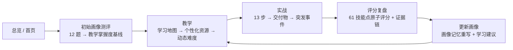
```mermaid
flowchart LR
  H["总览 / 首页"] --> Q["初始画像测评<br/>12 题 → 教学掌握度基线"]
  Q --> T["教学<br/>学习地图 → 个性化资源 → 动态难度"]
  T --> P["实战<br/>13 步 → 交付物 → 突发事件"]
  P --> S["评分复盘<br/>61 技能点原子评分 + 证据链"]
  S --> U["更新画像<br/>画像记忆重写 + 学习建议"]
  U --> T
```

### 6.1 初始画像测评

初始画像测评面向新账号开放：12 道题覆盖 8 个能力维度，提交后由画像 Agent 生成教学掌握度基线，写入画像记忆，作为后续难度调节与学习资料生成的依据。

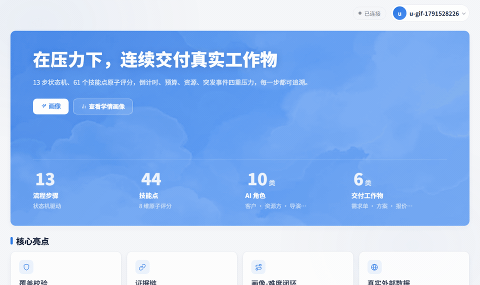

### 6.2 教学：学习地图 → 技能点对话 → 生成个性化资源

学习地图以三层结构组织能力：总掌握度 → 8 个能力维度 → 61 个技能点，每个节点以教学/实战双环呈现掌握度。进入任一技能点即打开该技能点专属的对话工作台，可生成讲义、实操指南与学习报告，生成过程由多智能体协作与六帽审查把关。

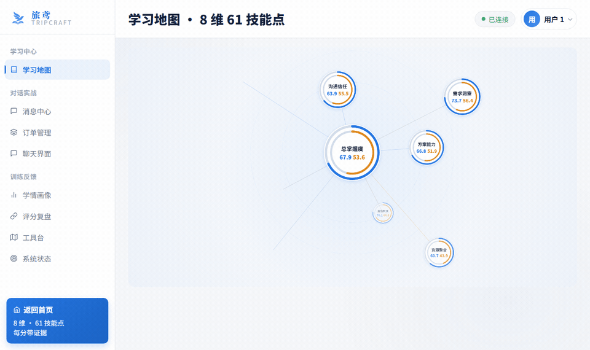

### 6.3 实战：13 步逐项

以下按实际推进顺序排列，每一步一张动图。

#### 6.3.0 平台界面与接单流程仿真

接单环节还原携程定制游工作台（vbooking）的界面与流程：左侧为通知分类（重要通知、订单通知、定制游待接单通知、度假 / 邮轮 / 玩乐订单通知、产品通知、财务通知等），右侧为待接单卡片，展示需求单号、目的地、客源语言、首呼倒计时与同期竞争人数。

抢单成功后进入订单管理，并可打开订单详情查看平台字段：提交时间、需求单号、客户与客源地、服务语言、入境证件、用户信息备注、订单跟进信息与企业合规提示，以及产出与投递（8 类交付物的投递状态）。

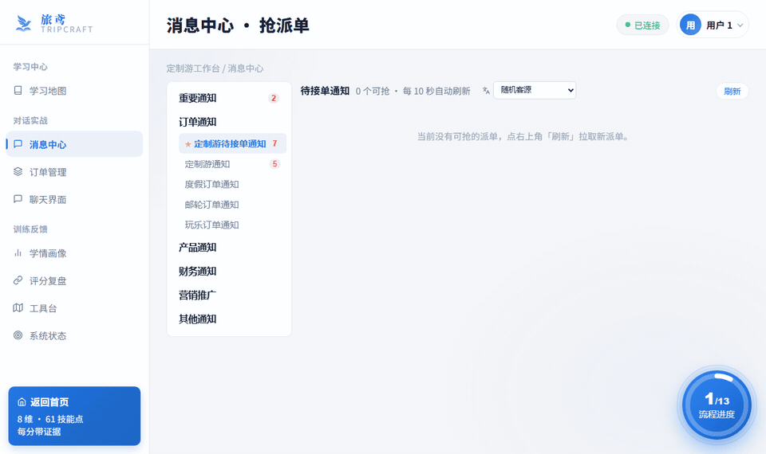

#### 6.3.1 实战里的沟通：聊天界面与群聊

实战过程中的全部沟通都在聊天界面完成：学员自行添加联系人（客户联系方式在首次通话中获取，资源方联系人通过资源大群获取），自行建群与重命名会话，并在群内与客户、地接社、车队、酒店、票务和司导沟通；交付物也可直接投递到群内。

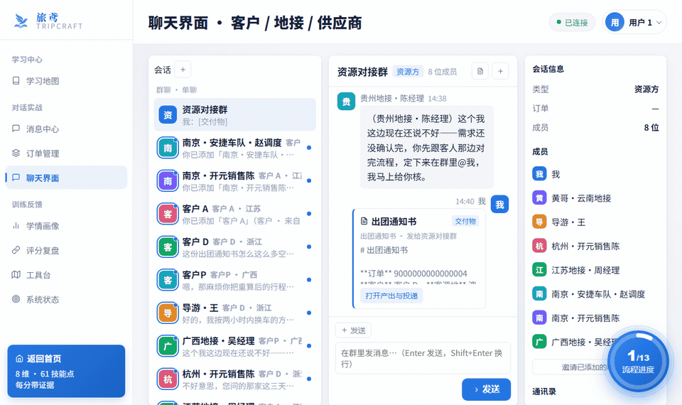

#### S0 · 任务初始化与规则交底
订单详情集中展示客户背景、服务语言、入境证件与派单信息；右下角进度条可展开，查看 13 步的当前进度与**本步完成条件**。

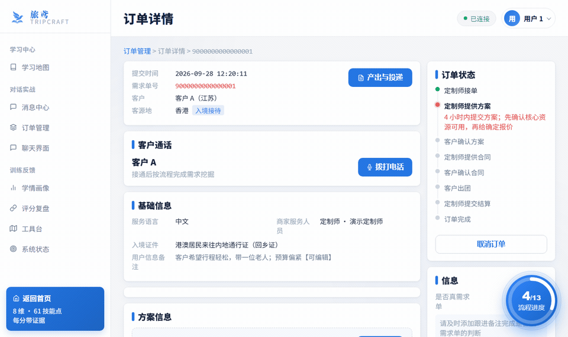

#### S1 · 抢单接单
派单依据学员画像生成，客源语言可选；刷新可获取新的派单。抢单成功后才能进入订单管理，超时未抢则该订单由其他定制师接走。

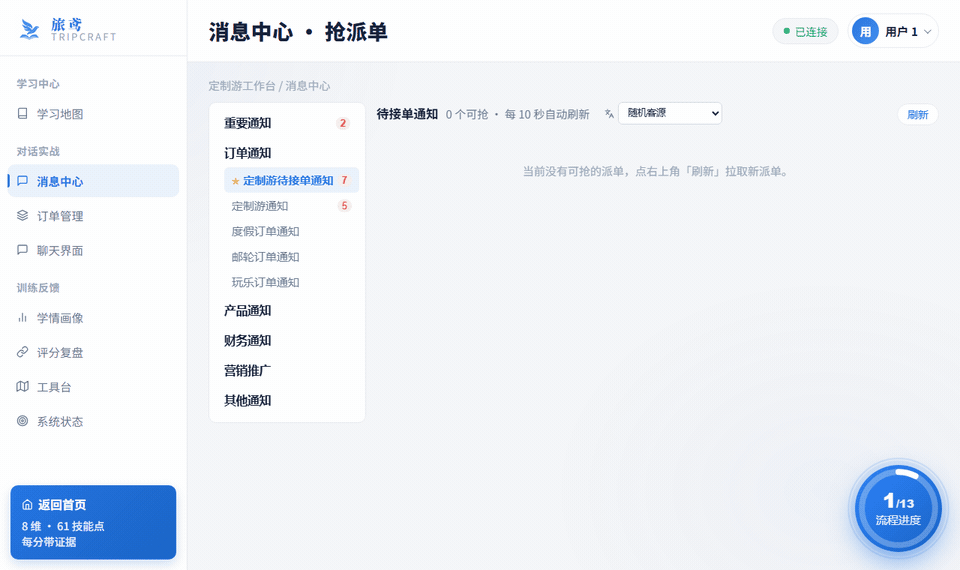

#### S2 · 首呼与需求挖掘
每个客户都有固定的国籍、性别、年龄与母语。通话界面在拨打前即展示这些信息，接通后显示本次实际使用的音色，人设、语种与声音三者一致；客户全程使用自己的母语，不会因学员使用中文而改口。

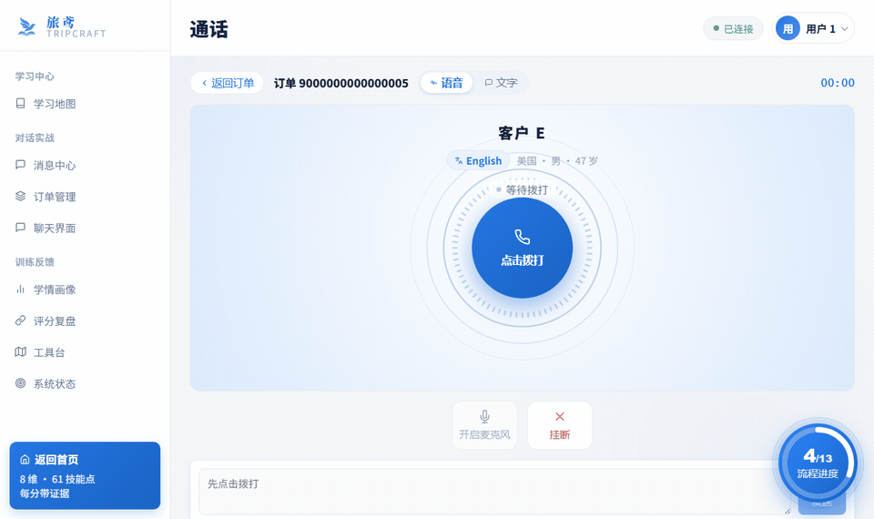

#### S3 · 需求结构化确认
将口语化需求整理为「必须满足 / 希望满足 / 可替代」三类，写入需求确认单；表单右侧同步渲染为该交付物的正式版式，确认后提交投递，投递前会先经过双层拦截网。

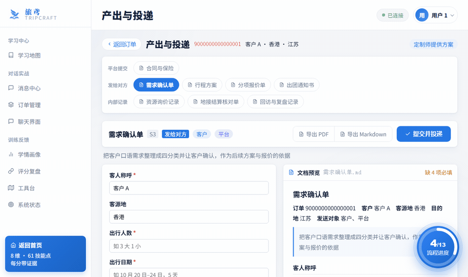

#### S4 · 资源询价与可行性核验
在资源大群中向地接社、酒店、车队与票务询价。资源方 Agent 仅根据本单客观事实（报价、库存、档期）作答；需求未经确认时不会给出确定报价，以避免学员将未确认资源对外报价。

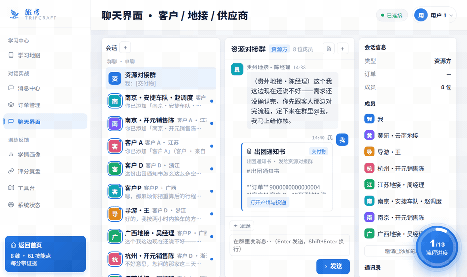

#### S5 · 行程方案设计
按天编排行程并直接发送给客户；发送后自动跳转至与客户的单聊窗口，客户已读并反馈意见，作为下一轮迭代的输入。

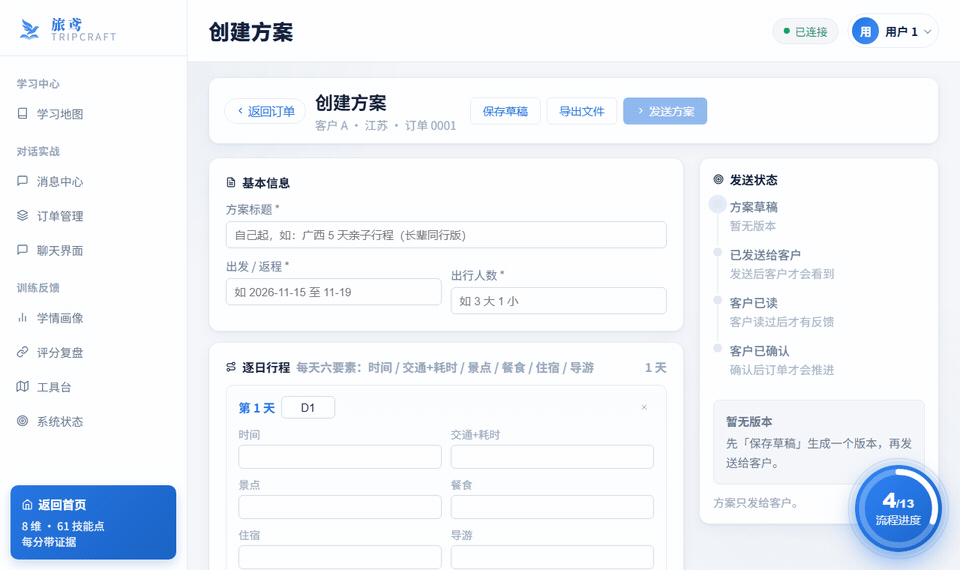

#### S6 · 分项报价与利润测算
分项报价单逐项列出导游、用车、住宿、餐饮、门票、保险与服务费；提交前先经确定性算术校验，核对分项合计、毛利率与保险项。

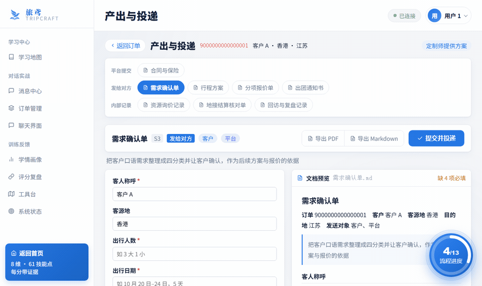

#### S7 · 客户反馈与方案迭代
客户对方案提出异议时，学员需给出取舍方案（更换酒店、调整交通方式、重算报价）。客户 Agent 会依据自身预算口径继续施压，考察学员能否把取舍理由解释清楚。

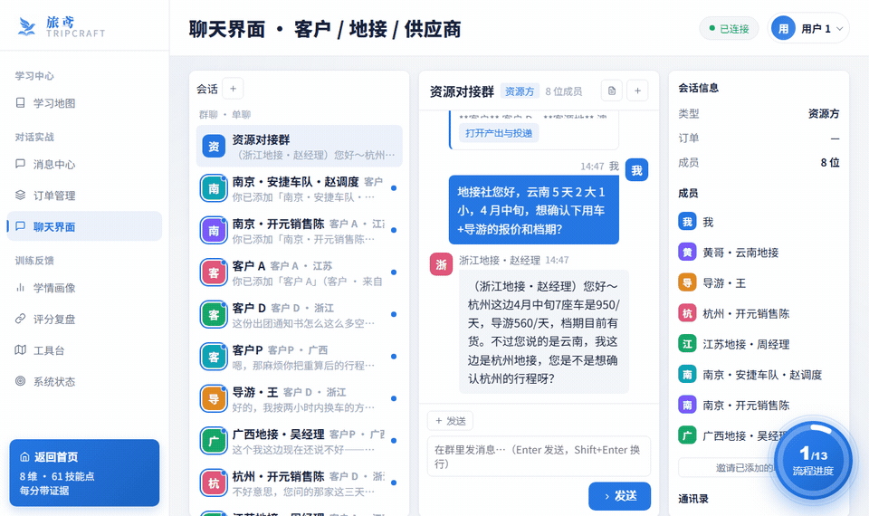

#### S8 · 成交确认与系统录单
客户确认方案后提交合同与保险。保险属于必填合规项，缺失或与其他安排冲突时会被双层拦截网拦截。

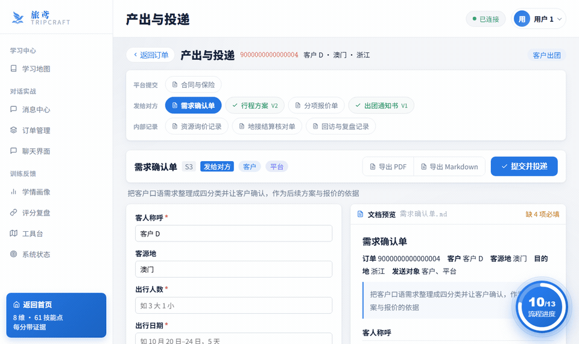

#### S9 · 资源锁定与行前准备
出团通知书用于锁定资源，并同步至客户群与地接群；行前阶段司导会就饮食禁忌、接机时间等要素反向确认，用于考核行前要素的覆盖度。


#### S10 · 行中执行与突发事件
行中突发事件由导演 Agent 直接发入对应工作群（车辆故障、酒店超售、票务变化等）。正确处理顺序是先行安抚客户、同时并行协调资源；顺序有误将直接影响应急解决维度的评分。

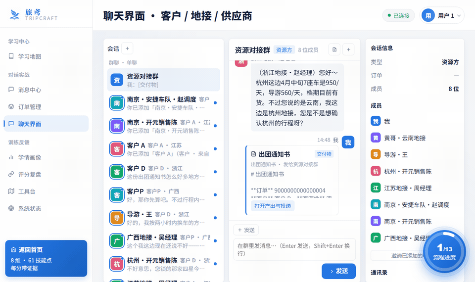

#### S11 · 行后结算与回访
成本与结算台账：逐项核对地接结算单与实际成本，处理赔偿与追偿，结账留档并计算该订单的实际利润。

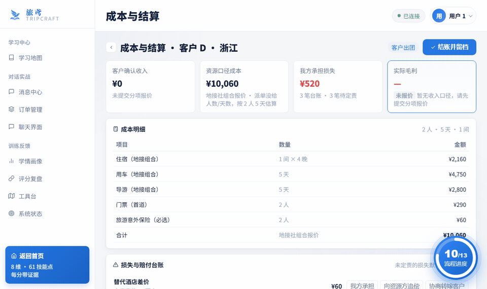

#### S12 · 复盘评分与个性化补救
61 个技能点逐项评分，每一分都带证据坐标；评分结果写回画像，决定下一单的难度参数与待补强技能点。

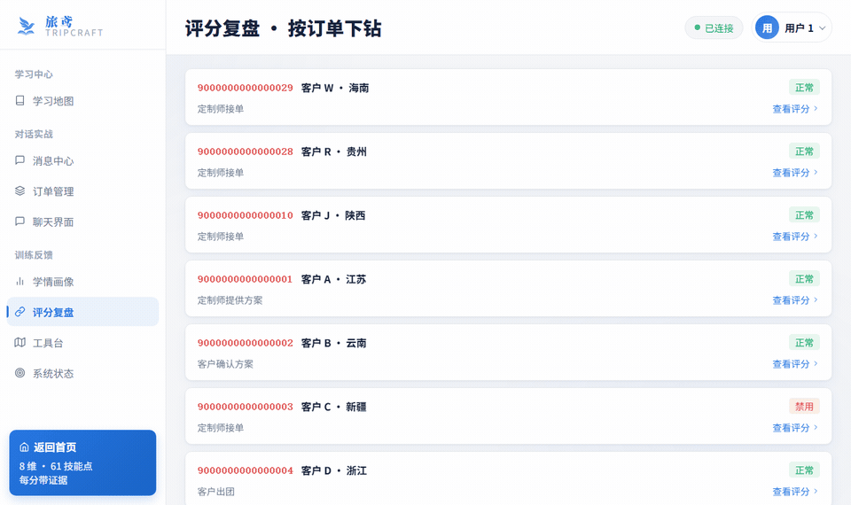

#### 6.3.14 工具查询与评分核验（真实接口）

实战所需的外部数据均来自真实接口调用：路线规划（高德，含途经点、驾车/步行/骑行/公交与耗时）、天气预报（Open-Meteo + 高德地理编码）、实时汇率（open.er-api.com），以及行程绕路与折返核验。

评分环节通过服务端接口调用评分 Agent：输出各技能点得分与平均分，同时给出**覆盖校验**（本单实际考核到的技能点、覆盖度与未覆盖项、并可直接跳转补考）与**校准基线**状态。覆盖度不足或校准未达标时，本次结果不会写入画像。

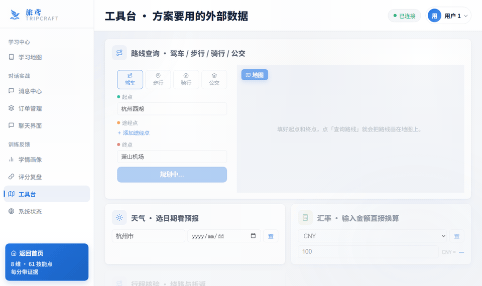

### 6.4 学情画像：维度明细与技能点下钻

画像页上半部分为综合掌握度与能力雷达，下半部分为 8 个能力维度；展开任一维度可查看该维度下每个技能点的教学/实战得分与掌握档位。

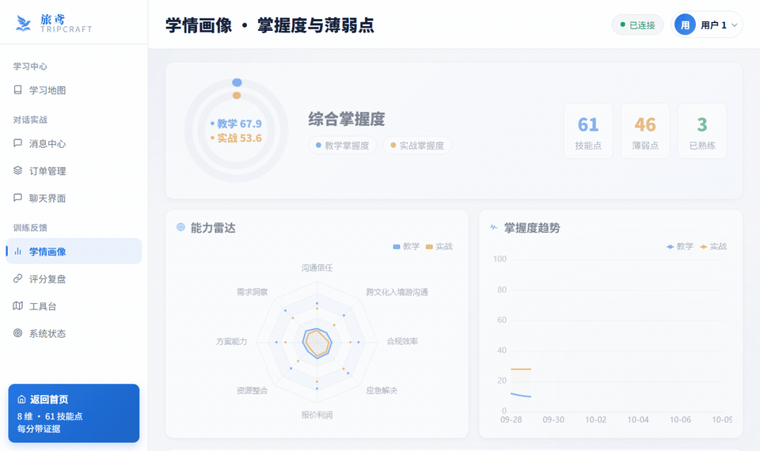

### 6.5 更新画像：画像记忆重写

画像 Agent 重新读取掌握度、实战评分与答题记录后，重写定性描述与学习建议并保存至画像记忆；下一单的难度参数随之调整。

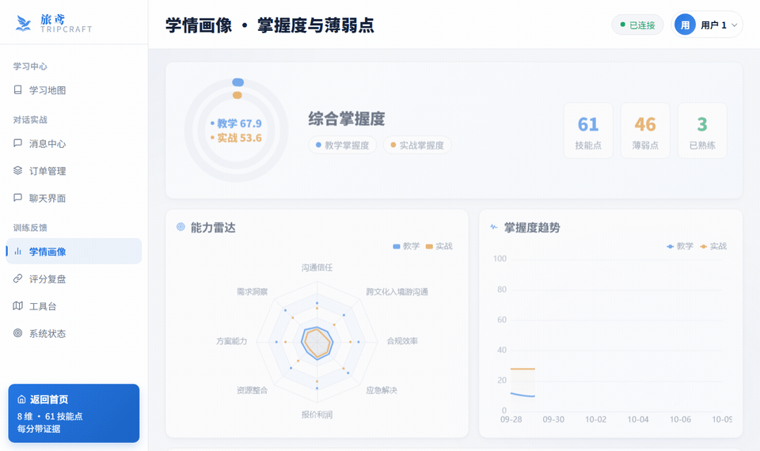

## 七、人工校准集：评分可信度如何保证

自动评分的核心风险是分数漂移。系统通过一套**人工校准集**约束评分 Agent：

- **样本来源**：从真实演练中挑选已人工标注 M 档、并标出证据坐标的样本；
- **覆盖要求**：覆盖 21 个技能点、M1–M5 全档位、9 个客源与中文/英文两种语言，并保留档位边界的难例；
- **校准方式**：每次调整评分提示词或 Rubric 锚点后运行校准，比对 M 档一致率与证据准确率，并重复两轮考察稳定性；
- **准入规则**：阈值取最保守档位（置信度与边界容差）；**未通过校准的评分 Agent 不参与主链**，且未达标时画像只允许下调、不允许上调。

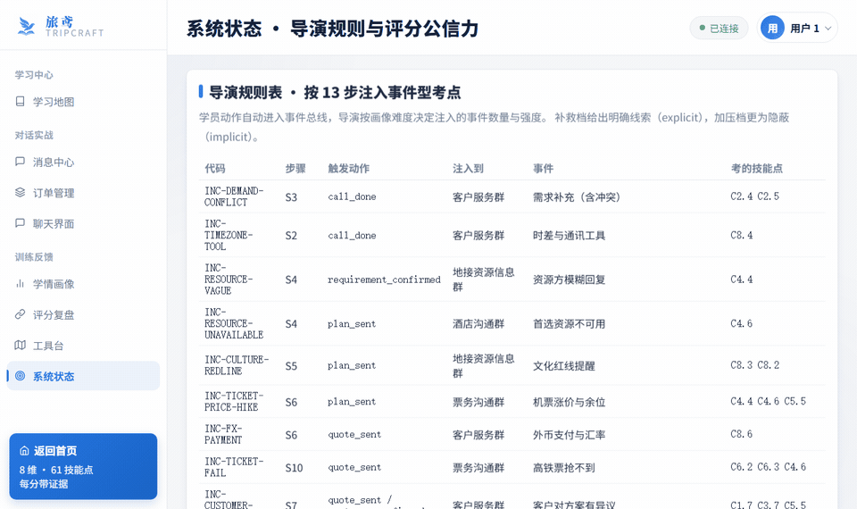

## 八、MCP 接口契约：为平台数据对接预留

外部数据与资源方能力统一按 **MCP 工具契约**（http-jsonrpc，`POST /mcp`）暴露，当前共 11 个工具，覆盖天气查询、路线规划、行程顺序核验、实时汇率、资源询价、交付物投递、拦截网校验、导演事件、订单状态、覆盖校验与知识点检索。

实现层目前使用模拟资源方与公开 API；接入真实供应商时仅需替换实现，契约与上层流程保持不变。**希望未来携程以及更多企业平台提供数据对接支持**（房态、车况、票务档期、结算单等），使训练环境与企业真实业务系统同源。

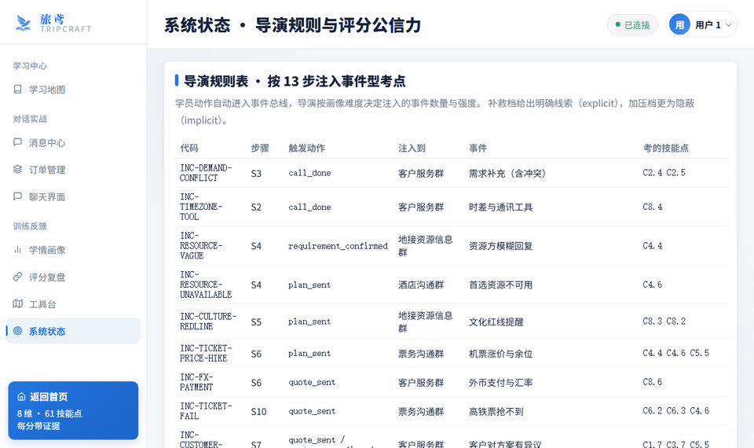

## 九、系统里有什么

| 维度 | 内容 |
| --- | --- |
| 流程 | 13 步状态机，每步有完成条件、失败回退与证据链 |
| 评分 | 8 维 61 技能点原子评分，Rubric 锚点 M1–M5，覆盖校验避免漏考 |
| AI 角色 | 10 类：客户 / 地接社 / 酒店 / 车队 / 票务 / 司导 / 导演 / 评分 / 画像 / 教研 |
| 交付物 | 需求确认单、逐日行程方案、分项报价、合同与保险、出团通知书、地接结算核对单 |
| 客源 | 15 门语言 / 23 个客源市场，全程入境接待口径 |
| 兜底 | 交付物双层拦截网：确定性算术校验 + 语义合规红线，违规方案无法投递 |
| 外部数据 | 高德地图与路线、Open-Meteo 天气、实时汇率，均为真实接口 |


## 十、本地一键运行

两个入口启动的是**同一套服务**（后端 18010 + 前端 5180），可按使用习惯选择：

| 入口 | 效果 |
| --- | --- |
| `一键启动.bat` | 命令行拉起服务，就绪后自动打开浏览器；日志在 `logs\backend.log` / `logs\frontend.log` |
| `旅鸢桌面版.bat` | 用 Electron 打开桌面窗口；首次运行会自动安装前端依赖与 Electron 运行时 |

- 后端默认带 `--reload`（改 Python 自动重载），前端 Vite 自带 HMR（改 Vue 自动刷新）
- 服务已经在跑时，两个入口都会**复用**而不会重复启动
- **停止统一使用 `停止服务.bat`**（用于结束监听 18010 / 5180 的进程）；关闭桌面版窗口不会停止服务
- 「一键启动」会先清理上一次启动的服务（修改代码后直接双击即可）

```powershell
cd <项目根目录>
.\scripts\start.ps1              # 清理旧进程并重启（默认）
.\scripts\stop.ps1               # 停止服务
.\scripts\smoke.ps1              # 跑测试 + 契约摘要
```

依赖：Python 3.11+、Node 20+，以及根目录的 `local.env`（DeepSeek / DashScope / 高德 的 key，**不入库**）。

## 十一、项目文档

| 文件 | 作用 |
| --- | --- |
| `docs/定制师全流程模拟实战系统-PRD-20261007.md` | 产品需求文档（28 章）：状态机、交付物、Rubric、画像与难度 |
| `docs/定制师全流程模拟实战系统-开发计划-20261007.md` | 开发计划与里程碑 |
| `docs/DECISIONS.md` | 关键决策记录（含被推翻方案与回退记录） |
| `docs/Rubric生成要求.md` | 61 技能点 Rubric 的生成口径与校验规则 |
