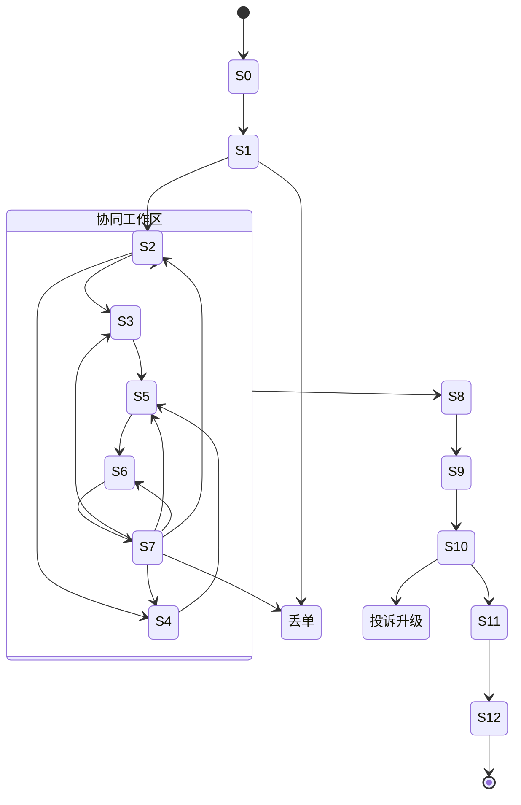

# 定制师全流程模拟实战系统 · 产品需求文档（PRD）

> 文档版本：v1.7
> 编写日期：2026-10-07
> 上游依据：《定制师全流程模拟设计-20261007.md》（基于 2026-09-23 线下访谈录音）
> 文档性质：产品需求文档。只定义「系统要做什么、每项需求如何工作、各角色与数据如何协同」，**不涉及技术落地**（不指定编程语言、框架、数据库引擎、模型、部署方式）。

---

> 修订记录：
> - v1.1：补入《入境游定制师学习分类》《国别文化分国家》两素材（第 14–16 章）。
> - v1.2：细化评分与画像——能力扩为 8 维、原子层细化到 61 技能点，新增对齐 Rubric、导演埋点、掌握度↔难度对应（第 17–21 章，并更新第 2、6、7、8 章）。
> - v1.3：补入外部数据服务与工具层（MCP / 地图路线 / 天气 / 方案自动核验）与技术架构亮点（第 23–24 章）。
> - v1.4：补入评分校准集与公信力保障（第 25 章）。
> - v1.5：补入真实平台还原（VBooking 携程定制游工作台，第 26 章）。
> - v1.6：补入技能点对话工作台（一技能点一线程，融合学习/做题/实战复盘/问答/个性资源，第 27 章）。
> - v1.7：补入后端实现（存储层 / 线程服务 / 实战服务 / API 与检验方式，第 28 章）。

## 0. 阅读说明

本文档把「定制师全流程模拟实战系统」拆解为四块可独立评审、可分别验证的内容：

1. **全流程状态机**：13 个主状态、并行区、循环回退、版本管理与倒计时。
2. **数据库表**：逻辑数据模型，明确系统要沉淀哪些原生数据、中间产物与结果数据。
3. **AI 角色分工 + 每个 Agent 的任务清单**：7 类 AI 角色各自做什么、何时做、给什么、边界在哪里。
4. **难度参数体系**：同一套流程如何用参数调出不同难度，并与学员画像闭环。

核心口径与源文档一致，全文贯穿 13 个步骤、6 类要素（系统输入、学员动作、交付物、通过条件、失败回退、录音依据）与 7 大评分维度。

---

## 1. 产品概述

### 1.1 一句话定位

一个「完全模拟」的定制师多智能体实战系统：让学员在真实倒计时、预算、资源、突发事件压力下，连续交付从抢单到回访的一整套真实工作物，而不是与 AI 客户聊天。

### 1.2 核心结论（产品定调）

**定制师全流程模拟不是「AI 扮演客户陪聊」，而是让学员在倒计时、预算、资源和突发事件压力下，连续交付真实工作物。**

这意味着系统的主线不是「对话」，而是「交付物 + 门控」：每一步都必须有系统输入物、学员动作、交付物、通过条件、失败回退和评分点；只有交付物合格、门控通过，流程才能前进。

### 1.3 六条设计原则（全文必须遵守）

1. **全流程不是聊天**：每一步都有系统输入物、学员动作、交付物和评分点。
2. **真实并行**：需求确认、方案设计、资源询价不是严格串行，而是边问、边查、边改、边确认。
3. **先确认资源，再报确定价**：房态、车、票、导游档期与成本未确认前，不能给客户最终确定报价。
4. **需求分批释放、反复变化**：客户不会一次说全，还会在首呼、微信、看方案后不断补充修改。
5. **沟通与信任第一，行程设计第二**：核心是让客户放心把团交给你。
6. **定制师是全程第一责任人**：行中出现任何问题，客户最终都找定制师，由定制师协调地接社、车队、导游、票务。

### 1.4 术语定义

| 术语 | 定义 |
| --- | --- |
| 系统输入（原生数据） | 系统在每一步推给学员的原始信息：平台通知、客户消息/语音、资源报价、突发事件、结算单等。 |
| 学员动作 | 学员（被训练者）在每一步必须完成的主动行为。 |
| 交付物 | 学员动作产生的、可被系统保存和评分的工作产物。 |
| 通过条件（门控） | 判定该步骤能否前进的客观标准。 |
| 失败回退 | 未通过门控时的后果：回退到上一环节、丢单、投诉升级、亏损、重练等。 |
| 录音依据 | 该步骤规则在真实录音中的出处，用于保证「真实优先于想象」。 |
| 状态机 | 描述系统/订单从初始化到复盘的所有状态及状态间迁移规则（需求层，非实现层）。 |
| Agent | 一个 AI 角色，承担一类固定职责，拥有明确输入、输出与权限边界。 |
| 难度参数 | 通过调整派单完整度、时限、情绪、预算等变量，改变同一流程的挑战程度。 |
| 硬约束 / 软偏好 | 硬约束=客户必须满足、不可妥协的要求；软偏好=可替代、可取舍的要求。 |

---

## 2. 角色与 AI 角色分工

系统由「人类角色」与「AI 角色」共同构成。AI 角色之间互不替代、职责单一，由状态机统一编排。

### 2.1 人类角色

| 角色 | 定位 | 核心职责 |
| --- | --- | --- |
| 学员（定制师） | 被训练者 | 在每步完成动作、产出交付物、应对压力与突发事件。 |
| 教练 / 师傅 | 监督者（真人） | 查看学员复盘与分数，必要时人工介入或带练。 |
| 管理员 / 内容运营 | 内容维护者 | 配置案例、知识库、模板、Rubric、难度参数。 |

### 2.2 AI 角色总览（9 类）

| # | AI 角色 | 一句话职责 | 服务的主要步骤 |
| --- | --- | --- | --- |
| 1 | 编排管家 / 状态机 Agent | 控制流程顺序、版本、时限、事件触发与跨步状态 | 全程 |
| 2 | AI 客户 Agent | 扮演客户，语音/文字、多语言、情绪变化、需求分批释放 | S2、S3、S7、S8、S10、S11 |
| 3 | AI 平台 / 派单 Agent | 跳单、抢单、倒计时、方案上传、订单状态、时限提醒 | S0、S1、S8 |
| 4 | AI 资源方 Agent（地接/酒店/车队/票务/导游） | 提供报价、库存、档期、资源冲突与临时变更 | S4、S6、S9、S10、S11 |
| 5 | AI 师傅 / 主管 Agent | 关键节点提供有限提示、带练、纠错 | S0、S1、S4、S6、S10、S12 |
| 6 | AI 质检 / 评审 Agent | 按 Rubric 检查需求完整性、资源可行性、报价合理性、合规性与应急处理 | 每一步门控 + S12 |
| 7 | 入境文化 / 政策 Agent | 处理签证、免签、宗教饮食禁忌、支付、语言、跨文化沟通 | 入境游全程叠加 |
| 8 | 导演 / 场景生成 Agent | 按 Rubric 生成实战对话、埋入 A/B 考点触发事件、保证覆盖度 | 全程（场景与埋点） |
| 9 | 学习资料生成 Agent | 按画像数值定位薄弱技能点，引用 Rubric 生成个性化资料与练习 | S12 复盘后 |

### 2.3 每个 AI 角色的职责边界（输入 / 输出 / 不允许做的事）

#### 2.3.1 编排管家 / 状态机 Agent
- 输入：学员动作、各 Agent 输出、倒计时到期、门控结果。
- 输出：当前步骤、下一步骤、状态迁移、版本号、触发事件。
- 边界：只负责「流转与约束」，不扮演任何业务角色、不替学员做决策、不代替质检打业务分。

#### 2.3.2 AI 客户 Agent
- 输入：学员话术/动作、需求脚本、情绪与难度参数。
- 输出：语音/文字回复、补充/变更需求、反馈、确认或拒绝。
- 边界：扮演「真实客户」，口径直接、可能不耐烦；不主动补全信息，不替学员设计行程，不做专业判断。

#### 2.3.3 AI 平台 / 派单 Agent
- 输入：流程阶段、倒计时、学员是否抢单/上传。
- 输出：跳单通知、派单卡片、时限提醒、抢单结果、录单校验结果。
- 边界：只呈现「平台事实与规则」，不提供需求洞察、不提示资源方案。

#### 2.3.4 AI 资源方 Agent
- 输入：学员询价请求、预订/锁定请求、突发事件。
- 输出：报价、库存、档期、冲突、临时变更、结算单。
- 边界：只回应「该资源方视角」的信息，价格与库存受难度参数约束；不主动替学员比价、不提示最优组合。

#### 2.3.5 AI 师傅 / 主管 Agent
- 输入：学员当前步表现、是否触发求助。
- 输出：有限提示、纠错、示范（在设定次数内）。
- 边界：只在关键节点与求助时出现，提示「有限且递减」，不直接替学员完成交付物。

#### 2.3.6 AI 质检 / 评审 Agent
- 输入：学员交付物、行为日志、Rubric。
- 输出：逐项打分、门控通过/不通过、扣分点与回退建议。
- 边界：只按 Rubric 打分，不打感情分；不参与流程推进，只提供判定结果。

#### 2.3.7 入境文化 / 政策 Agent
- 输入：客源国、语言、行程、需求、突发事件。
- 输出：签证/免签/过境政策、宗教饮食禁忌、礼仪、支付、时差与紧急联络建议。
- 边界：只提供「政策与文化事实」，不替学员做最终合规判断。**本平台只做入境接待，不存在国内单**（D-021）。

#### 2.3.8 导演 / 场景生成 Agent
- 输入：任务模板、目标技能点清单、Rubric 考核定位、难度参数。
- 输出：实战对话脚本、A/B 考点埋点、覆盖报告。
- 边界：只负责「生成场景与埋点」，不评分、不写画像、不替学员做决策。

#### 2.3.9 学习资料生成 Agent
- 输入：画像能力参数、Rubric 正例/反例/知识点。
- 输出：个性化学习资料与变式练习。
- 边界：内容全部引用 Rubric 与知识库，不做自由发挥。

---

## 3. 全流程状态机

状态机描述订单从创建到复盘的完整生命周期。它包含：顶层阶段、13 个主状态、一个「需求—资源—方案—报价」协同工作区、循环回退、版本管理与全局倒计时。

### 3.1 顶层阶段划分

| 阶段 | 包含主状态 | 说明 |
| --- | --- | --- |
| A. 接单 | S0、S1 | 交底 + 抢单，线性进入。 |
| B. 需求与方案（协同工作区） | S2–S7 | 内含循环，可并行、可回退，是核心工作区。 |
| C. 成交锁定 | S8、S9 | 确认、录单、合同保险、资源锁定。 |
| D. 行中执行 | S10 | 突发事件驱动的实时响应。 |
| E. 行后收尾 | S11、S12 | 结算回访 + 复盘补救。 |

### 3.2 主状态定义（13 个）

| 状态 | 名称 | 进入条件 | 退出条件（门控通过） |
| --- | --- | --- | --- |
| S0 | 任务初始化 | 任务创建 | 学员能复述硬规则并完成接单准备确认 |
| S1 | 抢单接单 | S0 完成 | 抢单成功 + 按时发起首呼 + 识别缺失字段 |
| S2 | 首呼与需求挖掘 | S1 完成 | 拿到核心信息、客户同意继续、未误判预算 |
| S3 | 需求结构化确认 | S2 完成 | 需求单无遗漏、硬软分开、预算口径已确认 |
| S4 | 资源询价与可行性核验 | S2 完成（可与 S3 并行） | 核心资源可用且价格明确、至少一套组合满足硬约束、未确认资源未报死价 |
| S5 | 行程方案设计 | S3+S4 完成 | 覆盖硬约束、路线时间资源可执行、客户可读 |
| S6 | 分项报价与利润测算 | S4+S5 完成 | 不漏项、不亏损、含保险、价与资源一致 |
| S7 | 客户反馈与方案迭代 | S5/S6 已发出 | 客户核心安排确认 + 版本可追溯 + 无新冲突 |
| S8 | 成交确认与系统录单 | S7 达成确认 | 字段完整一致、合同保险付款齐全、无模糊状态 |
| S9 | 资源锁定与行前准备 | S8 完成 | 核心资源锁定 + 出团通知按时送达确认 |
| S10 | 行中执行与突发事件处理 | S9 完成 | 事件闭环、客户未升级投诉、成本可控有记录 |
| S11 | 行后结算与回访 | S10 完成 | 账目一致、尾款结清、问题闭环、可复用记录 |
| S12 | 复盘评分与个性化补救 | S11 完成 | 生成复盘报告、画像更新、下一单难度参数 |

### 3.3 状态迁移规则（含并行与循环）

- S0 → S1 → 进入协同工作区（S2）。
- 协同工作区内：
  - S2 与 S4 可**并行**（边问客户、边查资源）。
  - S3 依赖 S2；S5 依赖 S3+S4；S6 依赖 S4+S5。
  - S7 是循环回退点，可回退到 S3 / S4 / S5 / S6 任一个，也可回退到 S2（需求不清需重新首呼）。
  - S7 只有达成「客户确认 + 方案/报价锁定 + 合规通过」才可迁出到 S8。
- S8 → S9 → S10 → S11 → S12（线性收尾）。
- 全局失败出口（任意状态可触发）：
  - 丢单：S1 超时未抢、S7 客户货比三家后流失。
  - 投诉升级：S10 响应慢/只解释不解决。
  - 亏损/合规失败：S6 报价亏损或漏保险（在 S6/S8 门控拦截）。

### 3.4 状态机示意（业务层，非技术实现）



### 3.5 全局状态与倒计时

| 全局状态 | 说明 | 关键倒计时 |
| --- | --- | --- |
| 订单归属 | 未接单 / 已接单(我) / 已被他人接走 | 抢单倒计时 |
| 客户信任分 | 沟通质量累计分，影响客户配合度与流失概率 | 首呼时限（默认 1 小时） |
| 客户情绪值 | 平静 → 着急 → 语气冲 → 投诉边缘 | 方案上传时限（默认 4 小时） |
| 版本状态 | 方案版本、报价版本分别管理 | 行前通知时限（1–2 天） |
| 风险等级 | 低/中/高，由未确认资源、成本偏差、投诉风险综合 | 行中响应时限（按事件） |

---

## 4. 十三步详解（六要素 + 原生数据 + 触发 Agent + 评分点）

> 每步统一按「系统输入（原生数据）/ 学员动作 / 交付物 / 通过条件 / 失败回退 / 录音依据 / 触发 Agent / 评分点」展开。系统输入字段即「数据库要落地的原生数据」。

### 第 0 步：任务初始化与规则交底

**系统输入（原生数据）**
- 学员画像：身份、经验、目标语言、目标客源国、薄弱能力。
- 模拟任务类型：国内定制 / 入境定制 / 企业团 / 家庭团 / 小包团。
- 本单规则参数：抢单倒计时、首呼时限、方案上传时限、预算、是否必须买保险、合规红线。

**学员动作**
- 阅读任务背景与平台规则。
- 确认本单目标：先抢到单，再完成从需求到回访的完整交付。
- 选择沟通渠道和语言。

**交付物**
- 接单准备确认。
- 本单风险提示清单。

**通过条件**
- 能复述硬规则：首呼时限、方案时限、保险必买、不得飞单、资源未确认不得报死价。

**失败回退**
- 未理解规则：进入 S1 后违规扣分、流程照常但风险升高。

**录音依据**
- 平台要求 1 小时内打电话、4 小时内上传方案；定制游必须买保险。

**触发 Agent**：平台 Agent（交底）、师傅 Agent（规则提示）。
**评分点**：合规效率（规则理解准确度）。

### 第 1 步：抢单接单

**系统输入（原生数据）**
- 平台跳单通知。
- 派单卡片（信息残缺，可能只有目的地）：目的地、出发地、人数、预算、景点偏好（各字段可能为空）。
- 竞争信息：同一客户同时派给 3 位定制师。
- 倒计时与抢单/举手按钮。
- 客源语言筛选（消息中心顶部）：中文 / 日本語 / 한국어 / ไทย / Tiếng Việt / Bahasa Indonesia / English / Deutsch / Français / العربية / Español / Русский / Italiano / Português / Türkçe；选「中文」只派港澳台与新马客源，选某门外语只派该语言的客源（D-064 / D-065）。

**学员动作**
- 倒计时内完成抢单/举手。
- 打开派单卡片，扫描已填/缺失字段。
- 判断必须首呼补齐的信息，立即发起电话。

**交付物**
- 抢单动作记录。
- 首呼计划：要问的 8 类核心信息。

**通过条件**
- 抢单成功；按时发起首呼；能识别卡片缺失的关键字段。

**失败回退**
- 超时未抢：订单被其他定制师接走（丢单）。
- 未识别缺失字段：进入 S2 后信息不足，方案无法确认。

**录音依据**
- 平台跳单后点抢单/举手；平台按规则派单；一个客户可同时由 3 位定制师服务；客户自填信息常大量缺失。

**触发 Agent**：平台 Agent（跳单/倒计时）、师傅 Agent（可选提示）。
**评分点**：合规效率（时限）、需求洞察（缺失字段识别）。

### 第 2 步：首呼与需求挖掘

**系统输入（原生数据）**
- AI 客户电话/实时语音。
- 客户特征：直接、不耐烦、说不清需求，可能只说「性价比高、住得好」。
- 需求分批释放：第一轮只给部分信息，后续微信/IM 补充。

**学员动作**
- 开场问候、确认身份与沟通时间。
- 开放式问题挖掘：人数、关系、出发地、目的地、日期、天数、预算、交通、酒店、景点、餐饮、禁忌、特殊需求。
- 处理客户情绪：语气冲时不争辩，先确认核心诉求。
- 引导加微信或切换可继续沟通渠道。
- 判断硬约束 vs 软偏好。

**交付物**
- 首呼记录。
- 需求单 v1：已知 / 未知 / 待确认 / 风险项。
- 后续沟通渠道确认。

**通过条件**
- 拿到人数、日期、目的地、预算口径、交通与住宿意向；客户同意继续；未把「性价比高」当预算已明确。

**失败回退**
- 关键信息缺失：方案阶段被迫回退。
- 追问生硬：客户不耐烦，沟通意愿下降。
- 只听字面需求，未识别真实约束。

**录音依据**
- 首呼要问人数、预算、景点、交通、酒店星级、是否包车；客户需求不明确需定制师问出来；问多了客户会烦；客户可能多次来电、后续微信补充。

**触发 Agent**：客户 Agent、入境文化政策 Agent（入境单）。
**评分点**：沟通信任、需求洞察。

### 第 3 步：需求结构化确认

**系统输入（原生数据）**
- 客户补充消息、语音、图片、文档。
- 客户临时新增/修改需求。
- 可能存在冲突要求：低预算 + 高星级 + 包车 + 深度体验。

**学员动作**
- 把口语需求整理成「必须满足 / 希望满足 / 可替代 / 明确不要」。
- 识别冲突并主动说明取舍。
- 向客户复述并取得确认。

**交付物**
- 需求确认单（结构化）。

**通过条件**
- 客户确认需求整理无误；硬约束与偏好分开；预算与期望不匹配时已提前说明取舍。

**失败回退**
- 需求单遗漏关键项：后续方案被推翻。
- 未确认预算口径：客户看报价后直接否定。

**录音依据**
- 需求分批释放、反复变化；需把硬约束和软偏好分清楚。

**触发 Agent**：客户 Agent、质检 Agent（需求完整性初查）。
**评分点**：需求洞察、沟通信任。

### 第 4 步：资源询价与可行性核验

**系统输入（原生数据）**
- 资源方回复：地接、酒店、车队、票务、导游。
- 房态、车况、座位数、导游档期、门票价、票务紧张程度。
- 节假日涨价、库存紧张、机票/高铁票价波动。
- 资源预留规则：可先付约 80% 预留，最后结全款。

**学员动作**
- 向资源方询价并确认可用性。
- 至少比较 2 套资源方案。
- 核对酒店星级/位置/房型、车队座位、导游语言能力。
- 确认门票、用餐、保险、接送成本。
- 对未确定资源标风险，不用「应该没问题」代替确认。

**交付物**
- 资源询价表。
- 可行资源组合 A/B。
- 资源风险清单。

**通过条件**
- 核心资源均有明确可用性与价格；至少一套组合满足硬约束；未确认资源未写成确定报价。

**失败回退**
- 资源冲突：回到 S5 调整。
- 报价低于成本：进入报价纠错。
- 行前才无房/无车：行中应急难度升级。

**录音依据**
- 给方案前先把所有资源价格确定好；酒店、车队、门票、导游都要确认；热门时段酒店易没房；部分订单付 80% 预留。

**触发 Agent**：资源方 Agent（各资源方）、质检 Agent（死报价拦截）。
**评分点**：资源整合、合规效率。

### 第 5 步：行程方案设计

**系统输入（原生数据）**
- 需求确认单。
- 资源可用性与报价。
- 目的地知识、路线距离、开放时间、交通耗时。

**学员动作**
- 设计逐日行程：时间、交通、景点、用餐、酒店、导游、自由活动。
- 检查折返、节奏、老人/儿童/企业团适配。
- 排除客户「明确不要」内容。
- 对不确定资源设备选。
- 形成客户可读方案。

**交付物**
- 行程方案 v1。
- 行程 PPT/PDF。
- 资源使用清单。

**通过条件**
- 覆盖全部硬约束；路线/时间/资源可执行；客户能看懂每天做什么、住哪、怎么走、费用包含什么。

**失败回退**
- 路线不合理：客户或质检打回。
- 资源不可执行：回到 S4。
- 超预算：进入报价与取舍阶段。

**录音依据**
- 客户一开始只给大概方向，定制师按需求推荐并制作行程；方案最后做 PPT 再转 PDF；客户看完方案才提修改。

**触发 Agent**：资源方 Agent（辅助核验）、入境政策 Agent（入境单）。
**评分点**：方案能力、需求洞察。

### 第 6 步：分项报价与利润测算

**系统输入（原生数据）**
- 资源成本、服务费、门票差价、酒店价、车费、餐费、保险、票务波动。
- 客户预算与报价底线。
- 报价有效期与价格波动提示。

**学员动作**
- 分项报价：导游、用车、酒店、餐饮、门票、保险、服务费。
- 写清名称、单位、数量、单价、总价。
- 算人均价、总价、毛利。
- 对机票/高铁留风险空间。
- 保险列入必选。
- 检查亏损、漏项、重复收费。

**交付物**
- 分项报价单 v1。
- 成本利润表。
- 报价说明与有效期。

**通过条件**
- 报价不漏项、不亏损、不超预算或能解释超预算；含保险；价与资源确认一致。

**失败回退**
- 报价过低：提示亏损风险。
- 报价过高：客户要求调酒店/交通/景点。
- 漏保险：合规扣分，不得进入成交。

**录音依据**
- 报价单写名称、单位、数量和所需项目；定制游必买保险；门票有拿货价与报价差价；机票可能从 1100 涨到 1200 需留空间。

**触发 Agent**：资源方 Agent（成本）、质检 Agent（亏损/漏保险拦截）。
**评分点**：报价利润、合规效率。

### 第 7 步：客户反馈与方案迭代

**系统输入（原生数据）**
- 客户方案反馈：不喜欢某景点、预算超、酒店降级、人数变化、临时增需求。
- 客户可能货比三家，联系慢或报价高就丢单。

**学员动作**
- 先听清客户反对的真实原因。
- 优先调弹性项，不动硬约束。
- 提供取舍：五星改四星、换景点、换交通、调天数。
- 每次修改后更新方案版本与报价版本。
- 确认客户接受，而非只发修改稿。

**交付物**
- 行程方案 v2/v3、报价单 v2/v3。
- 修改记录。
- 客户确认记录。

**通过条件**
- 客户对核心安排达成一致；修改未引入新冲突或亏损；所有版本可追溯。

**失败回退**
- 客户不接受：继续迭代或丢单。
- 口头同意未确认：不能进入资源锁定。
- 版本混乱：后续录单履约出错。

**录音依据**
- 客户看方案后提修改（如不喜欢狮子林）；预算超可五星改四星；客户对比多个定制师和供应商。

**触发 Agent**：客户 Agent、质检 Agent（版本一致性）。
**评分点**：沟通信任、方案能力、报价利润。

### 第 8 步：成交确认与系统录单

**系统输入（原生数据）**
- 客户确认信息。
- 平台/公司录单页面。
- 合同、保险、付款规则。

**学员动作**
- 复述最终版本并取得明确确认。
- 录方案名称、日期、人数、行程描述。
- 上传方案和报价。
- 签合同、买保险、收定金/首款。
- 检查平台字段与实际方案一致。

**交付物**
- 系统订单记录、合同、保险单、收款凭证、最终确认版行程与报价。

**通过条件**
- 字段完整且与最终方案一致；合同/保险/付款齐全；客户明确确认，无「应该可以」模糊状态。

**失败回退**
- 信息不一致：资源订错或投诉。
- 未签合同/未买保险：不得进入执行。
- 最终方案未锁定：行前变更风险升高。

**录音依据**
- 客户确认后在系统创建订单并手动输入方案名称、日期、人数、行程描述；平台要求上传方案；保险必买。

**触发 Agent**：平台 Agent（录单校验）、质检 Agent（合规）。
**评分点**：合规效率。

### 第 9 步：资源锁定与行前准备

**系统输入（原生数据）**
- 客户确认版。
- 资源方预留时限、付款要求、天气、集合信息。
- 行前 1–2 天时间节点。

**学员动作**
- 按确认版订酒店、车辆、门票、导游、餐饮、保险。
- 支付预留款/全款，拿到资源确认回执。
- 再次核对房型、车座、导游语言、接送时间。
- 行前 1–2 天发出团通知书：行程、注意事项、天气、联系人。
- 建客户群，确认客户收到并理解。

**交付物**
- 资源预订单/确认单、付款记录、出团通知书、客户群与应急联系人清单。

**通过条件**
- 核心资源锁定成功；出团通知按时送达并获确认；客户清楚集合时间、联系人、注意事项。

**失败回退**
- 资源未锁死：行中触发无房/无车事件。
- 客户未确认通知：行前再次提醒。
- 天气/交通异常：启动备选方案。

**录音依据**
- 客户确认后再订车、订房、订餐并一一确认；行前 1–2 天发出团通知书；正常拉客户群。

**触发 Agent**：资源方 Agent（预订）、平台 Agent（时限提醒）。
**评分点**：资源整合、合规效率。

### 第 10 步：行中执行与突发事件处理

**系统输入（原生数据）**
- 客户群消息、司机/导游/地接通知。
- 突发场景：车辆故障、酒店超售、高铁抢不到票、车辆临时降级、客户情绪升级。
- 时间压力：如早 5 点报车坏、8 点必须出发。

**学员动作**
- 第一时间回应并安抚，不推给地接/司机。
- 快速核实事实：发生了什么、影响谁、剩多少时间。
- 同时联系地接、车队、导游、票务找替代。
- 比较方案：换车、升级车辆、打车中转、改酒店、多买一站票、补偿。
- 向客户说明变更、原因、替代、时间。
- 记录额外成本，必要时给合理补偿。
- 全程跟进直至解决。

**交付物**
- 应急处理记录、客户沟通记录、变更通知、额外成本与补偿记录。

**通过条件**
- 时限内给出可执行替代方案；客户情绪下降未升级投诉；成本可控且有记录。

**失败回退**
- 响应慢：客户投诉，评分下降。
- 只解释不解决：事件升级。
- 未经确认擅自变更：客户拒收，费用争议。

**录音依据**
- 司机 5 点说车坏 8 点出发；定制师安抚、联系换车、打车到高速收费站中转、给水果和每人 30 元补偿；酒店没房临时换、17 座不行免费升 34 座、高铁抢不到票多买一站；客户最终都找定制师；周末也随时响应。

**触发 Agent**：资源方 Agent（突发事件）、客户 Agent（情绪升级）、师傅 Agent（可选提示）。
**评分点**：应急解决、沟通信任、资源整合。

### 第 11 步：行后结算与回访

**系统输入（原生数据）**
- 地接社结算单。
- 实际资源成本与原始报价差异。
- 尾款应付信息。
- 客户评价与回访机会。

**学员动作**
- 核对地接结算单与自己的记录。
- 确认实际成本、额外支出、补偿、尾款。
- 与地接对账并付尾款。
- 处理未结投诉或遗留问题。
- 回访客户，收集评价与改进意见。
- 记录本单实际毛利与亏损原因。

**交付物**
- 结算核对表、尾款支付记录、客户回访记录、本单利润复盘。

**通过条件**
- 账目一致且差异有说明；尾款结清；客户问题闭环；形成可复用成本与经验记录。

**失败回退**
- 结算差异无法解释：重新核对。
- 客户差评未处理：进入售后补救。
- 成本异常：更新报价模型与资源库。

**录音依据**
- 行后把地接结算单与自己的行程报价完全核对再付尾款；台账记录接单、联系、是否发方案、是否成团等状态。

**触发 Agent**：资源方 Agent（结算单）、客户 Agent（回访）。
**评分点**：报价利润、合规效率、沟通信任。

### 第 12 步：复盘评分与个性化补救

**系统输入（原生数据）**
- 全流程行为日志、交付物、客户反馈、成本数据、时限数据。
- 多维评分结果。

**学员动作**
- 查看每步得分与错误回放。
- 对失败环节重练或变式训练。
- 更新个人掌握度与学习路线。

**交付物**
- 全流程复盘报告、能力雷达图/掌握度变化、下一轮针对性训练任务。

**系统动作（Agent 负责）**
- 把「需求挖掘弱、报价亏损、应急响应慢」等错误写回画像。
- 生成针对性题目、对话脚本或下一单难度参数。

**触发 Agent**：质检 Agent（汇总评分）、编排管家（下一单难度）、师傅 Agent（补救建议）。
**评分点**：综合（该步不单独打分，产出复盘与画像更新）。

---

## 5. 数据库表设计（逻辑数据模型）

> 本部分只定义「系统要沉淀哪些数据、字段含义与来源、字段间的约束」，不指定数据库引擎或物理存储方式。字段类型用「文本/数字/布尔/枚举/时间/文件引用/引用ID」等逻辑类型描述。

### 5.1 数据域划分（10 个域、32 张表）

| 域 | 表 | 用途 |
| --- | --- | --- |
| 1 用户与画像 | 学员表、学员画像表、能力掌握度表 | 学员身份与能力画像 |
| 2 任务与流程 | 任务模板表、演练实例表、步骤状态表、派单卡片表、时限表、行为日志表 | 主线流程与状态机落点 |
| 3 沟通 | 会话表、消息表、通话记录表、客户群表 | 全渠道沟通留痕 |
| 4 需求 | 需求单表、需求条目表 | 需求结构化 |
| 5 资源 | 资源方表、资源询价表、资源报价库存表、资源预订表 | 资源询价与锁定 |
| 6 方案与报价 | 行程方案表、逐日行程表、报价单表、报价明细表、成本利润表 | 方案与报价产物 |
| 7 成交履约 | 订单表、合同表、保险单表、付款记录表 | 成交与资金 |
| 8 行中结算 | 出团通知书表、突发事件表、应急处理表、结算单表、结算明细表、回访表 | 行中与行后 |
| 9 评分复盘 | 评分规则表、评分结果表、评分明细表、复盘报告表 | 评分与复盘 |
| 10 知识内容 | 案例库表、知识条目表、模板库表、硬规则表 | 原生数据与知识底座 |

### 5.2 各表字段说明

#### 5.2.1 用户与画像域

**学员表（learner）**
| 字段 | 类型 | 含义 | 来源 |
| --- | --- | --- | --- |
| 学员ID | 引用ID | 唯一标识 | 系统 |
| 姓名/账号 | 文本 | 展示名 | 注册 |
| 身份/职级 | 枚举 | 新人/初级/资深 | 注册/画像 |
| 目标语言列表 | 枚举组 | 中文/英文/小语种 | 注册 |
| 目标客源国 | 枚举 | 国内/日本/欧美等 | 注册 |

**学员画像表（learner_profile）**
| 字段 | 类型 | 含义 | 来源 |
| --- | --- | --- | --- |
| 画像ID | 引用ID | 唯一标识 | 系统 |
| 学员ID | 引用ID | 关联学员 | 系统 |
| 经验等级 | 枚举 | L1–L4 | 历史训练 |
| 薄弱能力标签 | 枚举组 | 需求挖掘/报价/应急等 | 复盘写回 |
| 强项能力标签 | 枚举组 | 同上 | 复盘写回 |
| 累计成单/丢单/投诉次数 | 数字 | 统计 | 流程汇总 |
| 上次难度参数快照 | 文本 | 下一单难度依据 | 编排管家 |

**能力掌握度表（ability_mastery）**
| 字段 | 类型 | 含义 | 来源 |
| --- | --- | --- | --- |
| 掌握度ID | 引用ID | 唯一标识 | 系统 |
| 学员ID | 引用ID | 关联 | 系统 |
| 能力维度 | 枚举 | 7 大评分维度 | 规则 |
| 掌握度值 | 数字 | 0–100 | 评分汇总 |
| 更新时间 | 时间 | 最近变化 | 系统 |

#### 5.2.2 任务与流程域

**任务模板表（task_template）**
| 字段 | 类型 | 含义 | 来源 |
| --- | --- | --- | --- |
| 模板ID | 引用ID | 任务模板 | 内容 |
| 任务类型 | 枚举 | 国内/入境/企业团/家庭团/小包团 | 内容 |
| 客源国/语言 | 枚举 | 叠加变量 | 内容 |
| 难度参数集 | 文本 | 各项难度取值 | 编排管家/内容 |
| 关联案例ID | 引用ID | 原生数据来源 | 内容 |

**演练实例表（task_instance）**
| 字段 | 类型 | 含义 | 来源 |
| --- | --- | --- | --- |
| 实例ID | 引用ID | 一次演练 | 系统 |
| 学员ID | 引用ID | 谁在练 | 系统 |
| 模板ID | 引用ID | 用哪套任务 | 系统 |
| 订单状态 | 枚举 | 见 5.4 | 状态机 |
| 当前步骤 | 枚举 | S0–S12 | 状态机 |
| 客户信任分 | 数字 | 0–100 | 客户 Agent |
| 客户情绪值 | 枚举 | 平静/着急/语气冲/投诉边缘 | 客户 Agent |
| 风险等级 | 枚举 | 低/中/高 | 状态机 |
| 开始/结束时间 | 时间 | 计时 | 系统 |
| 最终结果 | 枚举 | 成单/丢单/投诉/结单 | 状态机 |

**步骤状态表（task_step_state）**
| 字段 | 类型 | 含义 | 来源 |
| --- | --- | --- | --- |
| 步骤状态ID | 引用ID | 单步落点 | 系统 |
| 实例ID | 引用ID | 关联 | 系统 |
| 步骤编号 | 枚举 | S0–S12 | 状态机 |
| 进入/退出时间 | 时间 | 计时 | 系统 |
| 状态 | 枚举 | 未开始/进行中/已通过/已回退/失败 | 状态机 |
| 回退来源/去向 | 枚举 | 循环记录 | 状态机 |

**派单卡片表（dispatch_card）**
| 字段 | 类型 | 含义 | 来源 |
| --- | --- | --- | --- |
| 卡片ID | 引用ID | 派单 | 平台 Agent |
| 实例ID | 引用ID | 关联 | 系统 |
| 目的地 | 文本 | 可能为空 | 平台 |
| 出发地 | 文本 | 可能为空 | 平台 |
| 人数 | 数字 | 可能为空 | 平台 |
| 预算 | 数字 | 可能为空 | 平台 |
| 景点偏好 | 文本 | 可能为空 | 平台 |
| 信息完整度 | 数字 | 20%–80% | 难度参数 |
| 竞争对手数 | 数字 | 默认 3 | 难度参数 |

**时限表（deadline）**
| 字段 | 类型 | 含义 | 来源 |
| --- | --- | --- | --- |
| 时限ID | 引用ID | 时限 | 系统 |
| 实例ID | 引用ID | 关联 | 系统 |
| 类型 | 枚举 | 抢单/首呼/方案上传/资源锁定/出团通知/行中响应 | 规则 |
| 到期时间 | 时间 | 绝对时间 | 难度参数 |
| 是否超时 | 布尔 | 判定 | 系统 |

**行为日志表（action_log）**
| 字段 | 类型 | 含义 | 来源 |
| --- | --- | --- | --- |
| 日志ID | 引用ID | 日志 | 系统 |
| 实例ID | 引用ID | 关联 | 系统 |
| 步骤 | 枚举 | 发生步骤 | 系统 |
| 动作类型 | 枚举 | 抢单/发起首呼/询价/上传方案/锁定资源/响应事件等 | 学员 |
| 动作时间 | 时间 | 时间戳 | 系统 |
| 动作内容摘要 | 文本 | 留痕 | 系统 |
| 关联交付物ID | 引用ID | 产物 | 系统 |

#### 5.2.3 沟通域

**会话表（conversation）**
| 字段 | 类型 | 含义 | 来源 |
| --- | --- | --- | --- |
| 会话ID | 引用ID | 会话 | 系统 |
| 实例ID | 引用ID | 关联 | 系统 |
| 渠道 | 枚举 | 电话/微信/IM/邮件 | 学员选择 |
| 语言 | 枚举 | 单/多语种 | 难度 |
| 开始/结束时间 | 时间 | 时间 | 系统 |

**消息表（message）**
| 字段 | 类型 | 含义 | 来源 |
| --- | --- | --- | --- |
| 消息ID | 引用ID | 消息 | 系统 |
| 会话ID | 引用ID | 关联 | 系统 |
| 发送方 | 枚举 | 学员/AI客户/AI资源方 | 系统 |
| 消息类型 | 枚举 | 文本/语音/图片/文档 | 系统 |
| 内容 | 文本 | 正文/转写 | 系统 |
| 时间 | 时间 | 时间戳 | 系统 |

**通话记录表（call_record）**
| 字段 | 类型 | 含义 | 来源 |
| --- | --- | --- | --- |
| 通话ID | 引用ID | 通话 | 系统 |
| 实例ID | 引用ID | 关联 | 系统 |
| 开始/结束时间 | 时间 | 时长 | 系统 |
| 转写文本 | 文本 | 全文 | 系统 |
| 关键信息抽取 | 文本 | 已知/未知/待确认 | 需求 Agent |

**客户群表（group_chat）**
| 字段 | 类型 | 含义 | 来源 |
| --- | --- | --- | --- |
| 群ID | 引用ID | 群 | 系统 |
| 实例ID | 引用ID | 关联 | 系统 |
| 成员列表 | 文本 | 学员/客户/导游/司机 | 系统 |
| 创建时间 | 时间 | 行前 | 系统 |

#### 5.2.4 需求域

**需求单表（requirement_sheet）**
| 字段 | 类型 | 含义 | 来源 |
| --- | --- | --- | --- |
| 需求单ID | 引用ID | 需求单 | 学员 |
| 实例ID | 引用ID | 关联 | 系统 |
| 版本号 | 数字 | v1/v2... | 系统 |
| 状态 | 枚举 | 草稿/已发出/已确认 | 状态机 |

**需求条目表（requirement_item）**
| 字段 | 类型 | 含义 | 来源 |
| --- | --- | --- | --- |
| 条目ID | 引用ID | 条目 | 学员 |
| 需求单ID | 引用ID | 关联 | 系统 |
| 类别 | 枚举 | 人数/关系/出发地/目的地/日期/天数/预算/交通/酒店/景点/餐饮/禁忌/特殊需求 | 规则 |
| 内容 | 文本 | 具体值 | 学员/客户 |
| 属性 | 枚举 | 必须满足/希望满足/可替代/明确不要 | 学员判定 |
| 状态 | 枚举 | 未知/待确认/已确认/冲突/已变更 | 状态机 |
| 预算口径 | 文本 | 总预算/人均/区间/未明确 | 学员判定 |

#### 5.2.5 资源域

**资源方表（supplier）**
| 字段 | 类型 | 含义 | 来源 |
| --- | --- | --- | --- |
| 资源方ID | 引用ID | 供应商 | 内容 |
| 类型 | 枚举 | 地接/酒店/车队/票务/导游/餐饮/保险 | 内容 |
| 报价规则 | 文本 | 价格区间/波动 | 难度参数 |

**资源询价表（resource_inquiry）**
| 字段 | 类型 | 含义 | 来源 |
| --- | --- | --- | --- |
| 询价ID | 引用ID | 询价 | 学员 |
| 实例ID | 引用ID | 关联 | 系统 |
| 资源类型 | 枚举 | 同上 | 学员 |
| 需求描述 | 文本 | 日期/人数/要求 | 学员 |
| 询价时间 | 时间 | 时间 | 系统 |

**资源报价库存表（resource_quote）**
| 字段 | 类型 | 含义 | 来源 |
| --- | --- | --- | --- |
| 报价ID | 引用ID | 报价 | 资源方 |
| 询价ID | 引用ID | 关联 | 系统 |
| 可用性 | 枚举 | 有货/紧张/无货/无档期 | 资源方 |
| 单价/总价 | 数字 | 成本 | 资源方 |
| 库存/座位/房态 | 文本 | 状态 | 资源方 |
| 预留规则 | 文本 | 80%预留等 | 资源方 |
| 是否已确认 | 布尔 | 死报价拦截 | 学员 |

**资源预订表（resource_booking）**
| 字段 | 类型 | 含义 | 来源 |
| --- | --- | --- | --- |
| 预订ID | 引用ID | 预订 | 学员 |
| 报价ID | 引用ID | 关联 | 系统 |
| 状态 | 枚举 | 待预留/已预留/已锁定/已取消 | 状态机 |
| 预付款比例 | 数字 | 如 80% | 学员 |
| 确认回执 | 文件引用 | 回执 | 资源方 |

#### 5.2.6 方案与报价域

**行程方案表（itinerary_plan）**
| 字段 | 类型 | 含义 | 来源 |
| --- | --- | --- | --- |
| 方案ID | 引用ID | 方案 | 学员 |
| 实例ID | 引用ID | 关联 | 系统 |
| 版本号 | 数字 | v1/v2... | 系统 |
| 状态 | 枚举 | 草稿/已发出/已反馈/已确认/已归档 | 状态机 |
| 文件引用 | 文件引用 | PPT/PDF | 学员 |

**逐日行程表（itinerary_day）**
| 字段 | 类型 | 含义 | 来源 |
| --- | --- | --- | --- |
| 行程日ID | 引用ID | 单日 | 学员 |
| 方案ID | 引用ID | 关联 | 系统 |
| 日期/天数 | 数字 | 第几天 | 学员 |
| 交通/景点/用餐/酒店/导游/自由活动 | 文本 | 逐项 | 学员 |
| 时间安排 | 时间 | 节奏 | 学员 |

**报价单表（quotation）**
| 字段 | 类型 | 含义 | 来源 |
| --- | --- | --- | --- |
| 报价单ID | 引用ID | 报价单 | 学员 |
| 实例ID | 引用ID | 关联 | 系统 |
| 版本号 | 数字 | v1/v2... | 系统 |
| 状态 | 枚举 | 草稿/已发出/已接受/已拒绝/已过期 | 状态机 |
| 人均价/总价/毛利 | 数字 | 结果 | 学员 |
| 有效期 | 时间 | 波动提示 | 学员 |

**报价明细表（quotation_line）**
| 字段 | 类型 | 含义 | 来源 |
| --- | --- | --- | --- |
| 明细ID | 引用ID | 明细 | 学员 |
| 报价单ID | 引用ID | 关联 | 系统 |
| 项目 | 枚举 | 导游/用车/酒店/餐饮/门票/保险/服务费 | 学员 |
| 名称/单位/数量/单价/总价 | 文本+数字 | 分项 | 学员 |
| 是否必选 | 布尔 | 保险必选 | 规则 |

**成本利润表（cost_profit）**
| 字段 | 类型 | 含义 | 来源 |
| --- | --- | --- | --- |
| 成本利润ID | 引用ID | 测算 | 学员 |
| 报价单ID | 引用ID | 关联 | 系统 |
| 成本合计 | 数字 | 成本 | 资源方 |
| 报价合计 | 数字 | 报价 | 学员 |
| 毛利/毛利率 | 数字 | 结果 | 系统 |
| 是否亏损/漏项 | 布尔 | 拦截 | 质检 |

#### 5.2.7 成交履约域

**订单表（order）**
| 字段 | 类型 | 含义 | 来源 |
| --- | --- | --- | --- |
| 订单ID | 引用ID | 订单 | 学员 |
| 实例ID | 引用ID | 关联 | 系统 |
| 方案名称/日期/人数/行程描述 | 文本+数字 | 录单字段 | 学员 |
| 方案/报价引用 | 文件引用 | 上传 | 学员 |
| 状态 | 枚举 | 已录单/已确认/已执行/已结单 | 状态机 |

**合同表（contract）**
| 字段 | 类型 | 含义 | 来源 |
| --- | --- | --- | --- |
| 合同ID | 引用ID | 合同 | 学员 |
| 订单ID | 引用ID | 关联 | 系统 |
| 状态 | 枚举 | 待签/已签 | 状态机 |

**保险单表（insurance）**
| 字段 | 类型 | 含义 | 来源 |
| --- | --- | --- | --- |
| 保险ID | 引用ID | 保险 | 学员 |
| 订单ID | 引用ID | 关联 | 系统 |
| 是否购买/险种 | 布尔+文本 | 必买 | 规则 |

**付款记录表（payment）**
| 字段 | 类型 | 含义 | 来源 |
| --- | --- | --- | --- |
| 付款ID | 引用ID | 付款 | 学员 |
| 订单ID | 引用ID | 关联 | 系统 |
| 类型 | 枚举 | 定金/首款/预留款/尾款/补偿 | 学员 |
| 金额/时间/凭证 | 数字+时间+文件 | 记录 | 系统 |

#### 5.2.8 行中与结算域

**出团通知书表（departure_notice）**
| 字段 | 类型 | 含义 | 来源 |
| --- | --- | --- | --- |
| 通知书ID | 引用ID | 通知 | 学员 |
| 订单ID | 引用ID | 关联 | 系统 |
| 内容 | 文本 | 行程/注意事项/天气/联系人 | 学员 |
| 发出时间/客户确认 | 时间+布尔 | 门控 | 状态机 |

**突发事件表（incident）**
| 字段 | 类型 | 含义 | 来源 |
| --- | --- | --- | --- |
| 事件ID | 引用ID | 事件 | 资源方 |
| 订单ID | 引用ID | 关联 | 系统 |
| 类型 | 枚举 | 车坏/酒店超售/无票/车辆降级/天气/客户情绪升级 | 难度 |
| 发生时间/时间压力 | 时间+文本 | 如早5点报坏8点出发 | 难度 |
| 状态 | 枚举 | 已触发/处理中/已解决/已升级投诉/已关闭 | 状态机 |

**应急处理表（incident_handling）**
| 字段 | 类型 | 含义 | 来源 |
| --- | --- | --- | --- |
| 处理ID | 引用ID | 处理 | 学员 |
| 事件ID | 引用ID | 关联 | 系统 |
| 响应时间 | 时间 | 快慢 | 系统 |
| 处理动作 | 文本 | 安抚/换车/升级/补偿 | 学员 |
| 替代方案 | 文本 | 结果 | 学员 |
| 额外成本/补偿金额 | 数字 | 成本 | 学员 |

**结算单表（settlement）**
| 字段 | 类型 | 含义 | 来源 |
| --- | --- | --- | --- |
| 结算单ID | 引用ID | 结算单 | 资源方 |
| 订单ID | 引用ID | 关联 | 系统 |
| 状态 | 枚举 | 待对账/有差异/已核对/已付尾款/已结清 | 状态机 |

**结算明细表（settlement_line）**
| 字段 | 类型 | 含义 | 来源 |
| --- | --- | --- | --- |
| 明细ID | 引用ID | 明细 | 资源方 |
| 结算单ID | 引用ID | 关联 | 系统 |
| 项目/地接金额/自记金额/差异 | 文本+数字 | 逐项核对 | 学员 |
| 差异说明 | 文本 | 解释 | 学员 |

**回访表（followup）**
| 字段 | 类型 | 含义 | 来源 |
| --- | --- | --- | --- |
| 回访ID | 引用ID | 回访 | 学员 |
| 订单ID | 引用ID | 关联 | 系统 |
| 客户评价 | 文本 | 评价 | 客户 |
| 改进意见 | 文本 | 反馈 | 客户 |
| 问题闭环状态 | 枚举 | 未处理/已处理 | 状态机 |

#### 5.2.9 评分与复盘域

**评分规则表（rubric）**
| 字段 | 类型 | 含义 | 来源 |
| --- | --- | --- | --- |
| 规则ID | 引用ID | 规则 | 内容 |
| 步骤/维度 | 枚举 | 定位 | 内容 |
| 评分点 | 文本 | 检查项 | 内容 |
| 权重 | 数字 | 占比 | 内容 |
| 及格线 | 数字 | 门槛 | 内容 |

**评分结果表（score_result）**
| 字段 | 类型 | 含义 | 来源 |
| --- | --- | --- | --- |
| 结果ID | 引用ID | 总评 | 质检 |
| 实例ID | 引用ID | 关联 | 系统 |
| 总分/是否及格/是否优秀 | 数字+布尔 | 结果 | 质检 |
| 生成时间 | 时间 | 时间 | 系统 |

**评分明细表（score_item）**
| 字段 | 类型 | 含义 | 来源 |
| --- | --- | --- | --- |
| 明细ID | 引用ID | 单点分 | 质检 |
| 结果ID | 引用ID | 关联 | 系统 |
| 步骤/维度/评分点 | 枚举+文本 | 定位 | 规则 |
| 得分/扣分原因 | 数字+文本 | 判定 | 质检 |

**复盘报告表（review_report）**
| 字段 | 类型 | 含义 | 来源 |
| --- | --- | --- | --- |
| 报告ID | 引用ID | 报告 | 质检 |
| 实例ID | 引用ID | 关联 | 系统 |
| 能力雷达图数据 | 文本 | 可视化 | 质检 |
| 错误回放 | 文本 | 回放 | 系统 |
| 画像写回项 | 文本 | 薄弱点 | 编排管家 |
| 下一单难度建议 | 文本 | 参数 | 编排管家 |

#### 5.2.10 知识与内容域

**案例库表（case_library）**
| 字段 | 类型 | 含义 | 来源 |
| --- | --- | --- | --- |
| 案例ID | 引用ID | 案例 | 内容 |
| 来源录音/订单 | 引用ID+文本 | 依据 | 内容 |
| 脱敏后流程/参数/金额区间 | 文本 | 原生数据 | 内容 |
| 标签 | 枚举组 | 场景/痛点/难度 | 内容 |

**知识条目表（knowledge）**
| 字段 | 类型 | 含义 | 来源 |
| --- | --- | --- | --- |
| 知识ID | 引用ID | 知识 | 内容 |
| 类别 | 枚举 | 目的地/路线/签证/免签/宗教饮食/礼仪/支付/时差 | 内容 |
| 内容 | 文本 | 事实 | 内容 |
| 适用范围 | 枚举 | 国内/入境/国别 | 内容 |

**模板库表（template）**
| 字段 | 类型 | 含义 | 来源 |
| --- | --- | --- | --- |
| 模板ID | 引用ID | 模板 | 内容 |
| 类型 | 枚举 | 需求单/询价表/行程/报价单/结算/出团通知 | 内容 |
| 结构定义 | 文本 | 字段规范 | 内容 |

**硬规则表（hard_rule）**
| 字段 | 类型 | 含义 | 来源 |
| --- | --- | --- | --- |
| 规则ID | 引用ID | 规则 | 内容 |
| 规则内容 | 文本 | 如「保险必买」「先确认资源再报价」 | 录音 |
| 适用步骤 | 枚举 | 作用域 | 内容 |
| 违反后果 | 文本 | 扣分/拦截 | 内容 |

### 5.3 关键枚举与状态值（统一口径）

| 枚举 | 取值 |
| --- | --- |
| 订单状态 | 待抢单 / 已抢单 / 首呼中 / 需求确认中 / 资源询价中 / 方案设计中 / 报价中 / 迭代中 / 已成交 / 资源锁定中 / 行中 / 行后结算中 / 已结单 / 已复盘 / 丢单 / 投诉升级 |
| 需求条目属性 | 必须满足 / 希望满足 / 可替代 / 明确不要 / 待确认 |
| 需求条目状态 | 未知 / 待确认 / 已确认 / 冲突 / 已变更 |
| 资源类型 | 地接 / 酒店 / 车辆 / 门票 / 导游 / 餐饮 / 保险 / 交通 |
| 资源可用性 | 有货 / 紧张 / 无货 / 无档期 |
| 资源预订状态 | 待预留 / 已预留 / 已锁定 / 已取消 |
| 方案/报价版本状态 | 草稿 / 已发出 / 已反馈(接受/拒绝) / 已确认 / 已过期 / 已归档 |
| 事件类型 | 车坏 / 酒店超售 / 无票 / 车辆降级 / 天气 / 客户情绪升级 |
| 事件状态 | 已触发 / 处理中 / 已解决 / 已升级投诉 / 已关闭 |
| 结算状态 | 待对账 / 有差异 / 已核对 / 已付尾款 / 已结清 |
| 评分维度 | 沟通信任 / 需求洞察 / 方案能力 / 资源整合 / 报价利润 / 应急解决 / 合规效率 |

### 5.4 数据一致性要求

1. 报价单中的每一条明细必须能追溯到「已确认可用」的资源报价，未确认资源不得进入确定报价。
2. 合同、保险、付款未齐全时，订单状态不得进入「已成交→资源锁定」。
3. 方案与报价的版本号必须同步可追溯，任何修改都生成新版本，不回写覆盖旧版本。
4. 每个门控判定都保留行为日志与质检明细，做到「可回放、可申诉」。
5. 入境单的签证/免签/宗教禁忌必须由入境政策 Agent 输出并落知识条目，再进入行程方案。

---

## 6. 每个 Agent 的任务清单

> 每个 AI Agent 用一张任务清单表描述：任务ID、任务、触发条件、输入、职责与处理规则、输出、质量要求、异常处理。任务ID 便于后续对齐、验收与迭代。

### 6.1 编排管家 / 状态机 Agent

| ID | 任务 | 触发条件 | 输入 | 职责与处理规则 | 输出 | 质量要求 | 异常处理 |
| --- | --- | --- | --- | --- | --- | --- | --- |
| OR-01 | 推进步骤 | 当前步骤门控通过 | 门控结果 | 迁到下一状态；维护步骤状态表 | 状态迁移 | 迁移与门控一致 | 门控失败则回退 |
| OR-02 | 计时与提醒 | 倒计时到期/临近 | 时限表 | 触发超时后果；发送提醒 | 提醒/超时标记 | 准时不漏 | 超时按失败回退 |
| OR-03 | 版本管理 | 方案/报价被修改 | 修改动作 | 生成新版本号，关联旧版本 | 版本记录 | 可追溯不回写 | 版本冲突告警 |
| OR-04 | 并行编排 | S2/S4 并行 | 学员动作 | 允许需求与资源并行推进 | 并行状态 | 不强行串行 | 依赖未满足则等待 |
| OR-05 | 循环回退 | S7 未达确认 | 客户反馈/质检 | 决定回退到 S2–S6 哪一步 | 回退指令 | 回退点准确 | 死循环检测 |
| OR-06 | 全局风险评级 | 持续 | 未确认资源/成本/情绪 | 综合计算风险等级 | 风险等级 | 及时更新 | — |
| OR-07 | 触发突发事件 | S9 完成进入 S10 | 难度参数 | 按参数注入事件 | 事件 | 与参数一致 | — |
| OR-08 | 生成下一单难度 | S12 复盘完成 | 画像/分数 | 依据画像生成下一单难度参数 | 难度参数 | 与薄弱点闭环 | — |

### 6.2 AI 客户 Agent

| ID | 任务 | 触发条件 | 输入 | 职责与处理规则 | 输出 | 质量要求 | 异常处理 |
| --- | --- | --- | --- | --- | --- | --- | --- |
| CU-01 | 首呼应答 | 学员发起首呼 | 学员话术、需求脚本 | 口语直接、需求模糊、可能不耐烦；只给部分信息 | 语音/文字 | 像真实客户 | 学员问多→降低配合 |
| CU-02 | 分批释放需求 | 首次对话后 | 难度参数 | 在微信/IM 分多次补充、修改需求 | 补充需求 | 分批不一次给全 | — |
| CU-03 | 方案反馈 | 收到方案/报价 | 方案版本 | 说超预算/不喜欢某景点/想换酒店 | 反馈 | 真实挑剔 | 联系慢则丢单 |
| CU-04 | 货比三家 | S7 迭代期 | 联系间隔 | 模拟与其他定制师比较 | 流失风险 | 体现竞争压力 | 超时则丢单 |
| CU-05 | 确认成交 | 方案达成一致 | 最终版本 | 明确确认，或保留模糊 | 确认/模糊 | 无「应该可以」 | 模糊不得进 S8 |
| CU-06 | 行中情绪 | 突发事件后 | 处理动作 | 情绪升级/下降，投诉倾向 | 情绪/投诉 | 响应快降级慢升级 | 只解释不解决→投诉 |
| CU-07 | 行后回访 | 行程结束 | 结算/处理记录 | 给评价与改进意见 | 回访 | 客观 | 差评未处理→售后 |

### 6.3 AI 平台 / 派单 Agent

| ID | 任务 | 触发条件 | 输入 | 职责与处理规则 | 输出 | 质量要求 | 异常处理 |
| --- | --- | --- | --- | --- | --- | --- | --- |
| PL-01 | 跳单通知 | 任务创建 | 任务模板 | 推送跳单，生成残缺派单卡片 | 通知+卡片 | 信息残缺真实 | — |
| PL-02 | 抢单判定 | 学员抢单 | 抢单动作 | 按倒计时判定成功/被抢走 | 抢单结果 | 准时准确 | 超时→丢单 |
| PL-03 | 竞争派单 | 抢单中 | 竞争对手数 | 同一客户同时派给 3 位定制师 | 竞争状态 | 竞争真实 | — |
| PL-04 | 时限提醒 | 各倒计时 | 时限表 | 首呼/方案等时限提醒与超时判定 | 提醒 | 准时不漏 | 超时按规则 |
| PL-05 | 录单校验 | 学员录单 | 录单字段 | 校验字段与最终方案一致、上传齐全 | 校验结果 | 一致才放行 | 不一致打回 |

### 6.4 AI 资源方 Agent（地接/酒店/车队/票务/导游）

| ID | 任务 | 触发条件 | 输入 | 职责与处理规则 | 输出 | 质量要求 | 异常处理 |
| --- | --- | --- | --- | --- | --- | --- | --- |
| RS-01 | 询价应答 | 学员询价 | 询价请求 | 给报价/库存/档期，受难度参数约束 | 报价+可用性 | 价格库存真实 | 紧张/无货按参数 |
| RS-02 | 确认可用性 | 学员要求确认 | 询价项 | 明确「有/无」，不接受「应该没问题」 | 确认结果 | 只有确认才算数 | 未确认标风险 |
| RS-03 | 预留/锁定 | 学员预订 | 预订请求 | 按 80% 预留规则，给确认回执 | 回执 | 预留可追溯 | 预留超时失效 |
| RS-04 | 临时变更 | 行前/行中 | 时间压力 | 车坏/酒店超售/无票/降级等突发 | 突发事件 | 变更真实 | 学员须替代 |
| RS-05 | 结算单 | 行程结束 | 实际成本 | 给地接结算单（可能与报价有差异） | 结算单 | 差异真实 | 学员须核对 |
| RS-06 | 尾款确认 | 对账完成 | 结算核对 | 确认尾款应收 | 尾款信息 | 金额准确 | 差异待解释 |

### 6.5 AI 师傅 / 主管 Agent

| ID | 任务 | 触发条件 | 输入 | 职责与处理规则 | 输出 | 质量要求 | 异常处理 |
| --- | --- | --- | --- | --- | --- | --- | --- |
| ME-01 | 规则交底 | S0 | 任务规则 | 讲解硬规则，可复述检查 | 交底+检查 | 无遗漏 | 学员未理解则提示 |
| ME-02 | 有限提示 | 学员求助或关键卡点 | 当前步表现 | 给有限、递减的提示 | 提示 | 不替做交付物 | 提示次数用尽则不给 |
| ME-03 | 纠错示范 | 学员明显错误 | 行为日志 | 指出错误并示范正确做法 | 纠错 | 只在关键节点 | 不全程代练 |
| ME-04 | 复盘补救建议 | S12 | 分数/画像 | 给重练或变式训练建议 | 补救方案 | 针对薄弱点 | — |

### 6.6 AI 质检 / 评审 Agent

| ID | 任务 | 触发条件 | 输入 | 职责与处理规则 | 输出 | 质量要求 | 异常处理 |
| --- | --- | --- | --- | --- | --- | --- | --- |
| QA-01 | 需求完整性检查 | S3 | 需求单 | 查遗漏、硬软不分、预算口径未确认 | 判定+扣分 | 按 Rubric | 不通过则回退 |
| QA-02 | 死报价拦截 | S4/S6 | 报价/资源 | 查「未确认资源写成确定价」「亏损」「漏保险」 | 拦截+扣分 | 严格 | 命中则不得进 S8 |
| QA-03 | 方案可行性检查 | S5 | 行程方案 | 查路线折返、节奏、硬约束覆盖 | 判定+扣分 | 客观 | 打回重做 |
| QA-04 | 版本一致性 | S7/S8 | 版本记录 | 查版本可追溯、录单与方案一致 | 判定+扣分 | 全链路一致 | 混乱则打回 |
| QA-05 | 合规检查 | S8/S9 | 合同/保险/付款 | 查合同保险付款齐全 | 判定+扣分 | 缺一不放行 | 拦截 |
| QA-06 | 应急处理评分 | S10 | 应急记录 | 查响应快慢、是否解决、成本可控 | 判定+扣分 | 有记录 | 升级投诉重扣 |
| QA-07 | 结算核对评分 | S11 | 结算核对 | 查账目一致、差异有说明、尾款结清 | 判定+扣分 | 客观 | 差异未解释重核 |
| QA-08 | 综合复盘 | S12 | 全部日志/交付物 | 汇总七维分数、生成雷达图、写回画像 | 复盘报告 | 可回放 | 画像写回闭环 |

### 6.7 入境文化 / 政策 Agent

| ID | 任务 | 触发条件 | 输入 | 职责与处理规则 | 输出 | 质量要求 | 异常处理 |
| --- | --- | --- | --- | --- | --- | --- | --- |
| IN-01 | 签证/免签/过境政策 | 入境单 S0/S5 | 客源国/行程/证件 | 给签证、免签、过境、口岸、证件有效期要求 | 政策事实 | 准确权威 | 政策冲突提示 |
| IN-02 | 宗教饮食禁忌 | S5/S6 | 客源国/客户偏好 | 给宗教饮食禁忌、礼仪、隐私习惯 | 文化事实 | 避免踩雷 | — |
| IN-03 | 多语种支持 | 全程 | 语言参数 | 多语种首呼、群聊、行程、报价、翻译确认 | 多语种产物 | 术语准确 | — |
| IN-04 | 外币结算/支付 | S6/S8/S11 | 结算/支付 | 给汇率、国际支付、发票收据差异 | 支付事实 | 汇率及时 | — |
| IN-05 | 跨境履约/时差/紧急联络 | S9/S10 | 行程/事件 | 给跨境地接、国际交通、时差、紧急联络建议 | 履约事实 | 联络可用 | — |

---

## 7. 难度参数体系

同一套流程用参数调出不同难度。每个参数有取值、影响步骤、影响机制与难度分值（分值越高越难）。

### 7.1 参数维度与取值范围

| 参数 | 取值（由易到难） | 影响步骤 | 影响机制 | 难度分值 |
| --- | --- | --- | --- | --- |
| 派单信息完整度 | 80% / 50% / 30% / 20% | S1、S2 | 缺失字段越多，首呼需补问越多 | 1/2/3/4 |
| 首呼时限 | 1小时 / 40分钟 / 20分钟 | S1、S2 | 压缩准备与首呼时间 | 1/2/3 |
| 客户情绪强度 | 平静 / 着急 / 语气冲 / 投诉边缘 | S2、S7、S10 | 影响沟通难度与投诉风险 | 1/2/3/4 |
| 需求模糊度 | 预算明确 / 只说性价比高 / 前后矛盾 | S2、S3、S6 | 影响需求洞察与报价口径 | 1/2/3 |
| 方案修改次数 | 1次 / 3次 / 临时加人减人 | S7 | 增加迭代与版本管理压力 | 1/2/3 |
| 资源冲突数 | 无 / 酒店没房 / 车坏 / 票没了 / 多事件叠加 | S4、S10 | 增加资源整合与应急难度 | 1/2/3/4/5 |
| 预算紧度 | 充足 / 刚好 / 严重低于合理成本 | S6、S7 | 影响报价利润空间 | 1/2/3 |
| 客源语言（学员自选） | 随机 / 中文 / 日本語 / 한국어 / ไทย / Tiếng Việt / Bahasa Indonesia / English / Deutsch / Français / العربية / Español / Русский / Italiano / Português / Türkçe | S1、全程 | 学员在消息中心选定语言后，只派该语言的入境客源；**语言不构成难度**，难度由其余旋钮决定（D-064） | — |
| 行中时间压力 | 提前一天 / 提前3小时 / 出发前30分钟 | S10 | 压缩应急响应窗口 | 1/2/3 |

### 7.2 难度等级定义

| 等级 | 命名 | 参数组合（典型） | 目标学员 |
| --- | --- | --- | --- |
| L1 | 入门 | 完整度80%、首呼1h、情绪平静、预算明确、无冲突、中文 | 新人 |
| L2 | 进阶 | 完整度50%、首呼40min、情绪着急、预算只说性价比、1次冲突、英文 | 初级 |
| L3 | 熟练 | 完整度30%、首呼20min、语气冲、预算前后矛盾、3次修改、票没了 | 资深 |
| L4 | 专家/高压 | 完整度20%、首呼20min、投诉边缘、多事件叠加、预算严重不足、小语种+宗教禁忌、出发前30分钟 | 专家挑战 |

### 7.3 参数对各步骤的影响矩阵（摘要）

- S1 抢单：派单完整度、首呼时限。
- S2 首呼：情绪强度、需求模糊度、派单完整度。
- S3 需求确认：需求模糊度。
- S4 资源询价：资源冲突数。
- S6 报价：预算紧度、需求模糊度。
- S7 迭代：方案修改次数、情绪强度。
- S10 行中：资源冲突数、行中时间压力、情绪强度。
- 全程：客源语言由学员在消息中心自选（随机 = 各国都有），不参与难度评分（D-064）。

### 7.4 动态难度与画像联动

1. S12 复盘把「需求挖掘弱、报价亏损、应急响应慢」等错误写回画像。
2. 编排管家根据画像薄弱点，为下一单**定向调高**对应参数（如「需求挖掘弱」→ 提高需求模糊度 + 缩短首呼时限）。
3. 学员某维度连续优秀 → 该维度参数**逐步上调**；连续不达标 → 先降难度做变式重练，再回到主线。
4. 难度变化有上限与保底，避免「无解单」或「无挑战单」。

> 细化见第 20 章：难度按技能点定向调（M1 补救分支 + M2–M5 递增加压分支），并含多技能点合成整单规则。

---

## 8. 评分与通过体系

### 8.1 八大评分维度（汇总层）

| 维度 | 考察内容 |
| --- | --- |
| 沟通信任 | 开场、倾听、情绪处理、让客户放心、跟进闭环 |
| 需求洞察 | 挖掘全面性、硬软约束区分、预算口径、冲突识别 |
| 方案能力 | 行程可执行、节奏、路线、硬约束覆盖、可读性 |
| 资源整合 | 比价、确认可用性、预留锁定、组合与备选 |
| 报价利润 | 分项完整、不漏项、不亏损、毛利与风险空间 |
| 应急解决 | 响应速度、替代方案、成本可控、不升级投诉 |
| 合规效率 | 时限、保险、合同、录单一致、先确认资源再报价 |
| 跨文化入境游沟通 | 多语种、国别风格、宗教饮食禁忌、签证免签、外币结算、跨文化投诉（**全部订单均为入境接待**） |

> 说明：本表「维度」为汇总层；原子层已细化为 61 个技能点（第 17 章），每个技能点用对齐 Rubric（第 18 章）评分，导演按 A/B 埋点（第 19 章），掌握度↔难度见第 20 章。

### 8.2 每步评分点（Rubric 主项）

| 步骤 | 主评分点 | 主维度 |
| --- | --- | --- |
| S0 | 硬规则复述准确度 | 合规效率 |
| S1 | 按时抢单、缺失字段识别 | 合规效率、需求洞察 |
| S2 | 核心信息获取、情绪处理、预算口径 | 沟通信任、需求洞察 |
| S3 | 结构完整、硬软分开、冲突说明 | 需求洞察、沟通信任 |
| S4 | 资源确认、比价、死报价拦截 | 资源整合、合规效率 |
| S5 | 路线节奏、硬约束覆盖、可读 | 方案能力、需求洞察 |
| S6 | 分项完整、无亏损、含保险 | 报价利润、合规效率 |
| S7 | 迭代质量、版本可追溯、确认达成 | 沟通信任、方案能力 |
| S8 | 录单一致、合同保险付款齐全 | 合规效率 |
| S9 | 资源锁死、出团通知确认 | 资源整合、合规效率 |
| S10 | 响应、替代方案、成本、投诉 | 应急解决、沟通信任 |
| S11 | 对账、尾款、回访闭环 | 报价利润、合规效率 |

### 8.3 及格 / 优秀线（建议口径，具体数值待内容团队标定）

| 判定 | 标准 |
| --- | --- |
| 单步及格 | 该步所有「门控项」全部通过（硬性），且评分点得分 ≥ 该步及格线 |
| 单步优秀 | 评分点得分 ≥ 优秀线，且无额外扣分 |
| 全流程及格 | 无丢单、无投诉升级、无合规致命项（漏保险、未确认资源报死价）、总分达标 |
| 全流程优秀 | 全程及格 + 关键步（S2/S5/S6/S10）达优秀 |

---

## 9. 失败回退与重练机制

| 失败类型 | 触发 | 回退/后果 | 重练方式 |
| --- | --- | --- | --- |
| 抢单超时 | S1 | 丢单 | 重开新单（变式） |
| 需求遗漏/预算口径未确认 | S3 | 回退 S2/S3 | 需求挖掘专项重练 |
| 未确认资源报死价 | S4/S6 | 拦截，回退 S4 | 资源核验专项重练 |
| 报价亏损/漏保险 | S6 | 拦截，回退 S6 | 报价利润专项重练 |
| 客户不接受/流失 | S7 | 继续迭代或丢单 | 方案取舍重练 |
| 录单不一致/缺合同保险 | S8 | 打回 S8 | 录单合规重练 |
| 资源未锁死 | S9 | 行中无房/无车 | 资源锁定重练 |
| 响应慢/只解释不解决 | S10 | 投诉升级 | 突发事件专项重练 |
| 结算差异未解释 | S11 | 重新核对 | 结算核对重练 |

重练遵循「先单项变式，再回到主线」；同一错误连续 3 次未改善，师傅 Agent 介入带练，并将该能力标记为高优先级薄弱点写回画像。

---

## 10. 数据闭环


1. 原生数据（录音/真实订单/案例库）→ 任务模板与难度参数。
2. 流程产生交付物与行为日志 → 质检评分。
3. 评分写回画像 → 编排管家生成下一单难度 → 回到模板，形成「越练越准、越练越难」的闭环。

> 追溯链与个性化学习资料模板见第 20.6 节：能力参数每次变化都留「实例→步骤→消息→动作→锚点→知识点」证据链。

---

## 11. 最小可跑通版本（MVP）范围

先跑通这条主线（8 步）：

**抢单接单 → 首呼需求挖掘 → 资源询价 → 行程方案 → 分项报价 → 客户反馈修改 → 行中突发事件 → 行后结算**

| 类别 | 内容 |
| --- | --- |
| 必须做 | 需求单、资源表、行程方案、报价单、应急记录、结算表（6 类交付物）+ 对应门控与评分 |
| 可先简化 | 合同签署、保险购买、系统录单、客户回访 |
| 后续增强 | 入境政策、多语种、跨境支付、多供应商协同、复杂投诉升级 |

MVP 必须闭环四件事：有倒计时、有资源约束、有预算压力、有突发事件；交付物可保存、可评分、可回放。

---

## 12. 待访谈验证项（入境游）

> 源文档明确：入境游负责人当天不在场，以下属于后续待访谈验证，暂不据此定死规则。

1. 入境游专属的合规红线与签证/免签/过境的具体政策口径。
2. 宗教饮食禁忌、礼仪、隐私习惯的国别差异与优先级。
3. 外币结算、汇率风险与国际支付的行业惯例。
4. 跨境地接、国际交通、时差与紧急联络的真实处理方式。
5. 多语种首呼、群聊、行程与报价的语言质量标准。

---

## 13. 附录：录音提炼的硬规则（全文强制）

1. 同一客户可能同时派给 3 位定制师，联系慢了就丢单。
2. 派单信息经常缺失，必须电话首呼补问。
3. 系统要求 1 小时内打电话、4 小时内上传方案。
4. 必须先确认酒店、车、票、导游等资源，再给客户确定报价。
5. 资源可先付约 80% 预留，最后结全款。
6. 定制游必须买保险。
7. 方案最终做成 PPT，再转 PDF 发给客户。
8. 行前 1–2 天发出团通知书。
9. 行中客户不会找地接社，最终都找定制师，定制师是全程第一责任人。
10. 行后要拿地接结算单和自己的报价逐项核对，再付尾款。

---

*文档完 · 定制师全流程模拟实战系统 PRD v1.0*

---

# 补充部分（基于《入境游定制师学习分类.xls》《国别文化分国家.csv》）

> 本节为 PRD 的增量补充：把「学习内容分类体系（9 模块）」与「国别文化数据（6 国）」纳入实训系统的知识底座、Agent 任务与难度参数。补充内容不改变原有 13 步状态机与 6 要素框架，只在知识与文化层做填充。

---

## 14. 入境游学习内容分类体系（9 大模块）

> 数据来源：《入境游定制师学习分类.xls》。9 个模块构成「知识学习层」，是学员先学后练的内容底座；「建议权重」合计 1.0，作为学习进度、能力雷达与 Rubric 权重的标定依据。

### 14.1 模块清单

| 序号 | UI 显示名 | 教材标准名 | 教材来源 | 核心内容 | 入境游适配重点 | 建议权重 |
| --- | --- | --- | --- | --- | --- | --- |
| 1.0 | 行业认知 | 行业与职业认知 | 第一章 | 国际旅游、定制旅行、定制服务、旅行定制师、产品对比 | 入境游岗位职责、业务边界、合规意识 | 0.09 |
| 2.0 | 沟通服务 | 沟通与顾问式服务 | 第二章 | 形象塑造、乔哈里视窗、顾问式沟通、首呼、提问核实、PAC、跟单、成交、投诉 | 跨文化沟通、外籍客户首呼、翻译工具、时差礼仪 | 0.12 |
| 3.0 | 需求管理 | 需求分析与期望管理 | 第三章 | 马斯洛、ERG、KANO、福格、峰终定律 | 外籍客户显性/隐性需求、文化差异下的期望管理 | 0.12 |
| 4.0 | 目的地资源 | 全球目的地与旅游资源 | 第四章 | 全球旅游资源分区、世界遗产、各大洲资源、申根签证 | 中国入境目的地、世界遗产、省市旅游口号、免签政策 | 0.12 |
| 5.0 | 国别文化 | 区域与国别文化知识 | 第四章+补充 | 宗教、礼仪、禁忌、节日、消费习惯、沟通风格、客源国文化 | 主要客源国文化画像、接待禁忌、跨文化服务 | 0.10 |
| 6.0 | 方案设计 | 定制方案设计与资源整合 | 第五章 | 设计原则、命名、特色描述、交通/酒店/餐饮/景区/活动、报价、签证、购物 | 中国线路设计、入境交通、支付通信、主题线路 | 0.15 |
| 7.0 | 视觉呈现 | 视觉设计与新媒体 | 第六章 | 视觉元素、文字规范、图片、排版、新媒体 | 多语言行程单、国际化审美、海外社媒适配 | 0.10 |
| 8.0 | 实操注意 | 实操注意事项与风险规避 | 第二、五、七章+补充 | 系统操作、红线、易错点、突发处理、投诉升级、合规风险 | 入境支付、通信、签证、住宿登记、应急处理 | 0.10 |
| 9.0 | 入境中国 | 入境游专项与实战认证 | 补充层 | 入境政策、签证免签、跨文化服务、中国目的地、AI 工具、全流程模拟 | 咨询→首呼→方案→报价→预定→接待→售后 | 0.10 |

### 14.2 模块 → 实训步骤 / 能力维度映射

| 模块 | 映射实训步骤 | 映射能力维度（7 维） | 说明 |
| --- | --- | --- | --- |
| 1 行业认知 | S0 | 合规效率 | 交底与硬规则复述 |
| 2 沟通服务 | S1、S2、S7、S10、S11 | 沟通信任、需求洞察 | 首呼、提问、情绪、成交、投诉 |
| 3 需求管理 | S2、S3 | 需求洞察 | 需求挖掘与结构化确认 |
| 4 目的地资源 | S4、S5 | 资源整合、方案能力 | 询价、目的地与资源 |
| 5 国别文化 | 入境全流程叠加 | 跨维度（见第 15 章） | 文化画像与禁忌 |
| 6 方案设计 | S5、S6、S7 | 方案能力、报价利润 | 方案、报价与迭代 |
| 7 视觉呈现 | S5 | 方案能力 | 行程 PPT/PDF 呈现 |
| 8 实操注意 | S8、S9、S10、S11 | 合规效率、应急解决 | 录单、锁定、应急、结算 |
| 9 入境中国 | 全流程 | 综合 | 入境专项实战认证 |

### 14.3 权重的用途

1. 「建议权重」作为**能力雷达图各维度的初始权重参考**：模块权重按映射关系聚合成 7 大能力维度的权重。
2. 作为**学习路线与掌握度**的分配依据：权重高的模块（方案设计 0.15、目的地资源/需求管理/沟通服务各 0.12）在训练与考核中占比更高。
3. 作为**Rubric 权重标定的起点**：内容团队可按模块权重把评分点细化为可量化分数。

---

## 15. 国别文化数据模型（分国家）

> 数据来源：《国别文化分国家.csv》。它给出「国别文化」这一模块的最小可用数据样板，字段口径为：国家 / 一句话沟通风格 / 最关键的实操红线 / 推荐入境目的地。

### 15.1 现成 6 国数据（原文）

| 国家 | 一句话沟通风格 | 最关键的实操红线 | 推荐入境目的地 |
| --- | --- | --- | --- |
| 俄罗斯 | 不轻易微笑，但坦诚直接 | 忌隔门槛握手、忌左手接触 | 三亚、上海、北京 |
| 韩国 | 重长幼、偏委婉、爱评价 | 敬酒需侧身，不可自斟 | 上海、张家界、北京+西安 |
| 日本 | 鞠躬、不添麻烦、极重细节 | 室内脱鞋、密闭空间不讲话 | 北京+西安、上海 Citywalk |
| 美国 | 直接、热情、重视个人空间 | 小费必须给，别问私人问题 | 北京+西安、成都+九寨沟 |
| 马来西亚 | 温和、重视家庭和社群 | 清真饮食禁忌 | 广州、深圳、厦门 |
| 泰国 | 温和、先说“是”不说“不” | 尊重佛教礼仪，头部不可碰 | 云南、上海、北京 |

### 15.2 字段口径定义（作为国别文化标准 schema）

| 字段 | 含义 | 在系统中的用途 |
| --- | --- | --- |
| 国家 | 客源国标识 | 难度参数「客源国」枚举；知识条目检索键 |
| 一句话沟通风格 | 该国客户典型的沟通与表达习惯 | 供 AI 客户 Agent 设定语言/沟通风格；供沟通服务模块教学 |
| 最关键的实操红线 | 接待该国客户最不能犯的禁忌/礼仪红线 | 供入境政策 Agent 输出红线提示；供质检 Agent 做合规检查 |
| 推荐入境目的地 | 该国客源偏好的中国目的地 | 供目的地资源模块与方案设计推荐线路 |

### 15.3 数据如何接入既有 PRD

1. **知识条目表（knowledge）扩展**：新增「国家、沟通风格、实操红线、推荐目的地」字段，国别文化条目按国家组织、可检索。
2. **入境文化/政策 Agent 增强**：见第 16.3 节新增任务（国别沟通风格、实操红线提示）。
3. **AI 客户 Agent 语言/风格参数**：「一句话沟通风格」作为客户语言与语气脚本的输入之一。
4. **目的地资源模块**：「推荐入境目的地」作为中国目的地推荐与线路设计的候选池。
5. **难度参数扩展**：新增「客源国」维度，6 国作为首批取值（见第 16.4 节）。

---

## 16. 本补充对既有 PRD 的增量落点

### 16.1 新增数据库表

**学习模块表（learning_module）**
| 字段 | 类型 | 含义 | 来源 |
| --- | --- | --- | --- |
| 模块ID | 引用ID | 模块 | 内容 |
| 序号/UI显示名/教材标准名 | 文本+数字 | 标识 | 学习分类.xls |
| 教材来源/核心内容/入境适配重点 | 文本 | 内容 | 学习分类.xls |
| 建议权重 | 数字 | 0–1 | 学习分类.xls |
| 关联能力维度/步骤 | 枚举组 | 映射 | 第 14.2 节 |

**国别文化表（country_culture）**
| 字段 | 类型 | 含义 | 来源 |
| --- | --- | --- | --- |
| 国别ID | 引用ID | 国家 | 内容 |
| 国家 | 枚举 | 客源国 | 国别文化.csv |
| 沟通风格 | 文本 | 一句话风格 | 国别文化.csv |
| 实操红线 | 文本 | 最关键禁忌 | 国别文化.csv |
| 推荐目的地 | 文本 | 中国目的地 | 国别文化.csv |
| 关联知识条目 | 引用ID | 与 knowledge 关联 | 系统 |

### 16.2 既有「知识条目表」扩展字段

在 5.2.10 的 `知识条目表（knowledge）` 基础上增加：
- 国家（枚举）：客源国标识。
- 沟通风格（文本）：该国沟通习惯。
- 实操红线（文本）：接待红线/禁忌。
- 推荐目的地（文本）：中国目的地推荐。

### 16.3 入境文化/政策 Agent 新增任务

| ID | 任务 | 触发条件 | 输入 | 职责与处理规则 | 输出 | 质量要求 | 异常处理 |
| --- | --- | --- | --- | --- | --- | --- | --- |
| IN-06 | 国别沟通风格提示 | 入境单首呼/沟通 | 客源国 | 按「一句话沟通风格」设定客户语气与学员沟通建议 | 风格提示 | 与国别一致 | 无数据则标注待补 |
| IN-07 | 实操红线提示 | S5/S6/S9 及接待环节 | 客源国+行程 | 输出「最关键的实操红线」并做合规检查 | 红线清单+校验 | 红线不漏 | 命中红线扣合规分 |

### 16.4 难度参数新增维度

| 参数 | 取值（由易到难） | 影响步骤 | 影响机制 | 难度分值 |
| --- | --- | --- | --- | --- |
| 客源国 | 泰国/马来西亚（温和）→ 美国/俄罗斯（直接）→ 韩国/日本（礼仪与细节敏感） | 入境全程 | 影响沟通风格、红线数量与严格度 | 1/2/3 |

> 「客源国」与既有「语言与文化复杂度」联动：客源国确定后，语言（中文/英文/小语种）与文化复杂度（禁忌/礼仪）随之确定或叠加。

### 16.5 对既有章节的更新说明

1. **第 2.3.7 入境文化/政策 Agent**：职责从「政策与文化事实」扩展为「政策 + 国别沟通风格 + 实操红线」三类事实输出。
2. **第 5 章数据库**：新增学习模块表、国别文化表；扩展知识条目表字段。
3. **第 7 章难度参数**：新增「客源国」维度，并说明与「语言与文化复杂度」联动。
4. **第 8 章评分**：国别文化相关评分点（实操红线是否触发、沟通风格是否适配）计入「合规效率」与「沟通信任」。
5. **第 11 章 MVP**：国别文化数据首批落地 6 国，可支撑 MVP 的入境单场景；其余国别留待内容扩充。
6. **第 12 章待访谈验证项**：6 国的沟通风格/红线/目的地为已给素材，可直接使用；其余国别与更细的宗教饮食禁忌仍需访谈/权威资料补充。

---

*补充完 · 定制师全流程模拟实战系统 PRD v1.1（含入境游学习分类 + 国别文化数据）*

---

# 第三部分 · v1.2 学情画像与 Rubric 细化

> 本部分是对第一版「7 维评分」的细化与替换：把能力从「维度」下沉到「技能点」这一原子层，并给出对齐 Rubric、导演埋点、掌握度↔难度对应的完整规则。第 8 章的「7 维」保留为**汇总层**，细节一律以本部分（第 17–21 章）为准。

---

## 17. 学情画像能力模型（8 维 · 61 技能点）

### 17.1 原子层设计：四要素合一

每个**技能点**是学情画像的最小单元，四个要素在同一技能点上闭环：

```
学习资料（教） ↔ 能力参数（值 0–100） ↔ Rubric（考，含考核定位） ↔ 画像能力节点（记）
```

- 学习资料：教这个技能点的模块·知识点。
- 能力参数：该技能点当前的掌握度数值（0–100）。
- Rubric：评分标准（含「考核定位」：在哪一步、考什么、触发条件）。
- 画像能力节点：学情画像上直接展示的、可点开看证据的那一格。

> 注意：原「实战评分点」已**并入 Rubric** 成为「考核定位」字段，不再单独作为第四个要素（避免两份数据打架）。

### 17.2 八大能力维度（含新增 C8）

| 维度 | 参考权重 | 考察内容 | 适用 |
| --- | --- | --- | --- |
| C1 沟通信任 | 0.14 | 开场、倾听、情绪处理、成交、投诉、跟进闭环 | 全程 |
| C2 需求洞察 | 0.14 | 挖掘、预算口径、硬软区分、冲突识别与取舍 | 全程 |
| C3 方案能力 | 0.14 | 行程、路线、节奏、硬约束、备选、版本、呈现 | 全程 |
| C4 资源整合 | 0.12 | 比价、可用性、模糊口径、隐藏费用、锁定 | 全程 |
| C5 报价利润 | 0.13 | 分项、成本、毛利、波动、保险、对账 | 全程 |
| C6 应急解决 | 0.12 | 响应、核实、替代、变更补偿、投诉阻断、闭环 | 全程 |
| C7 合规效率 | 0.13 | 时限、规则、录单、合同保险付款、通知 | 全程 |
| C8 跨文化入境游沟通 | 0.08 | 多语种、国别风格、红线、时差通讯、签证、汇率、跨文化投诉 | 全部订单 |

> **本平台只做入境接待（港澳台 / 新加坡 / 海外客源），中文单同样是入境单，C8 对所有订单参评**（D-021）。掌握度用 M1–M5 五级，难度沿用第 7 章 L1–L4 四级。

### 17.3 61 个技能点目录（含 A/B 考点类型）

> 类型 A＝交付物直查型（评分素材在静态产物里）；类型 B＝事件埋点型（必须导演注入触发事件/话术才有评分素材）。「考核定位」即 Rubric 的考核定位字段（步骤·考核对象）。

**C1 沟通信任**

| ID | 技能点 | 类型 | 学习资料 | 考核定位（步骤·对象） |
| --- | --- | --- | --- | --- |
| C1.1 | 开场与身份确认 | A | 沟通服务·首呼 | S2：开场问候+身份+时间确认 |
| C1.2 | 顾问式提问 | A | 沟通服务·提问核实 | S2：开放式问题挖 8 类信息 |
| C1.3 | 情绪安抚 | B | 沟通服务·顾问式沟通 | S2/S10：语气冲时不争辩、先确认诉求 |
| C1.4 | 成交促成与确认 | A | 沟通服务·成交 | S7/S8：复述版本并取得明确确认 |
| C1.5 | 投诉处理与售后 | B | 沟通服务·投诉 | S11：投诉闭环 |
| C1.6 | 应对不耐烦/追问过度 | B | 沟通服务·首呼 | S2：不耐烦时不连续追问 |
| C1.7 | 倾听真实诉求 | B | 沟通服务·顾问式沟通 | S7：先听清反对原因再给方案 |
| C1.8 | 回访闭环 | B | 沟通服务·投诉 | S11：差评→补救→复访 |

**C2 需求洞察**

| ID | 技能点 | 类型 | 学习资料 | 考核定位（步骤·对象） |
| --- | --- | --- | --- | --- |
| C2.1 | 信息挖掘（缺失字段识别） | A | 需求管理·需求分析 | S1/S2：识别缺失字段并补问 |
| C2.2 | 预算口径识别 | B | 需求管理·期望管理 | S2/S6：未把「性价比高」当预算明确 |
| C2.3 | 硬软区分 | A | 需求管理·KANO | S3：必须/希望/可替代/不要四分类 |
| C2.4 | 冲突识别 | B | 需求管理·期望管理 | S3：识别低预算+高星级等冲突 |
| C2.5 | 冲突取舍沟通 | B | 需求管理·期望管理 | S3：把冲突摊开、给取舍 |
| C2.6 | 结构化确认 | A | 需求管理·结构化 | S3：复述需求并取得确认 |
| C2.7 | 需求单遗漏自查 | A | 需求管理·结构化 | S3：交付前逐项核对完整性 |

**C3 方案能力**

| ID | 技能点 | 类型 | 学习资料 | 考核定位（步骤·对象） |
| --- | --- | --- | --- | --- |
| C3.1 | 逐日行程设计 | A | 方案设计·行程 | S5：逐日时间/交通/景点/餐/酒店/导游 |
| C3.2 | 路线合理性 | A | 方案设计·路线 | S5：无折返、节奏合理 |
| C3.3 | 开放时间/交通耗时核验 | A | 目的地资源·资源 | S5：开放时间与交通耗时可执行 |
| C3.4 | 硬约束覆盖与排除 | A | 方案设计·原则 | S5：覆盖硬约束+排除「不要」 |
| C3.5 | 特殊人群适配 | A | 方案设计·路线 | S5：老人/儿童/企业团节奏适配 |
| C3.6 | 备选方案设计 | A | 方案设计·资源整合 | S5：不确定资源设备选 |
| C3.7 | 取舍方案设计 | B | 方案设计·资源整合 | S7：五星改四星、换景点、换交通、调天数 |
| C3.8 | 版本管理 | A | 方案设计·原则 | S7：每次修改生成新版本、可追溯 |
| C3.9 | 视觉呈现 | A | 视觉呈现·排版 | S5：PPT/PDF 可读+多语言 |

**C4 资源整合**

| ID | 技能点 | 类型 | 学习资料 | 考核定位（步骤·对象） |
| --- | --- | --- | --- | --- |
| C4.1 | 询价发起 | A | 目的地资源·资源 | S4：向资源方发起询价 |
| C4.2 | 资源比价 | A | 目的地资源·整合 | S4：比较 ≥2 套组合 |
| C4.3 | 可用性确认 | A | 目的地资源·核验 | S4：房态/车/票/档期确认 |
| C4.4 | 模糊口径追问 | B | 实操注意·红线 | S4：把「应该没问题」追问成明确确认 |
| C4.5 | 隐藏费用识别 | A | 实操注意·易错点 | S4：确认含税/接送/附加费 |
| C4.6 | 备选资源兜底 | B | 目的地资源·整合 | S4：热门时段无房/无车时找备选 |
| C4.7 | 死报价拦截 | A | 实操注意·红线 | S4/S6：未确认资源不报死价 |
| C4.8 | 资源锁定与预留 | A | 实操注意·锁定 | S9：订房/车/票/导游+80%预留回执 |

**C5 报价利润**

| ID | 技能点 | 类型 | 学习资料 | 考核定位（步骤·对象） |
| --- | --- | --- | --- | --- |
| C5.1 | 分项报价完整 | A | 方案设计·报价 | S6：七项报价齐全 |
| C5.2 | 成本核算 | A | 方案设计·报价 | S6：成本准确、无漏项 |
| C5.3 | 毛利测算 | A | 方案设计·报价 | S6：毛利合理 |
| C5.4 | 波动成本对冲 | A | 方案设计·报价 | S6：机票/高铁涨价预留空间 |
| C5.5 | 超预算解释 | B | 方案设计·报价 | S6/S7：超预算时给取舍理由 |
| C5.6 | 保险必选 | A | 实操注意·红线 | S6/S8：保险必买 |
| C5.7 | 结算对账 | A | 实操注意·结算 | S11：逐项核对+付尾款 |
| C5.8 | 差异解释与复核 | B | 实操注意·结算 | S11：地接结算差异逐项找原因 |

**C6 应急解决（全部 B 型，需突发事件触发）**

| ID | 技能点 | 类型 | 学习资料 | 考核定位（步骤·对象） |
| --- | --- | --- | --- | --- |
| C6.1 | 快速响应安抚 | B | 实操注意·突发 | S10：第一时间回应、安抚、不推诿 |
| C6.2 | 事实核实 | B | 实操注意·突发 | S10：核实事件/影响/剩余时间 |
| C6.3 | 替代方案生成 | B | 实操注意·突发 | S10：联系资源方给替代并比较 |
| C6.4 | 变更沟通与补偿 | B | 实操注意·突发 | S10：说明变更原因+合理补偿 |
| C6.5 | 擅自变更规避 | B | 实操注意·红线 | S10：先确认再变更 |
| C6.6 | 投诉升级阻断 | B | 实操注意·投诉升级 | S10：情绪升级时降级处理 |
| C6.7 | 成本记录闭环 | B | 实操注意·突发 | S10：额外成本有记录+跟进到解决 |

**C7 合规效率**

| ID | 技能点 | 类型 | 学习资料 | 考核定位（步骤·对象） |
| --- | --- | --- | --- | --- |
| C7.1 | 时限管理 | A | 行业认知·规则 | S0/S1/S9：首呼1h/方案4h/通知1–2天 |
| C7.2 | 硬规则复述 | A | 行业认知·规则 | S0：复述硬规则 |
| C7.3 | 录单一致 | A | 实操注意·系统 | S8：字段与最终方案一致 |
| C7.4 | 合同保险付款 | A | 实操注意·合规 | S8：合同/保险/付款齐全 |
| C7.5 | 出团通知确认 | A | 实操注意·行前 | S9：通知按时送达+客户确认 |
| C7.6 | 模糊确认澄清 | B | 实操注意·易错点 | S8：把「应该可以」追问成明确确认 |
| C7.7 | 行前二次核验 | A | 实操注意·行前 | S9：房型/车座/导游语言/接送时间再核对 |

**C8 跨文化入境游沟通（新增）**

| ID | 技能点 | 类型 | 学习资料 | 考核定位（步骤·对象） |
| --- | --- | --- | --- | --- |
| C8.1 | 外籍客户多语种首呼 | A | 沟通服务·外籍首呼 + 入境中国 | 入境 S2：语言选择与多语种开场 |
| C8.2 | 国别沟通风格适配 | B | 国别文化·沟通风格 | 入境全程：按客源国风格调话术 |
| C8.3 | 实操红线规避 | B | 国别文化·禁忌 + 实操注意·红线 | S5/S6/S9：宗教饮食禁忌/礼仪红线不触发 |
| C8.4 | 时差与通讯工具切换 | B | 入境中国·通讯 | S2/S9：微信/邮件/IM 切换、时差礼仪 |
| C8.5 | 签证免签政策应用 | A | 目的地资源·签证 + 入境中国·政策 | S5：签证/免签/过境/证件有效期核验 |
| C8.6 | 外币结算与汇率沟通 | B | 入境中国·支付 | S6/S11：汇率、国际支付、发票收据差异 |
| C8.7 | 跨文化投诉与信任补救 | B | 国别文化·礼仪 + 沟通服务·投诉 | S10/S11：用客户母语解释变更与补偿 |

### 17.4 能力值计算与掌握度档位

**能力值计算（建议口径，具体系数待标定）：**

```
能力值(技能点) = 该技能点历次实战评分按时间指数加权（近期权重更高）
能力值(维度)   = Σ(该维度各技能点能力值 × 技能点权重) ÷ Σ(技能点权重)
```

**掌握度五级（M1–M5）：**

| 等级 | 名称 | 能力值 | 含义 | 画像颜色 |
| --- | --- | --- | --- | --- |
| M1 | 未掌握 | <60 | 需重学重练 | 红 |
| M2 | 初步 | 60–69 | 需师傅带练 | 黄 |
| M3 | 基本掌握 | 70–79 | 能完成但需提示 | 蓝 |
| M4 | 掌握 | 80–89 | 独立完成、偶有瑕疵 | 绿 |
| M5 | 熟练 | ≥90 | 压力下稳定输出、可带教 | 深绿 |

### 17.5 能力维度 ↔ 实战步骤（正向：实战 → 能力值）

| 维度 | 评分来源步骤（主/次） | 低分症状 | 高分表现 |
| --- | --- | --- | --- |
| C1 沟通信任 | S2主、S3次、S7主、S10主、S11次 | 客户情绪易升级、易流失/投诉 | 客户配合、情绪稳定、接受取舍 |
| C2 需求洞察 | S1次、S2主、S3主、S5次 | 问不全、误判预算口径、方案被推翻 | 一次挖清、硬软分清 |
| C3 方案能力 | S5主、S7次 | 路线折返、节奏过满、被打回 | 一次成型、可执行可读 |
| C4 资源整合 | S4主、S9主 | 未确认就报价、行前无房无车 | 两套组合、确认到位、备选充分 |
| C5 报价利润 | S6主、S11主 | 漏项、亏损、漏保险 | 分项完整、毛利合理、留空间 |
| C6 应急解决 | S10主 | 响应慢、只解释不解决、投诉 | 时限内替代、成本可控 |
| C7 合规效率 | S0主、S1主、S4次、S6次、S8主、S9次、S11次 | 超时、缺合同保险、录单不一致 | 时限内完成、合规齐全 |
| C8 跨文化 | 入境全程叠加 | 踩禁忌、语言沟通障碍、签证出错 | 文化适配、多语种顺畅、政策准确 |

### 17.6 能力值 ↔ 实战参数（反向：能力值 → 实战变化）

| 维度 | 对应实战调节参数 | 薄弱(M1/M2)时 | 优秀(M4/M5)时 |
| --- | --- | --- | --- |
| C1 沟通信任 | 情绪强度、修改次数 | 情绪上调、配合度下降 | 复杂关系（企业团多决策人） |
| C2 需求洞察 | 需求模糊度、派单完整度、首呼时限 | 模糊度↑、完整度↓、时限↓ | 模糊度升为「前后矛盾」 |
| C3 方案能力 | 修改次数、预算紧度 | 修改↑、预算更紧 | 主题/人数复杂度↑ |
| C4 资源整合 | 资源冲突数、预算紧度 | 冲突↑、无房无车概率↑ | 多供应商协同比价 |
| C5 报价利润 | 预算紧度、需求模糊度 | 预算严重低于成本、波动加大 | 预算刚好但波动区间更大 |
| C6 应急解决 | 资源冲突数、行中时间压力、情绪 | 时间压力↑、多事件叠加 | 事件更隐蔽、窗口更紧 |
| C7 合规效率 | 时限、红线提示可见度 | 时限压缩、红线更易漏 | 时限更紧、红线更隐蔽 |
| C8 跨文化 | 客源国、语言文化复杂度 | 温和客源国→敏感客源国、红线增多 | 小语种+宗教禁忌+时差叠加 |

---

## 18. 对齐 Rubric（行为锚定 BARS）

### 18.1 Rubric 结构（每个技能点一张）

「实战评分点」并入 Rubric 成为「考核定位」字段；Rubric 是每个技能点**唯一**的考核规格。

| 字段组 | 字段 | 说明 | 谁读 |
| --- | --- | --- | --- |
| 考核定位 | 实战步骤 | 哪一步（S#） | 导演、评分 |
| 考核定位 | 考核对象 | 考哪件事 | 导演、评分 |
| 考核定位 | 触发条件 | 需要什么刺激才会发生（B 型必填） | 导演 |
| 判定标准 | 掌握度 5 级锚点 | M1–M5，每级一句可观测行为 | 评分 |
| 判定标准 | 正例 | 该怎么做 | 评分、资料生成 |
| 判定标准 | 反例 | 常见错误（命中即扣分） | 评分、资料生成 |
| 判定标准 | 证据要求 | 评分必须引用学员哪条消息/动作 | 评分 |
| 判定标准 | 关联知识点 | 写进学习资料 | 资料生成 |

### 18.2 四要素对齐 + 一份数据三个消费者

```
技能点ID ─┬─ 学习资料（教）
          ├─ 能力参数（值 0–100）
          ├─ Rubric（考：考核定位 + 判定标准）
          └─ 画像能力节点（记）
```

三个消费者读同一份 Rubric 的不同字段，杜绝「两份描述打架」：
- **导演 Agent** 读「考核定位」→ 决定实战埋点。
- **评分 Agent** 读「判定标准」→ 按锚点 + 证据打分。
- **学习资料生成 Agent** 读「正例/反例/知识点」→ 生成个性化资料。

### 18.3 完整示例 Rubric（C2.2 预算口径识别）

| 字段 | 内容 |
| --- | --- |
| 技能点 | C2.2 预算口径识别 |
| 实战步骤 | S2 首呼、S6 报价 |
| 考核对象 | 是否把「性价比高」当预算已明确 |
| 触发条件 | 客户说「性价比高」 |
| M1 (<60) | 全程未追问预算，直接按「性价比高」做方案/报价 |
| M2 (60–69) | 只问「预算多少」，客户答「性价比高」就停止 |
| M3 (70–79) | 追问「人均还是总价」，但没确认区间、是否含大交通 |
| M4 (80–89) | 问到人均/总价+区间，但未二次复述确认 |
| M5 (≥90) | 追问并量化确认（人均/总价+区间+是否含大交通），复述得到确认 |
| 正例 | 「您的预算是人均还是整团总价？大概区间？含不含机票高铁？」 |
| 反例 | 客户说「性价比高」就当成预算已明确，报价被否定 |
| 证据要求 | 引用 S2 通话转写中关于预算的问答原文 |
| 关联知识点 | 需求管理·期望管理——「性价比高 ≠ 预算明确」；KANO（预算属硬约束） |

### 18.4 掌握度分级 Rubric（M1–M5）

同 17.4 表；每个技能点用它做 5 级锚点，评分 Agent 只能对号入座，不做自由发挥。

### 18.5 难度分级 Rubric（L1–L4，决定实战难度 + 学习资料生成）

| 难度 | 名称 | 适用掌握度 | 实战难度参数 | 学习资料生成 |
| --- | --- | --- | --- | --- |
| L1 | 入门 | M1/M2 | 完整度80%、无冲突、中文、情绪平静 | 基础知识点 + 示范视频 + 选择题 |
| L2 | 进阶 | M2/M3 | 完整度50%、1 冲突、英文、情绪着急 | 案例讲解 + 变式题 + 对话脚本 |
| L3 | 熟练 | M3/M4 | 完整度30%、3 次修改、票没了、语气冲 | 复杂案例 + 开放式任务 |
| L4 | 高压 | M4/M5 | 完整度20%、多事件叠加、小语种+禁忌、出发前30分钟 | 综合实战 + 随机事件 + 限时 |

---

## 19. 导演埋点与考点分类

### 19.1 两类考点

| 类型 | 名称 | 评分素材来源 | 导演动作 |
| --- | --- | --- | --- |
| A | 交付物直查型 | 静态交付物/完整记录 | 确保流程走到该步并收口（不跳过） |
| B | 事件埋点型 | 学员对触发刺激的反应 | 注入触发事件/话术 |

规律：**动作型技能点多为 A，问题应对型技能点多为 B**——「解决问题」这个能力，只有问题真的发生才看得到。

### 19.2 A/B 分布（61 点，已在 17.3 标注）

- 全 A 型（无 B）：C6 应急解决 7 点全为 B；其余维度 B 型点如下。
- C1 B：C1.3/C1.5/C1.6/C1.7/C1.8；C2 B：C2.2/C2.4/C2.5；C3 B：C3.7；C4 B：C4.4/C4.6；C5 B：C5.5/C5.8；C7 B：C7.6；C8 B：C8.2/C8.3/C8.4/C8.6/C8.7。

### 19.3 导演埋点任务

1. 测试前拿到「本单目标技能点清单」（来自画像薄弱点 + 随机覆盖）。
2. 对每个技能点：
   - A 型：确保流程走到产生交付物的步骤并在该步收口。
   - B 型：在对应步骤注入「触发事件/话术」，强度按难度档位设定（见第 20 章）。
3. 测试结束做**覆盖校验**。

### 19.4 覆盖校验（防「画像没评估到」）

| 检查 | 结果 | 处理 |
| --- | --- | --- |
| A 型：交付物存在且可评分 | 覆盖 | 正常评分 |
| B 型：触发发生 + 学员有可观测反应 | 覆盖 | 正常评分 |
| 未触发/无素材 | 未覆盖 | **该技能点画像值不更新**，标记「未覆盖」，下次补考 |

**测试覆盖度 = 已覆盖技能点数 ÷ 目标技能点数**；低于门槛（建议 80%）时，本次测试对画像的写入降权或作废。

---

## 20. 掌握度 ↔ 难度对应

### 20.1 难点与解法

难点：掌握度是「每技能点」的，难度是「整单」的参数组合，且多对多。解法是把难度的最小作用对象从「整单」下沉到「技能点」，**难度参数就是该技能点「触发条件」的强度旋钮**。

### 20.2 掌握度 → 触发强度（补救 / 加压双分支）

| 掌握度 | 能力值 | 压力方向 | 触发条件强度 | 时限/提示 |
| --- | --- | --- | --- | --- |
| M1 未掌握 | <60 | **补救分支（降难）** | 触发点显式、甚至给答案线索 | 时限宽松、允许师傅提示 |
| M2 初步 | 60–69 | 递增加压 | 触发点显式、单次 | 时限正常 |
| M3 基本掌握 | 70–79 | 递增加压 | 触发点正常、可能二次 | 时限稍紧 |
| M4 掌握 | 80–89 | 递增加压 | 触发点隐蔽（暗示而非明说） | 时限紧 |
| M5 熟练 | ≥90 | 递增加压 | 触发点极隐蔽 + 多变量叠加 | 时限极紧 / 换高阶考法 |

> 关键：**不是「掌握度低→难度低」一条直线，而是「M1 走补救、M2–M5 走递增加压」两条分支**。M1 的人先降难让他成功一次，再回主线加压。

### 20.3 触发强度示例（C2.2 预算口径识别）

| 掌握度 | 客户「性价比高」这个触发点怎么埋 |
| --- | --- |
| M1 补救 | 客户直接说「我人均 3000 左右，你帮我看看」——把口径喂出来 |
| M2 | 客户说「性价比高就行」——显式模糊 |
| M3 | 客户说「便宜点、住得好点」——更模糊 |
| M4 | 先说「性价比高」，追问后说「也不一定，看你们方案」——前后矛盾暗示 |
| M5 | 给矛盾信号 + 中途改口 + 时间紧——多变量叠加 |

### 20.4 维度 → 压力参数映射（每个技能点继承其维度）

| 维度 | 对应压力参数（难度旋钮） |
| --- | --- |
| C1 沟通信任 | 情绪强度、修改次数（配合度） |
| C2 需求洞察 | 需求模糊度、派单完整度、首呼时限 |
| C3 方案能力 | 修改次数、预算紧度 |
| C4 资源整合 | 资源冲突数、预算紧度 |
| C5 报价利润 | 预算紧度、需求模糊度 |
| C6 应急解决 | 资源冲突数、行中时间压力、情绪强度 |
| C7 合规效率 | 时限、红线提示可见度 |
| C8 跨文化 | 客源国、语言文化复杂度 |

### 20.5 多技能点合成「整单难度」的规则

1. **主考优先**：本单标注的「主考技能点」决定其对应参数取值。
2. **同参数冲突取高**：多技能点都要调同一参数时取更高压力（宁难勿漏）。
3. **无法共存则拆单**：如「应急」与「报价」要相反时间压力时，拆成两单分别考。
4. **整单难度等级 = 各参数取值加权综合**，落到 L1–L4，同时决定学习资料生成档位。

### 20.6 追溯链路 + 个性化学习资料模板

**追溯链（每次能力参数变化都留这条链）：**

```
能力参数 C2.2 下降 → 某次实战(实例ID) → S2(状态) → 某条消息(消息ID，客户说"性价比高")
→ 学员动作(未追问，日志ID) → 命中 Rubric M1 反例 → 取正例+知识点 → 生成学习资料
```

**个性化学习资料固定模板：**

```
你在【S2 首呼】中，客户说「性价比高」后，你直接进入方案设计，
没有追问人均/总价和预算区间（反例行为），导致后续报价被客户否定（后果）。

正确做法：追问「预算是人均还是总价？大概区间？是否含大交通？」，并复述确认（正例行为）。

关联知识点：需求管理·期望管理——「性价比高 ≠ 预算明确」。
配套练习：3 道预算口径识别变式题（从 M1 难度起步）。
```

---

## 21. Agent 分工更新（导演 / 评分 / 资料生成）

> 在原有 7 类 AI 角色基础上新增 2 类，共 9 类。埋点职责从「编排管家」移交给「导演」；编排管家保留流程/状态/时限/版本。

### 21.1 导演 / 场景生成 Agent（新增）

| ID | 任务 | 触发条件 | 输入 | 职责与处理规则 | 输出 | 质量要求 |
| --- | --- | --- | --- | --- | --- | --- |
| DI-01 | 生成实战对话 | 每单开始 | 任务模板 + 目标技能点清单 | 按 Rubric 生成客户/资源方话术 | 对话脚本 | 贴合真实录音 |
| DI-02 | A 型考点收口 | 走到对应步骤 | 目标技能点(A) | 确保产生对应交付物、不跳过 | 交付物收口 | 不遗漏 |
| DI-03 | B 型考点埋点 | 走到对应步骤 | 目标技能点(B) | 按触发强度注入事件/话术 | 触发事件 | 强度与掌握度匹配 |
| DI-04 | 覆盖校验 | 测试结束 | 已触发/已覆盖记录 | 判定每点是否考到，输出覆盖度 | 覆盖报告 | 未覆盖不更新画像 |

### 21.2 评分 Agent 证据要求（更新）

评分 Agent（原质检/评审）逐技能点按 Rubric 锚点打分时，**每分必须引用证据**（消息 ID / 动作日志 ID / 交付物片段）；无证据不得给分。评分结果连同证据链一起写入「评分明细表」，供追溯。

### 21.3 学习资料生成 Agent（新增）

| ID | 任务 | 触发条件 | 输入 | 职责与处理规则 | 输出 | 质量要求 |
| --- | --- | --- | --- | --- | --- | --- |
| LM-01 | 定位薄弱技能点 | 画像数值变化 | 能力参数 | 找 M1/M2 技能点 | 薄弱清单 | 精确到技能点 |
| LM-02 | 生成个性化资料 | 定位后 | Rubric 正例/反例/知识点 | 按「反例→后果→正例→知识点」模板生成 | 个性化学习资料 | 全部引用 Rubric 与知识库 |
| LM-03 | 生成练习 | 资料后 | 知识点 + 掌握度 | 按难度档位出变式题 | 练习 | 从当前掌握度起步 |

---

# 第四部分 · 工程化落地口径

---

## 22. 旧项目资产保留与迁移口径

> 结论：**不改造旧库，新建干净仓库。** 经逐项核对，旧项目共保留 **5 项资产**：2 项直接移植、1 项移植算法+重写数据层、1 项移植框架+改造、1 项重写机制。
> 依据：旧库中「不想要的部分」是主体（`data/` 66.8 MB 题库知识库 + `orchestrator.py` 134 KB + `sandbox_templates.py` 139 KB + `sandbox.py` 47 KB），且与掌握度/画像深度耦合（掌握度 80% 来自题库通过率，内部约 90 处交叉引用）；「想要的部分」是边角且可干净剥离。

### 22.1 保留原则

1. 只保留**与旧内容（题库/技能点/导游证）无耦合**的资产；耦合内容的部分只保留算法或理念。
2. 保留资产在新库中**重新对接新数据结构**（新技能点 ID / 新知识条目 ID），不照搬旧接口。
3. 绑定旧题库/旧技能点的模块（掌握度、画像、难度、实训核心）一律**重写**，不移植。
4. 关键判定（门控、算术、证据链、状态迁移）不交给生成式模型。

### 22.2 保留清单（共 5 项）

| # | 资产 | 旧位置 | 保留方式 | 迁移边界 |
| --- | --- | --- | --- | --- |
| 1 | 实时语音 | `brain_of_cloud/voice/realtime_qwen.py`、`services/language_profiles.py`、`frontend/src/components/RealtimeVoiceBar.vue` | **直接移植** | 不迁移旧 sandbox 模板；语音只依赖「场景人设 + 语言 + 音色」 |
| 2 | 前端设计语言 | `frontend/src/styles/tokens.scss`、`global.scss`、`components/InkMountain.vue`、`components/SIcon.vue`、`assets/logo-*.svg` | **提炼重建** | 不复制旧 `views/*.vue`（115 KB / 85 KB 单文件，绑旧内容） |
| 3 | 六帽审查 | `brain_of_cloud/services/agents/{white,black,green,yellow,red,blue}_hat.py` + `base.py` + `tools/agent_tools.py` 的审查工具 | **移植框架 + 改造 Prompt** | 保留「六帽分别审查 + 蓝帽汇总判定」的多智能体质量闸门；Prompt 按新 Rubric/技能点重写 |
| 4 | 引用链（来源 ID） | `services/orchestrator.py` 的「材料末尾追加参考来源 + knowledge_point_ids」逻辑 | **重写机制** | 保留「每份生成资料附来源 ID + 参考来源章节」的理念；ID 改为绑定新技能点 C#.# / 新知识条目 ID |
| 5 | BM25 多路召回 | `knowledge/search.py`（中文 Bigram BM25） + `services/agents/retrieval.py`（LLM 重排） | **移植算法 + 重写数据层** | 移植零依赖的 BM25 打分算法；索引重建在新知识库上；保留「BM25 召回 → LLM 重排」两段式 |

### 22.3 三项补充资产的处置说明

**（1）六帽审查 —— 移植框架 + 改造 Prompt。**
旧实现是 6 个独立 Agent（白帽事实 / 黑帽逻辑 / 绿帽创意 / 黄帽激励 / 红帽个性适配 / 蓝帽协调），在交付训练材料前必须调用，黑帽被明确标注为「核心反幻觉角色」。这套「多帽审查 + 蓝帽汇总判定（合格 / 需修改）」正好服务于本系统第 18 章的对齐 Rubric 与低幻觉目标。处置：保留六帽的**框架、Agent 骨架、汇总判定逻辑**；把 Prompt 从旧「训练材料/导游教材」改写为「本系统 61 技能点 + Rubric + 画像」，作为**学习资料生成 Agent 的交付质量闸门**（对应第 21.3 节 LM 任务的质检环节）。

**（2）引用链（来源 ID）—— 重写机制。**
旧逻辑在生成材料后追加「参考来源」章节，并携带 `knowledge_point_ids` / `chunk_id` / `trust_score`。理念正确（这正是本系统「可追溯、低幻觉」的核心）。但旧实现埋在 134 KB 的 `orchestrator.py` 里、且绑定旧知识库 ID。处置：**重写为一个独立的小组件**——输入=生成内容 + 命中的知识/资料 ID，输出=正文 + 来源 ID 列表 + 「参考来源」章节；ID 绑定第 17 章技能点与第 5 章知识条目表。禁止搬运 orchestrator 代码。

**（3）BM25 多路召回 —— 移植算法 + 重写数据层。**
`knowledge/search.py` 是零外部依赖的纯算法：中文按字符二元组（Bigram）做 BM25，外加三重加权（标题 ×5、关键词 ×3、正文 ×1）与精确命中/标题命中加分；`services/agents/retrieval.py` 在其上做 LLM 相关性重排（失败静默降级为原始检索）。算法本身质量高、可离线、可测试。处置：**移植 `tokenize` 与 `ChineseSearchIndex` 的打分算法**（约 7 KB），索引重建在第 14/15/17 章的新知识库（学习模块 + 国别文化 + 技能点 + 知识点）上；保留「BM25 多路召回 → LLM 重排」两段式，成为第 21 章各 Agent 的检索底座。

### 22.4 不保留清单（丢弃）

| 丢弃项 | 位置 | 原因 |
| --- | --- | --- |
| 题库与知识库数据 | `data/*.json`（66.8 MB） | 技能点太多太杂、含导游证考试内容，与新定位不符 |
| 知识检索层（数据部分） | `brain_of_cloud/knowledge/loader.py`、`catalog.py`、`__init__.py` | 绑定旧 master 知识库结构（仅 `search.py` 的算法被移植） |
| 掌握度服务 | `services/mastery.py` | 掌握度 = 题库通过率 80% + 管家主观 20%，绑题库 |
| 画像与难度 | `services/agents/profile.py` | 难度为傻瓜式硬编码（连对3升/连错3降），与画像无联动 |
| 旧实训核心 | `services/orchestrator.py`、`sandbox.py`、`sandbox_templates.py` | 旧沙盒逻辑，绑技能点/题库，与 13 步状态机不同源 |
| 旧前端页面 | `frontend/src/views/*.vue` | 巨型单文件、绑旧内容，须按新 PRD 重建 |

### 22.5 只借鉴、不移植

| 项目 | 借鉴什么 | 为什么不全盘移植 |
| --- | --- | --- |
| 个性化 | 「分层画像」概念（有画像、有掌握度、有薄弱点） | 旧实现绑死题库且粗浅；按第 17 章 8 维 61 技能点重写 |
| 场景导演 | `services/scene_director.py` 的「LLM 判定剧情走向」（continue/advance/complete/fail） | 旧 Prompt 面向「导游资格证培训」，是剧情推进判定，非按 Rubric 埋点 |

### 22.6 迁移顺序与验收

1. **先移实时语音**：新库跑通「接通麦克风 → 客户语音对话 → 文字回显」；验收=可连续对话 3 轮不中断。
2. **提炼前端设计语言**：产出 tokens + 基础组件 + logo，在新库搭 1 个样例页；验收=与旧版视觉可辨识同源。
3. **移植 BM25 算法 + 六帽框架**：在新知识库上建索引、跑通六帽审查；验收=检索可复现、六帽能给出合格/需修改判定。
4. **重写引用链组件**：验收=任一份生成资料都能列出其来源 ID 并可反查到知识条目。
5. **其余全部新写**：按第 17–21 章重写状态机、Rubric、Agent、画像、难度。
6. **验收红线**：新库中不得出现对旧 `data/*.json`、旧 `knowledge/loader`、旧 `mastery/profile` 的依赖。
---

# 第五部分 · 外部数据与架构亮点

> 本部分为 v1.3 增量：补入「外部数据服务与工具层」（MCP / 地图路线 / 天气 / 自动核验）与「技术架构亮点」（供路演与实现对齐）。不改变第 1–22 章的产品设计。

---

## 23. 外部数据服务与工具层

### 23.1 设计目标

1. 让学员的方案基于**真实数据**（路线/距离/耗时/天气），而不是模型臆造。
2. 让系统能**自动核验**学员提交的方案（地理与时间可行性）。
3. 为未来接入真实供应商/数据接口（如携程）预留**标准通道**。

### 23.2 工具层架构

```
学员查询 / 系统核验 / Agent 调用
        ↓
工具与数据服务层（统一接口）
        ↓
外部 API（地图路线 / 天气 / 未来携程等），统一以 MCP 封装
```

- 学员查询与系统核验走**同一套**工具接口。
- 模拟资源方与真实供应商**接口一致**，可无缝切换。

### 23.3 地图路线服务

- 用途：路线规划、距离矩阵、交通耗时、折返检测、POI/景点信息。
- 服务步骤：S5 行程方案设计、S6 报价（交通成本）、S10 行中（改道）。
- 关联技能点：C3.2 路线合理性、C3.3 开放时间/交通耗时核验、C4.x 资源整合。

### 23.4 天气服务

- 用途：行前天气提醒（S9 出团通知）、行中天气类突发事件（S10）。
- 关联技能点：C7.5 出团通知确认、C6.x 应急解决。
- 可作为「事件埋点」的天然来源（导演 Agent 调用）。

### 23.5 方案自动核验（关键能力）

学员提交方案/报价后，系统做**双重校验**：

| 层 | 校验内容 | 性质 |
| --- | --- | --- |
| 确定性校验（硬编码） | 路线可达、总耗时、是否折返、景点开放时间冲突、预算算术 | 可复现、可审计 |
| 语义校验（LLM Guardrails） | 国别文化红线、是否覆盖硬约束、是否漏项 | 需证据引用 |

**输出**：核验报告（逐项通过/不通过 + 证据 + 关联技能点）。

> 这一步把「方案能力」从主观打分变成**可验证的客观检查**，是本系统的重要差异化。

### 23.6 MCP 定位

- MCP = 外部数据/供应商的**标准化接入层**。
- **MVP**：模拟资源方走 MCP 兼容接口（接口先行，数据是模拟的）。
- **复赛 / 未来**：携程等真实数据接口按同一 MCP 接口接入，**上层不改**。
- 价值：既是工程解耦，也是路演可讲的「可插拔供应商架构」。

### 23.7 建议选用（国内优先，免费额度易得）

| 用途 | 建议服务 | 备注 |
| --- | --- | --- |
| 地图/路线 | 高德地图 Web 服务 API | 路线规划 + 距离矩阵 + POI，国内覆盖好 |
| 天气 | 和风天气 / 高德天气 | 免费额度易得，可按城市查询 |
| 入境/海外 | Mapbox / OpenStreetMap(OSRM) | 国内地图在海外覆盖弱，入境单可切换 |

> 统一走第 23.2 节的工具层，具体供应商可替换。

### 23.8 与既有技能点的对应

| 技能点 | 由哪个外部服务支撑 |
| --- | --- |
| C3.2 路线合理性 | 地图路线 API |
| C3.3 开放时间/交通耗时核验 | 地图路线 API + POI |
| C4.1/C4.3 询价与可用性 | 资源方 Agent（未来走 MCP 接真实供应商） |
| C6.x 应急解决 | 天气 API + 事件注入 |
| C7.5 出团通知确认 | 天气 API |

---

## 24. 技术架构亮点（供路演与实现对齐）

> 本节只收录**可见、难仿、扣题**的架构亮点，用于路演讲解与实现对齐；不引入重框架。

### 24.1 亮点一 · 可解释 AI 评测（Explainable AI Evaluation）

- 评分 Agent 判分时**必须输出结构化「证据坐标」**：消息 ID / 时间戳 / 交付物字段。
- 前端复盘页**点击任一扣分项 → 高亮当时学员说错的原文或漏掉的字段**。
- 与常见「黑盒大模型打分」的区别：**每一分都能反查**。
- 已有基础：PRD 第 18 章 BARS + 第 21.2 节证据要求；本处新增**前端交互规格**。

### 24.2 亮点二 · 事件驱动导演总线（Deterministic Core + Async Director Bus）

- 学员每个动作（抢单/提交询价/发出方案）→ 向**导演总线**发事件。
- 导演 Agent 监听事件，动态决定是否在后台**注入突发事件**（如车队 Agent 报「车坏了」）。
- 架构含义：**确定性核心业务状态机** + **异步非对称多 Agent 事件注入引擎**。
- 实现要求（轻量）：进程内事件总线 / 异步队列即可，**不用 LangGraph / 消息中间件**。
- 与既有设计的关系：细化了 PRD 第 6 章 OR-07 与第 21.1 节导演埋点。

### 24.3 亮点三 · 双层拦截网（Deterministic Code + LLM Guardrails）

- 学员提交任何最终交付物（报价单/方案）时**双重校验**：
  1. 确定性代码：算术、利润率是否 <0、保险项是否为 True、路线是否可达。
  2. 语义合规：质检 Agent 检查国别文化红线（如宗教饮食禁忌）。
- 架构含义：用 **确定性代码 + LLM Guardrails** 双层卡死幻觉与业务违规。
- 与既有设计的关系：即 PRD 第 8 章「三层判断」与第 23.5 节「方案自动核验」的框架化表达。

### 24.4 亮点四 · 地理/时间可行性自动核验（新增）

- 用地图路线 API **客观核验**学员方案：是否折返、总耗时是否合理、是否超出开放时间。
- 用天气 API 校验行前/行中安排是否与天气冲突。
- 价值：把「方案能力」从主观打分升级为**可验证的客观检查**。
- 依赖：第 23 章外部数据服务与工具层。

### 24.5 亮点 → 60 秒演示对应

| 亮点 | 演示动作 | 时长 |
| --- | --- | --- |
| 可解释 AI 评测 | 点开一个扣分项 → 高亮学员原话 + Rubric 锚点 | 60s |
| 事件驱动导演总线 | 学员提交方案 → 后台自动注入「车坏」事件 | 60s |
| 双层拦截网 | 提交一份有漏项的报价 → 被确定性校验拦下并说明原因 | 60s |
| 地理可行性核验 | 提交一份折返方案 → 系统标出折返段与超时 | 60s |
| 覆盖校验（已有） | 一次没考到某技能点的测试 → 画像**未**被误改 | 90s |
| 画像-难度闭环（已有） | 跑完一单 → 下一单难度按薄弱点变化 | 90s |

---

# 第六部分 · 质量保障

---

## 25. 评分校准集与公信力保障

> 背景：BARS 锚点 + 证据链解决了「有标准、可追溯」，但大模型评委在微观裁量上仍会漂移。校准集是保障评分公信力的必要手段。
> 与覆盖校验的关系：**覆盖校验保证「考到了」，校准集保证「判得准」**，两者互补。

### 25.1 为什么需要

- 评分 Agent 是 LLM-as-a-Judge，存在位置偏差、啰嗦偏好、自偏好与不稳定。
- 「有 Rubric」不等于「判得准」；需要一组**人工打过分的标准答案**来定期测验它。
- 没有校准集，评分 Agent 的准确率无法证明，画像公信力无从谈起。

### 25.2 校准集构成

每个样本包含：实战实例（对话 + 交付物 + 动作日志）+ 每个技能点的**人工 M 档** + **证据坐标**（哪条消息/哪个字段）+ 正/反例判定。

| 维度 | 要求 |
| --- | --- |
| 技能点分层 | 按 61 技能点分层，每点 ≥ N 条样本（B 型考点必须保证覆盖） |
| 难度分层 | 覆盖 M1–M5，重点覆盖边界档（M2/M3 之间最易漂移） |
| 难例集 | 专收易误判样本：反例命中、证据模糊、跨文化红线 |
| 语言/客源 | 覆盖中文 + 至少 1 门入境语言、≥2 个客源国 |

### 25.3 标注规范

1. **双人独立标注**（≥2 人），计算一致性（Cohen's Kappa / Krippendorff's Alpha）。
2. 分歧样本由**资深教研裁决**，形成金标准。
3. 标注必须含**证据坐标**，不只给 M 档——否则无法验证「判对了但理由错」。

### 25.4 评测指标

| 指标 | 含义 | 建议门槛（待标定） |
| --- | --- | --- |
| M 档一致率 | 评分 Agent 与人工判定同档比例 | ≥ 85% |
| 证据准确率 | 引用证据是否真的支持该判定 | ≥ 90% |
| 校准度 | 置信度与实际正确率是否吻合 | 待标定 |
| 稳定性 | 同输入多次判定的一致性 | 高（方差小） |
| 错误分布 | 最易错的技能点/档位 | 用于修 Rubric |

### 25.5 使用节奏

| 时机 | 动作 |
| --- | --- |
| 上线前 | 建基线；未达门槛不得进入主链影响画像 |
| Rubric / Prompt / 模型变更后 | 跑回归 |
| 线上运行 | 抽样与人工对比，监控漂移 |
| 不达标 | 修 Rubric 锚点 / 修 Prompt / 换模型 / 人工兜底 |

### 25.6 与低置信度升级的关系

校准集同时用于**标定低置信度阈值**：低于该置信度的判定必须升级（LLM 复核 / 人工 / 补考），不直接写画像。

### 25.7 验收红线

- 评分 Agent **未经校准集验证**，不得进入主链影响画像。
- 校准集样本的**证据坐标**必须可反查到具体消息/字段。

---

# 第七部分 · 真实平台还原（VBooking）

---

## 26. 携程定制游工作台（vbooking）高保真还原

> 来源：真实旅行定制师（上海途悠国际旅行社 · 卞显翔）使用的携程定制游平台（vbooking）工作台截图。
> 定位：**教学/演示用的高保真仿制品，非携程官方产品**；用于让学员在"贴近真实的操作台"上完成实训。

### 26.1 为什么要有这一层

原设计里的 S0–S12 描述的是**业务逻辑**；学员需要一个**像真实工作台那样的操作面**，
才能产生"在真实平台里接单、做方案、跟单"的代入感与肌肉记忆。因此本系统采用双层：

| 层 | 作用 | 对应页面 |
| --- | --- | --- |
| **操作面（VBooking 仿真）** | 学员在此接单、看订单、做方案、跟单 | 消息中心 / 订单列表 / 订单详情 / 创建方案 / 方案编辑 |
| **反馈面（训练系统）** | 评分、证据、画像、难度 | 评分复盘 / 学情画像 / 工具台 |

两层用**同一批数据**串起来：订单详情里"创建方案"→ 方案编辑 → 提交后进入评分复盘。

### 26.2 视觉规范（对齐真实平台）

| 项 | 规范 |
| --- | --- |
| 主色 | 携程蓝 `#2577e3`（链接、主按钮、选中态） |
| 背景 | 白底 `#ffffff` + 页面底浅灰 `#f5f6f8` |
| 分隔线 | 浅灰 `#e8eaed` |
| 风格 | 企业级后台：表格密集、信息层级清晰、克制（参考飞书/有赞后台） |
| 状态标签 | 正常=绿底绿字；禁用=红/橙；推荐=橙底白字；方案未创建=浅蓝 chip；急需处理=红色 |
| 交互 | 表格行 hover 浅灰；当前选中行浅绿高亮；链接一律携程蓝 |
| 字号 | 正文 13-14px；表格 13px；标题 15-16px |

### 26.3 页面清单与路由

| 编号 | 页面 | 路由 | 核心内容 |
| --- | --- | --- | --- |
| P1 | 订单通知中心 | `/messages` | 左侧分类导航 + 右侧消息卡片流 |
| P2 | 订单管理列表 | `/orders` | 表格：需求单号 / 关联单号 / 客户 / 操作 / 状态 |
| P3 | 订单详情（核心） | `/orders/:id` | 左主区 + 右侧订单状态时间轴 |
| P4 | 创建方案 · 方式选择 | `/orders/:id/plan/new` | 导入模板 / 手动创建 两张卡片 |
| P5 | 方案编辑 | `/orders/:id/plan/edit` | Tab + 方案快照 + 方案概况表单 |

**闭环**：P1 消息卡"链接 >" → P3；P2 点单号 → P3；P3"创建方案" → P4 → P5。

### 26.4 各页关键要素（还原清单）

**P1 订单通知中心**
- 左侧分类：重要通知 / 订单通知（定制游待接单通知⭐、定制游通知、度假订单通知、邮轮订单通知、玩乐订单通知）/ 产品通知 / 财务通知 / 营销推广 / 其他通知。
- 右侧消息卡片：头像 + 时间戳（如 13:21:24）+ 标题「待接单信息！」+ 正文「需求单号 1128150068363075，【江苏】，客户有出行意向，请及时沟通！」+ 右下「链接 >」。
- 待接单消息带星标 ★。

**P2 订单管理列表**
- 列：需求单号（红色，带放大镜图标）/ 关联单号（SYS + 8 位数字）/ 日期选择 / 定制师下拉 / 客户名 / 操作列。
- 操作列：联系人按钮、添加记录、跟进记录文字（如「卞显翔 26-09-22 13:19 发送方案之后，客户无意向」）。
- 状态标签：绿色「正常」、红色「禁用」。

**P3 订单详情（核心）**
- 顶部：提交时间 / 「新增订单事件」/「找客人聊聊」。
- 左主区：服务语言（简体中文）/ 用户信息备注（可编辑）/ 方案信息（「方案未创建」chip + 引导文案 + 蓝色「创建方案」）/ 订单跟进信息（红色合规提示 + 跟单指导 + 跟进备注 + 客户联系记录表格：联系时间｜状态「已接通(16s)」｜录音）。
- 右侧栏：8 步订单状态时间轴（定制师接单 → 定制师提供方案 → 客户确认方案 → 定制师提供合同 → 客户确认合同 → 客户出团 → 定制师提交结算 → 订单完成），当前步红色「截止时间」+ 红色「急需处理」浮标；「取消订单」；信息区（是否真需求单 / 是否添加企微 / 是否建售前微信群 + 建群流程链接）；商家服务人员。

**P4 创建方案 · 方式选择**
- 面包屑：订单管理 > 订单详情 > 方案调整。
- 卡片 1「导入方案模版」（橙色「推荐」角标）：模版导入率、卖点、使用说明流程、适用场景、「去导入」。
- 卡片 2「手动创建新方案」：适用场景为个性化需求，「去创建」→ P5。

**P5 方案编辑**
- 顶部：下单时间 + 提示；按钮组：操作指南 / 导出方案PDF / 导入方案·行程 / 更换方案类型。
- Tab：方案概况（完整实现）/ 行程描述（占位）/ 报价方案（占位）。
- 方案快照条：名称 / 方案总价 CNY / 方案状态 / 最后更新时间 / 历史方案下拉。
- 方案概况表单：方案名称* / 出发日期* / 出行人数*（成人·儿童·婴儿）/ 出发城市* / 目的城市*（多选 tag）/ 方案亮点 / 方案特色（「导入特色」+ 富文本工具条）。
- 底部：将方案另存为新模版 / 保存。

### 26.5 与实训系统的融合

| 真实平台动作 | 对应本系统 |
| --- | --- |
| 待接单通知 → 抢单 | S1 抢单接单 |
| 「找客人聊聊」/ 联系记录 | S2 首呼与需求挖掘 |
| 创建方案 → 方案编辑 | S5 行程方案设计 |
| 报价方案 / 报价核算表 | S6 分项报价与利润测算 |
| 订单状态时间轴 | 13 步状态机的可视化 |
| 方案暂缓 / 截止时间 | 时限与倒计时 |
| 红色合规提示 | 硬规则与合规红线 |

### 26.6 还原范围与边界

- **还原**：页面结构、信息层级、字段命名、状态标签、路由闭环、真实感数值格式（16 位单号 / SYS 单号 / 时间格式）。
- **不还原**：携程真实后端接口、登录鉴权、真实发送、完整顶部菜单。
- **数据**：前端 mock（无需后端即可演示）；后续可切换为本系统 API。
- **彩蛋**：在订单详情体现「上海途悠国际旅行社 · 定制师 卞显翔」身份元素。

### 26.9 订单 = 完整单元；进度用平台订单状态（不是统一 13 步）

**修正**：此前在实战页面顶部放「统一 13 步进度条」是**错误的**——每个订单的实际进度并不相同。

| 项 | 正确做法 |
| --- | --- |
| 订单单位 | **一个订单是一块完整的工作单元**（消息 → 订单列表 → 订单详情 → 创建/编辑方案 → 跟进） |
| 进度展示 | 用**平台真实订单状态（8 态）**：定制师接单 → 定制师提供方案（急需处理）→ 客户确认方案 → 定制师提供合同 → 客户确认合同 → 客户出团 → 定制师提交结算 → 订单完成 |
| 进度条 | **每单独立**渲染自己的状态时间轴与推进点；**不再有全局统一的 13 步条** |
| 13 步的定位 | 作为**判断点（门槛）明示进度**：在订单详情给「**本步门槛**」——列出当前状态对应的判断点及其实时通过情况（勾选 + 进度条），并配一条「下一步提示」。既让学员看到门槛有没有达到，又不把 13 步当成订单进度条 |
| 消息中心 | **保留，且是流程起点**：平台跳单通知（定制游待接单通知⭐）→ 学员**抢单** → 进入订单 → 首呼。去掉它会丢失「接到单」的入口，整条流程少了起点 |

**平台状态 → 下一步提示（映射）**

| 平台订单状态 | 下一步提示 |
| --- | --- |
| 定制师接单 | 尽快首呼，挖清人数/日期/预算口径（1 小时内） |
| 定制师提供方案 | 创建并发送方案（4 小时内） |
| 客户确认方案 | 跟进客户确认方案 |
| 定制师提供合同 | 准备并发送合同 |
| 客户确认合同 | 跟进客户确认合同 |
| 客户出团 | 行前准备：锁定资源、发出团通知 |
| 定制师提交结算 | 核对地接结算单，提交结算 |
| 订单完成 | 回访客户，记录利润与复盘 |

**订单详情的职责（修正）**：只保留**通话入口**（「客户通话」卡 + 「**拨打电话**」按钮；「首呼」为旅行社内部叫法，界面统一用「拨打」）；

**不**在订单详情放「加客户微信 / 建群」「评分复盘」的一键跳转——这两项属**学员自主操作**，分别从「聊天界面」与「评分复盘」进入。
**也去掉「找客人聊聊」「新增订单事件」**——订单详情不做这类操作入口。


**工作台形态**：按「进行中 / 已完成 / 已取消」分组的**订单工作流**（卡片列表），每张卡显示：需求单号、客户与目的地、**8 段进度点 + 当前状态**（急需处理高亮）、**下一步提示**、进入订单。

### 26.10 聊天界面（模拟 IM / 群聊）

真实业务里，**地接社的对接不在 vbooking，而在企业微信**。本系统在「对话实战」下新增**聊天界面**模块，模拟一个完整的聊天软件（不只是地接，也包含与客户的沟通）。

**为什么必须有**：地接是实战的关键一环——**用地接资源信息制定计划**、**报价必须用上地接成本**、**行中要和司导沟通解决游客问题**。

| 会话 | 成员 | 承载环节 |
| --- | --- | --- |
| **客户服务群** | 我 · 客户 | **首呼成功后按问到的手机号加客户联系人 / 拉群**；方案与报价的沟通 |
| 地接资源信息群 | 我 · 地接社 · 地接调度 | S4 资源询价 · S5 方案设计（用资源信息制定计划） |
| 供应商报价群 | 我 · 酒店 · 车队 · 票务 | S4/S6 询价与成本（**报价必须用上**） |
| 司导沟通群 | 我 · 导游 · 司机 | S10 行中执行（车坏 / 超售 / 无票等问题的协调处理） |

**形态**：左侧会话列表（含未读）+「**新建会话**」；右侧消息流 + 输入框。

**新建会话**：选类型（客户 / 地接社 / 酒店 / 车队 / 票务 / 导游 / 司机 / 其他）+ 填手机号 + 名称 → 创建会话。
**与首呼的衔接**：S2 首呼拿到客户电话并通过节点后，可在订单详情点「**加客户微信 / 建群**」进入这里创建客户会话。

**与状态机的衔接**：群聊中的资源确认、报价确认、行中处置，均作为**证据链来源**写入该订单线程（对应第 20.6 节追溯链）。


**评分复盘与订单绑定（修正）**

评分复盘**不再是一个独立页面**，而是**按订单**查看，形成三级下钻：

```
订单（列表按 进行中/已完成/已取消 分组）
  └─ 展开 → 8 个维度（各带聚合得分）
        └─ 展开 → 该维度的技能点（档位 M1–M5 + 分数）
              └─ 点「复盘」→ 进入该技能点的对话窗口（线程）
```

- 入口：订单详情 → 「**评分复盘**」按钮；或导航「评分复盘」→ 选择订单。
- 路由：`/practice/orders/:id/score`
- 页面顶部同时显示该订单的**当前平台状态**与**门槛进度（x/y）**。

**13 步判定的位置（修正）**：改为**右下角浮动进度条**（常驻实战页面）——
折叠态是一个**环形进度按钮（96px、带脉冲光晕，显示 `当前阶段/13` 与「流程进度」）**；
- **展开面板顶部有「当前订单」下拉**（客户 · 单号后 4 位 · 目的地），可直接切换订单；折叠态不在按钮上方放标签；
- 点击展开为面板，含两个页签：
① **流程进度**：13 个阶段的清单与当前落点；② **完成条件**：当前平台状态对应的判断点逐条 ✅/⬜ + 进度条。
> 用词规范：不用「门控」这类术语，面向学员统一用「**完成条件**」。

> 术语规范：不用「本步门槛 / 下一步提示」这类口语，统一用「**完成条件**」与「**行动指引**」。

### 26.11 语音通话界面（科技感动画）

订单详情的「**拨打电话**」→ 进入通话界面（`/practice/orders/:id/call`）。

**视觉与动效**

- **浅蓝 + 白底**（不用深色），中心**呼吸光环**（3 层同心环随音量外扩与呼吸）。
- **环形音量条 72 根**，高度与亮度由当前说话方的音量驱动。
- **说话方区分配色**：客户说话＝橙（`#e08a1e`），学员说话＝蓝（`#2577e3`），静默＝灰蓝。
- **音量来源**：客户侧为模拟包络；学员侧**接真实麦克风**（`getUserMedia` + `AnalyserNode` 取 RMS），授权失败时降级为模拟包络。
- 中心常驻客户名与状态；底部为通话记录（实时逐条出现）。
- **必须点击才开始**：客户名与状态在顶部，中央一个大按钮「**点击拨打**」（与动画环同心）；点击后才请求麦克风并开始通话（拒绝授权也照常开始，仅降级为模拟音量）。

**与实训的衔接**：通话记录即 S2 首呼的**原始语料**，后续作为该技能点线程的上下文与证据链来源（第 20.6 / 27.3 节）。

### 26.7 技术说明（与建议栈的差异）

建议文档给出 React + Tailwind + shadcn/ui；本系统**沿用既有前端栈 Vue 3 + Vite + Element Plus**，
以保证与训练系统（评分/画像/工具台）同仓同栈、复用现有组件。视觉规范与页面清单完全按本节执行。

### 26.8 桌面端实证（vbk-electron 拆包结果）

对携程「旅游商家桌面版」（`vbk-electron` v1.2.9，Electron + React + Ant Design）解包后确认：

**（1）真实页面清单（22 个）**

`ai` / `alarm` / `bi` / `bulletin` / `comment` / `course` / `event` / `home` / `image` / `imPlus` / `launch` / `login` / `main` / `notice` / `notifier` / `order` / `product` / `screenshotsOverlay` / `setting` / `toolTip` / `update` / `web`

关键映射：`notice`=消息中心、`order`=订单、**`course`=课程学习**、**`ai`=AI**、`bi`=数据看板、`imPlus`=IM 沟通。

**（2）本地数据模型（SQLite，11 张表，仅看结构）**

| 表 | 关键列 | 对本系统的意义 |
| --- | --- | --- |
| `conversationInfo` | `relationOrderId`（会话关联订单）、`languageInfo`（服务语言）、`conversationType`、`memberList` | 印证"找客人聊聊"是**会话与订单绑定**；服务语言是会话属性 |
| `messageInfo` | `aiReply`（AI 回复标记）、`citeMsgId`（引用消息）、`bizType`、`isTargetRead` | 印证**引用链**与 **AI 参与对话**是真实产品特性 |
| `groupMember` | `roles` / `rolesV2` / `rolesV3` | 群内角色分层 |
| `venAgentInfo` | `serviceLimit` / `receiveLimit` / `skillGroups` / `imAutoMatchKnowledgeBase` | 定制师有**接单上限**与**技能组**、**知识库自动匹配** |
| `workingSchedule` | `sun`…`sat` / `offdays` | 工作时间影响响应时限 |
| `IQConversationInfo` / `IQMessageContent` | 会话与消息 | 存在独立的**智能问答（IQ）**会话体系 |

**（3）对设计的启示**

- `course` + `ai` 两个页面说明：**「学习」与「AI 问答」在真实产品里也是独立入口**，与本系统「学习做题 / 对话实战」的二分一致。
- `aiReply` / `citeMsgId` 印证了本系统「AI 参与 + 引用链（证据/来源 ID）」的设计方向正确。
- `serviceLimit` / `receiveLimit` / `skillGroups` 可作为**难度参数与派单规则**的真实参照。

**（4）边界**

桌面端是**壳**：真实页面在 `https://vbooking.ctrip.com`（需商家登录），asar 内不含前端产物。
因此本系统按本节与 26.3–26.4 的清单**自行实现**，不复用其任何代码或品牌素材。

---

# 第八部分 · 技能点对话工作台

---

## 27. 技能点对话工作台（Skill Thread）

> 设计原点：旧项目「司南礼客」的**管家（Concierge）= 一对一 AI 老师** + **教学状态机** + **资产库（讲义/指南/报告/错题本）** + **跨会话记忆** + **引用链**。
> 本次改造：把「学习 / 做题 / 实战复盘 / 问答 / 个性资源」**收敛进同一个对话窗口**，并让窗口与技能点一一对应。

### 27.1 核心概念：技能点 ↔ 唯一对话线程（1:1）

**每一个技能点（C1.1 … C8.7）对应唯一一个对话线程。** 同一技能点的所有活动都落在这一个线程里，不另开新窗口。

| 规则 | 说明 |
| --- | --- |
| 一线程一技能点 | 线程 ID 与技能点 ID 强绑定（`thread:C2.2`） |
| 多入口同线程 | 从「学情画像」点某技能点、从「实战评分」点某扣分项，进入的是**同一个线程** |
| 不丢上下文 | 之前对话、答题、生成的资源都挂在该线程下，随时可回溯 |
| 跨线程记忆 | 用户级长期记忆（背景/目标/偏好）在所有线程间共享 |

### 27.2 线程内可做的 5 件事

| 活动 | 说明 | 来源 |
| --- | --- | --- |
| **学习** | 老师 AI 讲知识点（结论 → 2-3 要点 → 例子 → 易错点） | 知识点基座 + BM25 检索 |
| **做题** | 出题 → 判分 → 答错同题重问 → 答对进阶（简答题） | 教学状态机 + 题目基座 |
| **实战复盘** | 结合该技能点在实战中的表现与证据链做复盘 | 实战证据链（第 20.6 节） |
| **问答** | 自由提问，老师按该技能点的 Rubric 与画像作答 | 上下文装配 |
| **个性资源** | 该线程生成的讲义/指南/报告/错题本（**个性资源栏**） | 资产库 |

### 27.3 AI 上下文装配（这条是"证据链打通"的关键）

每次老师 AI 回复前，按技能点装配上下文，**六类来源**按优先级注入：

| 优先级 | 来源 | 取什么 | 实现 |
| --- | --- | --- | --- |
| 1 | 该技能点 Rubric | 考核定位 + M1–M5 锚点 + 正例/反例 | 直接读取 |
| 2 | 知识点基座 | 该技能点的讲解/要点/示例/资源/题目 | `data/knowledge/<id>.json` |
| 3 | 该线程历史 | 之前对话（本技能点） | 线程消息表 |
| 4 | 答题情况 | 做过哪些题、对错、连续对错、当前难度 | 评测记录 |
| 5 | 画像与评分 | 该技能点掌握度（M1–M5）、薄弱标签、维度值 | 画像表 |
| 6 | 实战状况与证据 | 该技能点在实战中的得分、命中锚点、证据（原话/交付物） | 证据链表 |

**检索方式**：BM25 多路召回（PRD 第 22 章）+ 技能点过滤 → LLM 重排；**记忆**为用户级长期记忆（背景/目标/偏好）跨线程共享。

> 硬约束：老师 AI **必须引用来源**（Rubric 锚点 / 知识点 / 证据 ID），不得凭空编造；与 10 条硬规则冲突的内容一律不输出。

### 27.4 个性资源栏（保留，不可省）

线程右侧固定「个性资源栏」，展示该技能点线程生成并保存的资产：

| 资产类型 | 内容 | 生成时机 |
| --- | --- | --- |
| 讲义（lecture） | 考点总结 / 知识梳理 | 学习后按需生成 |
| 实操指南（practice_guide） | 话术模板 / 步骤清单 | 学完要点后生成 |
| 学习报告（report） | 该技能点的学习+实战复盘报告 | 复盘后生成 |
| 错题本（wrong_book） | 每道错题一张卡片（题干+你的选择+正确答案+解析+降维解释） | 答错后自动沉淀 |

**每份资产都带引用链**（`evidence_ids`：引用了哪些知识点/证据），可点开反查。

### 27.5 做题闭环（沿用旧项目的教学状态机）

```
老师讲解 → 末尾主动提议做题 → 学员同意 → 出题（绑定本技能点）
   → 判分 → 答错：同题重问，直到答对才解除
            → 答对：连续 3 题 → 升难度 / 提示进阶（简答题）
   → 沉淀：错题进错题本；掌握度写回画像
```

- **出题必须绑定本技能点**，禁止跨技能点随机抽题、禁止 AI 自编题。
- 答错 → **同题重问闭环**，未解除前不出新题。
- **难度由 AI 按 Rubric 判定掌握度后决定**：先对照该技能点的 M1–M5 锚点判定学员当前在哪一档，
  再据此出更基础或更高阶的题（M1–M2 → 基础题/同题重问；M4–M5 → 进阶题/简答题）。
  **数字阈值（≥80 升档、<60 降档）仅作兜底**，不作为唯一规则——真正的判据是 Rubric。

### 27.6 实战复盘如何融入

1. 学员在「实战评分」看到某技能点扣分 → 点击 → **进入该技能点的线程**。
2. 线程自动带入该次实战的：得分、命中锚点、证据（原话/交付物）、时间。
3. 老师 AI 基于证据做复盘：**先复述当时发生了什么（引用原话）→ 对照 Rubric 锚点 → 讲正确做法 → 生成复盘报告（存个性资源栏）**。
4. 复盘后可一键进入该技能点的练习（做题闭环）。

### 27.7 数据模型（本系统新增）

| 表 | 关键字段 | 说明 |
| --- | --- | --- |
| `thread` | thread_id, user_id, skill_point_id, created_at, last_active_at | 一技能点一线程 |
| `thread_message` | thread_id, role, content, evidence_ids, created_at | 线程消息（role=老师/学员/系统） |
| `asset` | asset_id, user_id, thread_id, skill_point_id, type, title, content, evidence_ids, source_tool, created_at | 个性资源栏的资产 |
| `memory` | memory_id, user_id, type, content, importance, source_thread | 跨线程长期记忆 |
| `quiz_attempt` | attempt_id, user_id, skill_point_id, question_id, correct, answer, created_at | 答题记录 |
| `thread_context_snapshot` | thread_id, mastery, weak_tags, last_practice_at | 线程上下文快照（免每次重算） |

### 27.8 与既有章节的关系

| 既有 | 关系 |
| --- | --- |
| 第 17 章 61 技能点 | 线程的锚点（1:1） |
| 第 18 章 Rubric | 上下文第 1 优先级来源 |
| 第 21.3 学习资料生成 Agent | 生成资产的执行者 |
| 第 22 章 BM25 / 引用链 | 检索与来源标注的实现 |
| 第 20.6 追溯链 | 实战复盘带入的证据来源 |
| 第 26 章 VBooking 还原 | 实战页面；评分后跳转到线程 |

### 27.9 前端形态（UI 规范）

**两栏布局**（对话占主体、尽量大；学习地图**不放进线程页**，避免拥挤）：

| 栏 | 内容 |
| --- | --- |
| 主 · 对话 | 消息流（**Markdown 渲染**）+ 快捷动作（讲解 / 做题 / 实战复盘 / 问答）+ 多行输入框 |
| 右 · 信息栏 | ① 当前掌握度 ② 出题难度动态曲线 ③ 个性资源栏 |

> 学习地图是独立页面（`/learn`）；线程页顶栏只放一个「学习地图」返回入口，不放导航树。

**右侧信息栏三条规范**：

1. **当前掌握度（重点，图形化）**：分**教学掌握度**与**实战掌握度**两类，用**两个不同颜色的环形图**并列展示；
   教学掌握度来自学习/做题，实战掌握度来自实战评分。
2. **题目难度动态曲线**：折线图展示难度随掌握度自适应变化（≥80 升档、<60 降档）。
3. **个性资源栏**：讲义 / 实操指南 / 学习报告 / 错题本 四类（**不含测试卷与备考计划**）。

**不做的事（明确）**：

- **不在右侧放 Rubric 摘要**——Rubric 是 AI 教学与出题的**依据**，不是给学生看的说明面板；
  它的内容体现在老师的讲解里、以及题目对锚点的考察上。
- **不在右侧放「AI 上下文来源」清单**——溯源放在**真实对话里**：每条 AI 回复下方提供「展开溯源」，
  展开后列出本次回复用到的来源（Rubric / 知识点 / 本线程历史 / 答题 / 画像 / 实战证据）。
- **引用不写在前端坐标里**——个性化资源（讲义、指南等）在**末尾**标注「参考来源」，可点开反查。

**Markdown 与导出（硬要求）**：

- 对话**不是纯文字框**：AI 回复按 **Markdown 渲染**（标题/列表/表格/引用/代码均可显示）。
- 个性资源（讲义 / 实操指南 / 学习报告 / 错题本）全部支持 **Markdown 渲染预览** 与 **导出 .md**。
- 资源末尾标注「**参考来源**」（引用了哪些 Rubric 锚点 / 知识点 / 证据），可反查；不把引用写成前端坐标。

**图标规范**：前端**不使用 emoji**，统一使用**复合配色的矢量图标**（`SIcon` 组件 + 统一色板）。

**难度曲线数据来源**：来自每次答题后的「Rubric 判档结果 + 出题难度」记录（线程接口接入后为真数据）。

**学习地图（径向技能树 + 局部放大）**：中心向四周分支的三层结构——
- **第一层（中心）**：总掌握度（双环，文字居中）
- **第二层**：8 个维度（双环，维度名 + 教学/实战数值居中）
- **第三层**：该维度的技能点（双环，**显示技能点名称**，不显示序号）
- **取值规则**：上一层 = 下一层的平均值
- **画布**：1600×1600 大画布，**无滚动条**；采用 canvas 式交互——**滚轮缩放**（以光标为锚点，0.3×–2.6×）、**按住空白拖动平移**、右上角「**复位**」回到适应视图。
- **自动适配（关键）**：视图按**实际内容范围**自动缩放居中，保证「刚好占满画面主体」——
  初始 = 中心 + 8 个维度；展开 = 该维度 + 其全部技能点。窗口缩放时自动重算。
- **交互（关键）**：点维度后，**该维度节点移动到画布中心并放大**（真实坐标移动，非 CSS 缩放，避免被裁切），其技能点**围绕中心以宽扇面铺开**（8 个以上用 320° 扇面、6 个以上 280°、4 个以上 210°），半径**三重交错**（300/372/336）避免堆叠；**其余 7 个维度整体隐藏**，杜绝第三层压到别的第二层。
- **第二层**：半径长短差异大（150–318）、角度散（非 45° 等分），有明显错落感。
- 再点该维度 / 点面包屑「返回总览」收起。
- 点技能点弹说明框：类型 + 名称 + 教学/实战掌握度 + 「进入学习」。

补充：节点用**双环图形**同时显示**教学掌握度**（蓝）与**实战掌握度**（橙）；
- 节点用**双环图形**同时显示**教学掌握度**（蓝）与**实战掌握度**（橙），一眼看出两点差距；
- **点击节点展开**：显示两项掌握度数值 + 「进入对话」按钮 → 打开该技能点的对话窗口；
- 视觉走**科技动态风**（连接线渐变、节点悬停发光、网格底纹），按维度配色。

**入口**：学习地图点节点 / 学情画像点「去学习」/ 评分复盘点「复盘」，三处进入**同一线程**。

**文案规范**：界面**只写用户需要的话**；不写给开发看的解释性小字（如数据来源、实现方式、字段说明）。

### 27.10 旧项目继承清单（本部分借鉴自旧项目，代码不直接搬运）

| 旧项目 | 借鉴什么 | 处理 |
| --- | --- | --- |
| `agents/concierge.py` 管家 | 教学铁律：先讲解再出题、出题绑定主题、禁编题、答错重问、主动提议做题、简答题进阶 | **借鉴 Prompt 规则**，按本系统技能点重写 |
| `services/teaching.py` 教学状态机 | stage/depth/连续对错/reteach 闭环/难度自适应 | **借鉴机制**，重写 |
| `services/assets.py` 资产服务 | 讲义/指南/计划/报告/错题本 + evidence_ids | **借鉴模型**，重写为线程资产 |
| `services/memory.py` 记忆 | 跨会话记忆 + 规则提取 + 注入上下文 | **借鉴机制**，重写 |
| `knowledge/search.py` BM25 | 多路召回 | **已移植**（第 22 章） |
| `tools/agent_tools.py` 工具集 | search/generate/review/quiz 等工具划分 | **借鉴工具划分** |

> 明确不搬运：旧题库/旧技能点/旧掌握度算法/旧 orchestrator。

---

# 第九部分 · 后端实现

---

## 28. 后端实现（与前端一一对应）

> 实现原则：不引入重框架；标准库 sqlite3 + FastAPI + 既有 LLM 客户端。
> 每个功能都写清「函数 → 数据表 → 检验方式」。

### 28.1 分层与文件

| 层 | 文件 | 职责 |
| --- | --- | --- |
| 存储 | `tripcraft/storage/db.py` | 23 张表（新增 deliverable_doc / deliverable_file）：profile / ability / thread / thread_message / asset / quiz_attempt / memory / biz_order / im_session / im_message / order_contact / notice / supplier_state / order_evidence / order_score / call_session / call_line / order_target / director_event / incident |
| 线程 | `tripcraft/services/thread_service.py` | 上下文装配、老师回复、资产生成、判档出题、判分纠错 |
| 实战 | `tripcraft/services/practice_service.py` | 订单、平台 8 态、完成条件、13 步映射、8 维评分 |
| 通话 | `tripcraft/services/call_service.py` | 订单绑定的实时客户 Agent：拨打 / 对话 / 记录 |
| 导演 | `tripcraft/services/director_service.py` | 动作→事件→规则化注入突发事件 |
| 流程 | `tripcraft/services/workflow.py` | 平台 8 态的可执行门槛定义 |
| 派单 | `tripcraft/services/dispatch_service.py` | 抢单窗口、竞争者、首呼/方案倒计时、候选单放出 |
| 画像→难度 | `tripcraft/services/learner_brief.py` | 画像换算成目标技能点与各压力旋钮档位 |
| 派单生成 | `tripcraft/agents/scenario.py` | 按档位生成入境游客 + 派单残缺度与压力 |
| 交付物 | `tripcraft/contracts/deliverables_spec.py` | 8 份交付物的字段契约与渲染器 |
| 交付物 | `tripcraft/services/deliverable_service.py` | 字段校验 / 渲染 / 分路投递 / 证据登记 |
| 语音 | `tripcraft/voice/bridge.py` | 浏览器 ⇄ DashScope Qwen-Omni-Realtime 中继 |
| 拦截网 | `tripcraft/services/guard_service.py` | 交付物确定性校验 + 语义合规校验 |
| 校准集 | `tripcraft/calibration/` | 人工标注样本、评测指标、阈值标定 |
| MCP | `tripcraft/mcp/server.py` | 11 个能力的 MCP 工具契约（JSON-RPC） |
| 接口 | `tripcraft/api/app.py` | `/practice/*`、`/threads/*` |

### 28.2 线程服务：函数 → 表 → 检验

| 函数 | 做什么 | 读写表 | 检验 |
| --- | --- | --- | --- |
| `build_context(user_id, sp)` | 装配 6 类来源（Rubric / 知识点基座 / 线程历史 / 答题 / 画像 / 实战证据） | 读 ability / thread_message / quiz_attempt / biz_order；读 Rubric 与 `data/knowledge/<sp>.json` | `test_context_has_six_sources` |
| `reply(user_id, sp, text)` | 老师回复（受约束生成，带来源） | 写 thread_message（user + ai，ai 带 evidence） | `test_reply_saves_message_and_evidence` |
| `generate_asset(user_id, sp, kind)` | 生成讲义 / 实操指南 / 学习报告 / 错题本（Markdown） | 写 asset | `test_generate_asset_and_list` |
| `judge_mastery(user_id, sp)` | AI 按 Rubric 判档 M1–M5 → 定难度 L1–L3 | 读上下文 | `test_pick_question_follows_judged_level` |
| `pick_question(user_id, sp)` | 按判档难度出题 | 读上下文 | 同上 |
| `submit_answer(...)` | 判分 → 更新教学掌握度 → 答错写记忆并置 reteach | 写 quiz_attempt / ability / memory | `test_submit_answer_updates_mastery`、`test_submit_wrong_triggers_reteach` |

**难点一（上下文装配）**：把 6 类来源渲染成一段文本注入 system；**回复必须回传 sources**，前端「展开溯源」显示的就是它。

**难点二（判档出题）**：不是硬编码阈值，而是「AI 对照 Rubric 锚点判档 → 按档位定难度」（M1–M2→L1、M3→L2、M4–M5→L3）。

### 28.3 实战服务：函数 → 表 → 检验

| 函数 | 做什么 | 读写表 | 检验 |
| --- | --- | --- | --- |
| `seed(user_id)` | 写入 4 个模拟订单（合成数据） | 写 biz_order | `test_seed_and_list_orders` |
| `list_orders(user_id)` | 订单 + 平台状态名 + 是否急需处理 | 读 biz_order | 同上 |
| `gate_progress(order_id)` | 当前平台状态对应的完成条件（逐条 ok） | 读 biz_order | `test_gate_progress_shape` |
| `flow_progress(order_id)` | 平台状态 → 13 步落点与三态 | 读 biz_order | `test_flow_progress_maps_to_13_steps` |
| `order_scores(order_id)` | 8 维 → 61 技能点 → 分数/档位 + 平均分 | 读 biz_order | `test_order_scores_cover_8_dimensions_and_61_points` |
| `order_detail(order_id)` | 订单详情 = 订单 + 平台 8 态 + 联系记录 | 读 biz_order / order_contact | 通过 API 冒烟验证 |
| `order_steps(order_id)` | 平台 8 态的 done/current/todo + 当前节点提示 | 读 biz_order | 同上 |
| `messages(user_id)` | 消息中心：分组 + 计数 + 订单链接 | 读 notice | 同上 |

**评分来源**：当前为按「订单 + 技能点」稳定生成的演示值；接入评分 Agent 后替换 `score_of()` 即可（单点替换）。

### 28.4 API 一览

| 方法 | 路径 | 说明 |
| --- | --- | --- |
| GET | `/practice/orders` | 订单列表（平台状态） |
| GET | `/practice/orders/{id}/gates` | 完成条件 |
| GET | `/practice/orders/{id}/flow` | 13 步流程进度 |
| GET | `/practice/orders/{id}/scores` | 订单评分（8 维 61 点） |
| GET | `/threads/{sp}` | 线程快照（掌握度 / 消息 / 资产 / 答题） |
| POST | `/threads/{sp}/messages` | 问老师 → 回复 + 来源 |
| POST | `/threads/{sp}/assets` | 生成资产（kind=lecture/guide/report/wrong_book） |
| POST | `/threads/{sp}/quiz` | 出题（AI 判档定难度） |
| POST | `/threads/{sp}/quiz/answer` | 交卷 → 判分 + 掌握度 + 纠错 |
| GET | `/learn/map` | 学习地图（8 维 + 61 技能点的教学/实战掌握度） |
| GET | `/practice/steps` | 平台 8 态名称 + 各阶段跟进提示 |
| GET | `/practice/orders/{id}` | 订单详情（含 steps 与 contacts） |
| GET | `/practice/orders/{id}/steps` | 平台 8 态进度 |
| GET | `/practice/orders/{id}/contacts` | 客户联系记录 |
| GET | `/practice/orders/{id}/evidence` | 本单可评分证据清单 |
| GET | `/practice/orders/{id}/coverage` | 覆盖校验（目标 / 已覆盖 / 未覆盖原因） |
| GET | `/practice/orders/{id}/reviews` | 待人工复核判定 |
| POST | `/practice/orders/{id}/reviews/{sp}` | 采纳 / 改判 / 驳回 |
| GET | `/practice/director/catalog` | 导演事件与规则表 |
| POST | `/practice/orders/{id}/events` | 学员动作入总线（可注入突发事件） |
| GET | `/practice/orders/{id}/timeline` | 本单事件 + 注入事件时间线 |
| WS | `/voice/realtime` | 语音通话中继 |
| GET | `/practice/messages` | 消息中心（分组 + 消息） |
| POST | `/practice/orders/{id}/call` | 拨打电话 → 建立实时客户会话 |
| GET | `/practice/call/{sid}` | 通话快照 |
| POST | `/practice/call/{sid}/messages` | 学员说一句 → 客户 Agent 实时回复 |
| GET | `/practice/im/sessions` | 聊天会话（含消息） |
| POST | `/practice/im/sessions` | 新建会话（加联系人 / 建群） |
| POST | `/practice/im/sessions/{sid}/messages` | 会话发消息（持久化） |
| GET | `/tools/weather` | 天气（真实 API） |
| GET | `/tools/route` | 路线距离与耗时（真实 API） |
| POST | `/tools/itinerary/check` | 行程可行性核验（折返 / 耗时） |
| POST | `/tools/supplier` | 资源方 Agent（地接 / 酒店 / 车队 / 票务） |
| GET | `/tools/fx` | 实时汇率（open.er-api.com，无需 key） |
| GET | `/tools/supplier/state` | 资源方情景约束（导演控制） |
| POST | `/tools/supplier/state` | 设定资源方约束：库存/档期、价格系数、备注 |
| POST | `/tools/deliverable` | 交付物投递 → 客户读取并反馈 |

### 28.5 检验方式总览

| 层级 | 方式 | 结果 |
| --- | --- | --- |
| 单元测试 | `python -m pytest -q` | **97 项通过** |
| 真实冒烟 | `python scripts/smoke_thread.py` | 讲解 / 判档出题 / 判分纠错 / 生成讲义 全通过 |
| 接口冒烟 | `TestClient` 调 `/practice/*`、`/threads/*` | 全部 200 |

### 28.6 工具台服务（第 28.4 节补充）

| 函数 | 做什么 | 实现 |
| --- | --- | --- |
| `weather(city)` | 先地理编码再取天气 | 高德 + Open-Meteo（确定性） |
| `route(origin, destination)` | 两点路线距离 / 耗时 | 高德驾车路线 |
| `check_itinerary(stops)` | 折返检测 + 累计耗时 | 确定性几何与路线核算 |
| `supplier(kind, request)` | 扮演地接 / 酒店 / 车队 / 票务回价 | LLM 角色扮演，输出「报价 / 可用性 / 备注」 |
| `deliverable_feedback(kind, content)` | 「客户」读取交付物并反馈 | LLM 扮演客户，输出「回复 / 情绪 / 追问」 |
| `fx(base, quotes)` | 实时汇率 | open.er-api.com（确定性） |
| `set_supplier_state(kind, state)` | 导演设定资源方客观约束 | 写 supplier_state，并注入 `supplier()` 的 system prompt |
| `supplier_states()` | 读当前情景约束 | 读 supplier_state |

**资源方情景控制（导演）**：学员问价不应得到“万能回答”。导演在工具台设定「库存 / 档期」「价格系数」「备注」后，地接 / 酒店 / 车队 / 票务的回复必须遵守该约束。这是“确定性环境参数 + 可控 Agent”的分界点：能力数值由确定性代码管，口语化回复由 Agent 生成。

### 28.7 前端全量接入真实接口（2026-10-08）

`frontend/src/data/vbooking.ts` 的前端 mock 已下线（改为壳文件），每个页面都走后端：

| 页面 | 真实接口 |
| --- | --- |
| 总览 / 学习地图 | `/learn/map` |
| 技能点对话工作台 | `/threads/{sp}*` |
| 实战工作台 | `/practice/orders` + `/practice/steps` |
| 订单管理 / 订单详情 | `/practice/orders` + `/practice/orders/{id}`（含 steps / contacts） |
| 消息中心 | `/practice/messages` |
| 聊天界面 | `/practice/im/sessions*` |
| 评分复盘 | `/practice/orders/{id}/scores` |
| 流程进度悬浮窗 | `/practice/orders/{id}/flow` + `/gates` + `/practice/orders` |
| 拨打电话 | 默认 `WS /voice/realtime`（Qwen-Omni-Realtime 流式语音）；可切文字：`/practice/orders/{id}/call` + `/practice/call/{sid}/messages` |
| 工具台 | `/tools/*`（天气 / 路线 / 行程核验 / 汇率 / 资源方 / 交付物） |

### 28.8 实战评分链路（2026-10-08）

目标：分数只能来自**真实证据**，且每一分都能回溯到原文。

| 环节 | 实现 | 存储 |
| --- | --- | --- |
| 证据登记 | 通话结束、交付物投递时写入（kind + 步骤落点 + 原文） | `order_evidence` |
| 待评技能点 | 由「证据覆盖的 13 步」反推 `by_step()`；全部订单都含 C8 | —（派生） |
| 判档 | 评分 Agent 对照 Rubric M1–M5，批量 8 条/次 | `order_score` |
| 约束 | 无 evidence 的判定**不入库**，返回 `dropped` | — |
| 画像回写 | 判定后写 `ability.real_v`（实战掌握度） | `ability` |
| 展示 | 评分复盘：已评 n/61、证据清单、未评估态、逐点依据 | — |

**为什么删掉演示分**：旧版按「订单+技能点」生成伪随机分，与画像/证据无关。现在未评估的技能点显示“未评估”，而不是一个看起来像真的分数。

### 28.9 语音通话中继（Qwen-Omni-Realtime）

`tripcraft/voice/bridge.py` + `WS /voice/realtime?order_id=`。

| 方向 | 内容 |
| --- | --- |
| 浏览器 → 服务端 | `{"type":"audio","audio":"<base64 pcm16 16k>"}` / `commit` / `text`（无麥备用）/ `stop` |
| 服务端 → 浏览器 | `ready` / `audio`（24k）/ `transcript`（双方）/ `state` / `error` / `closed` |

要点：
1. **密钥不进浏览器**：后端持 DashScope 连接，浏览器只连本服务（D-023）。
2. **人设按客源地**：转译为语音 instructions 时带上客源市场（港澳台/新加坡/美国）与入境证件关切点。
3. **转写即证据**：双方转写落 `call_session` / `call_line`，通话结束登记为 `order_evidence`，直接可被 §28.8 的评分引用。
4. **纯文字备用**：噪音环境或未授麥克风时切「文字」模式。

### 28.10 覆盖校验与低置信度升级（2026-10-08）

**目标清单**：`build_plan()` 按「已注入的 B 型 → 画像薄弱点 → 稳定补充」取最多 12 项，一旦生成写入 `order_target` 并**不再重算**（D-026）。

**覆盖判定（\u00a719.4）**：

| 类型 | 覆盖条件 | 未覆盖时 |
| --- | --- | --- |
| A 交付物直查型 | 对应步骤存在可评分交付物/证据 | 记「未贡献对应交付物」 |
| B 事件埋点型 | 触发已注入 + 学员在该群有可观测反应 | 记「触发已注入但未回应」/ 「未注入」 |

- 覆盖度 = 已覆盖 ÷ 目标；低于 **80%** 则本次**不写画像**（取「作废」而非「降权」，界面直接列出未覆盖项与原因）。
- 只评「已覆盖」的目标点：未覆盖的没有素材，送进去只会得到幻觉分。

**低置信度升级（\u00a725.6，D-027）**：评分 Agent 输出 `confidence`；`confidence < 0.7` 或分数距 M 档边界 ≤ 3 分 → 判定记「待复核」、**不写画像**，由人工采纳 / 改判 / 驳回。「本单未覆盖」与「低置信度」是两件事，前者属覆盖校验，后者属升级机制。

### 28.11 导演总线（事件 → 规则 → 突发事件，D-025）

`tripcraft/services/director_service.py`。学员动作写入 `director_event`，规则表命中则注入 `incident` 并直接发一条消息到对应聊天群。

| 事件 | 规则（code） | 阶段 | 注入群 | 考的 B 型点 |
| --- | --- | --- | --- | --- |
| 首呼结束 | INC-VISA-DOCS | ≥1 | 客户服务群 | C8.5 / C8.4 |
| 发出方案 | INC-TICKET-PRICE-HIKE | ≥2 | 供应商报价群 | C4.4 / C4.6 / C5.5 |
| 发出方案（再次） | INC-CULTURE-REDLINE | ≥2 | 地接资源信息群 | C8.3 / C8.2 |
| 发出报价 | INC-TICKET-FAIL | ≥2 | 供应商报价群 | C6.2 / C6.3 / C4.6 |
| 发出报价（再次） | INC-CUSTOMER-COMPLAINT | ≥3 | 客户服务群 | C1.3 / C1.5 / C1.7 / C6.6 / C8.7 |
| 锁定资源 | INC-HOTEL-OVERBOOK | ≥5 | 供应商报价群 | C6.1 / C6.3 / C6.4 / C4.6 |
| 出团 | INC-VEHICLE-BREAKDOWN | ≥5 | 司导沟通群 | C6.1 / C6.2 / C6.3 / C6.5 / C6.7 |
| 提交结算 | INC-SETTLEMENT-DISPUTE | ≥6 | 地接资源信息群 | C6.2 / C6.7 / C5.6 |

规则：**一次事件最多注入一条**（避免事件轰炸）；同一动作重复发生时会匹配到下一条尚未触发的规则；同一规则不重复注入。模型只用来把消息说成该角色的口吻，失败则回退模板原文。

### 28.12 双层拦截网（PRD 24.3 / D-028）

`tripcraft/services/guard_service.py`。交付物提交前跑两层，任一层命中硬条件就**不投递给客户、不登记证据**。

| 层 | 校验 | 判定 |
| --- | --- | --- |
| 确定性 | 分项金额求和 vs 总价、成本 ≥ 售价、保险项、逐日时间轴、需求四分类、合同与保险关键词 | **硬拦** |
| 确定性 | 缺日期/人数、缺备选、行程要素不全 | 提醒 |
| 语义 | 按客源地 + C8 Rubric 的文化/宗教/证件红线清单逐条核对 | 仅 severity=高 时硬拦 |

报告结构：`{blocked, verdict, reasons, deterministic:{checks,errors,warnings}, semantic:{issues}}`。

### 28.13 人工校准集与信度标定（PRD 第 25 章 / D-030 / D-031）

- 数据集：`data/calibration/samples.jsonl`（**50 条人工标注**，21 个技能点、9 个客源市场、中文+English、**M1–M5 全档位**）。每条带转写、交付物、人工 M 档与**证据坐标**。
- 指标：M 档一致率（下限 85%）、证据准确率（证据引文是否真的出自序列，下限 90%）、稳定性（多轮同判）、错误分布（混淆矩阵 + 逐技能点）。
- 标定：在一致率达标、保留率 ≥ 60% 的可行组合中取**最保守**的（置信度阈值、边界带）。实测：**0.9 / ±3 分**。
- **集内审计**（D-032）：`audit_dataset()` 先检查结构（每技能点 ≥ 2 条、M1–M5 全档位、客源/语言覆盖、难例），不过审计不能当验收依据。
- 准入：无基线 → 不写画像；有基线未达标 → 降权（只采信 <60 的「暴露薄弱」判定）；达标 → 正常写入。
- 命令：`python scripts/calibrate.py [--repeats 2] [--limit N] [--audit]`，结果同时写入 `data/calibration/report.json` 与 `calibration_run` 表。
- 当前基线实测：**M 档一致率 90.0% / 证据准确率 100% / 稳定性 100%**；5 条判错分散在 5 个不同技能点，无系统性偏差。

### 28.14 MCP 封装（PRD 23 / D-029）

`tripcraft/mcp/server.py` + `POST /mcp`，实现 MCP 核心方法 `initialize / tools/list / tools/call / ping`。
暴露 11 个工具：`weather.get`、`route.plan`、`itinerary.check`、`fx.rates`、`supplier.inquire`、
`deliverable.push`、`guard.check`、`director.emit`、`order.status`、`practice.coverage`、`knowledge.lookup`。
契约（名字 / 入参 JSON Schema / 出参文本）不变，复赛换真实供应商只替换 handler。

### 28.15 流程通关驱动（D-033）

`tripcraft/services/workflow.py` + `order_action` 账本。每道门槛绑定一个**可验证的学员动作**：

| 当前平台状态 | 离开该状态需要的动作 |
| --- | --- |
| 0 定制师接单 | 抢单、1 小时内首呼、需求确认单已产出 |
| 1 定制师提供方案 | 行程方案、分项报价、报价通过双层拦截网、客户确认方案 |
| 2 客户确认方案 | 合同已生成、保险已购买 |
| 3 定制师提供合同 | 客户已签署合同、定金到账 |
| 4 客户确认合同 | 资源已锁定、出团通知书已送达 |
| 5 客户出团 | 账目核对一致 |
| 6 定制师提交结算 | 尾款已结清、客户回访与复盘完成 |

规则：
1. 动作要么由接口自动登记（抢单 / 首呼结束 / 交付物通过拦截网），要么由学员显式确认；
2. 本阶段门槛**全部达成才推进**，并支持连续推进（一个动作补齐多步）；
3. 时限类门槛用「抢单时间 → 动作时间」差值判定（1 小时内首呼）；
4. 每次推进写一条 `stage_advanced` 事件到导演时间线。

API：`POST /practice/orders/{id}/grab`、`POST /practice/orders/{id}/actions`、
`GET /practice/orders/{id}/actions`、`GET /practice/orders/{id}/gates`（返回真实门槛状态）。

### 28.16 交付物工作台（D-036–D-038）

每个步骤的交付物由契约定义：**中文名 + ASCII code + 13 步落点 + 发送对象 + 字段表 + 适用校验 + 自动/条件动作**。

| 交付物 | code | 步骤 | 发送对象 | 字段 | 拦截网 |
| --- | --- | --- | --- | --- | --- |
| 需求确认单 | `requirement_sheet` | S3 | 客户 + 平台 | 14 | 需求四分类 |
| 资源询价记录 | `resource_quote` | S4 | 内部 | 9 | — |
| 行程方案 | `itinerary` | S5 | 客户 + 平台 | 11 | 逐日时间轴 / 六要素 |
| 分项报价 | `quotation` | S6 | 客户 + 平台 | 10 | 字段级算术 + 报价文本校验 |
| 合同与保险 | `contract` | S8 | 平台 + 客户 | 13 | 合同/保险关键词 |
| 出团通知书 | `departure_notice` | S9 | 客户 + 地接社 | 8 | — |
| 地接结算核对单 | `settlement` | S11 | 内部 | 9 | 字段级算术 |
| 回访与复盘记录 | `review` | S12 | 内部 | 10 | — |

**一次提交做五件事**：
1. 按契约校验必填项，渲染成正式文档（Markdown）；
2. **字段级算术校验**（分项求和 vs 合计、成本 vs 售价、结算差异与毛利）+ **文档级双层拦截网**；被拦不投递、不登记证据；
3. 按发送对象分路：客户 → 客户 Agent 读它反馈；平台 → 登记 `platform_submission`；地接社 → 写进聊天群；
4. 渲染文档写入 `order_evidence`，作为**评分 Agent** 的素材（步骤落点来自契约）；
5. 登记契约里的自动/条件动作（如「客户签署状态 = 已签署」才登记 `customer_signed_contract`），可能因此推进平台状态。

前端：`/practice/orders/:id/deliverables` 交付物工作台（左侧清单、右侧表单 + 实时预览 + 提交结果）。
API：`GET /deliverables/specs`、`GET/POST /practice/orders/{id}/deliverables[/{code}]`、
`POST .../preview`、`POST /deliverables/files`、`GET /deliverables/files/{id}`。

### 28.17 派单竞争与时限（D-039）

`tripcraft/services/dispatch_service.py`。时间参数可在 `local.env` 调：`DISPATCH_WINDOW_MIN`（15）、
`FIRST_CALL_LIMIT_MIN`（60）、`PLAN_LIMIT_MIN`（240）。

| 阶段 | 机制 |
| --- | --- |
| 派单 | 订单**第一次被看到**时起算抢单窗口（避免种子订单一上来就超时） |
| 竞争 | 名义竞争者 2–4 位，按订单号确定性地在窗口 80%–93% 处接走 |
| 丢单 | 未抢单且已过竞争者时点 → 订单转「已派他人」，记 `dispatch_lost` 事件，抢单返回 409 |
| 首呼时限 | 抢到后 60 分钟；超时记 `deadline_miss:first_call` + `deadline_miss` 事件（进 C7.1 评分素材） |
| 方案时限 | 抢到后 240 分钟，倒计时展示 |

前端：订单列表、消息中心、订单详情均显示**实时倒计时**（`components/Countdown.vue`，急促色 <3 分钟）。
订单详情额外提示同期竞争人数与竞争者预计接走时间。

### 28.18 信息架构：消息中心抢单 → 订单管理（D-041 / D-042）

对话实战下只保留三个入口：

| 入口 | 职责 |
| --- | --- |
| 消息中心 | 「待接单通知」**持续刷新可抢的派单**（每 10 秒拉一次），抢到才进入下一个入口 |
| 订单管理 | **我的订单**（已抢或已推进，含已取消），逐单推进 13 步 |
| 聊天界面 | 客户 / 地接 / 供应商 / 司导群聊 |

- 原「实战工作台」改名**订单管理**；原 vbooking 式订单管理表废弃，`/practice/orders` 重定向到 `/practice`。
- 抢单成功后跳转 `/practice?grabbed={id}`，列表中该单高亮。
- 消息中心卡片直接给出：客源地/语言、目的地、**派单缺失字段**、抢单剩余倒计时、同期竞争人数与预计被接走时间。

**候选单池（一直在更新）**：预置 9–10 号 4 张候选单，服务启动后每 `PUBLISH_INTERVAL_MIN`（默认 2）分钟放出 1 张；
放出即起算抢单窗口并记 `dispatch_published` 事件。未到点的候选单不会出现在任何列表里。

API：`GET /practice/orders/available`（可抢订单）、`POST /practice/orders/{id}/grab`、`GET /practice/orders/{id}/dispatch`。

### 28.19 派单由画像反推（D-045）

「随机游客」不是真随机——**人设、语言文化背景与学员画像、技能掌握度深度绑定**。中间层是 `learner_brief.py`：

```
画像（每技能点 teach / real_v）
  → 目标技能点（未评估优先 → 分数最低 → 上一单未覆盖的补考）
  → 各压力旋钮档位（0=补救，1–4=递增加压）
  → 派单生成 Agent 输出游客人设与派单残缺度
```

| 旋钮 | 拉动维度 | 作用到交付上的体现 |
| --- | --- | --- |
| 客源与语言复杂度 | C8 | **D-064 起与难度解耦**：客源国/语言由学员在消息中心自选（见 28.32），不再由 C8 档位强制；C8 只体现在文化复杂度要求（宗教禁忌、礼仪提醒的密集度） |
| 需求模糊度 | C2 / C5 | 客户在平台提交的那句意向有多模糊 |
| 派单残缺度 | C2 | 应该给应的 8 项里实给几项（剥余的首呼去补问） |
| 时限压力 | C7 / C2 | 首呼时限 120 / 60 / 45 / 30 / 20 分钟 |
| 预算紧度 | C5 / C3 / C4 | 客户给不给预算口径、给得有多紧 |
| 资源冲突 | C4 / C6 | 本单预置 0–3 起突发事件（交给导演按步骤注入） |
| 客户情绪 | C1 | 客户性格与不耐烦程度 |

**两条分支**（PRD 20.2）：M1 走补救（旋钮全 0、时限宽、不埋突发、派单给得更全）；M2–M5 递增加压。

**可追溯**：生成的订单 payload 带 `brief`（目标技能点、旋钮档位、为什么给这单的一句话），
消息中心的派单卡片直接展示难度标签与依据。

API：`GET /practice/dispatch/brief`、`POST /practice/dispatch/generate`（`{count, language}`，`language` 为空 = 各国随机）、`GET /contracts/markets`（语言与市场清单，前端不写死）；
消息中心「生成新派单」按钮，以及刷新时可抢队列为空会自动生成一单。

### 28.20 每一步可考核的事件注入与难度调节（D-047）

学员动作**自动**进总线，导演按画像简报决定注入几起与强度；学员界面**不提供**事件注入按钮。

| 步骤 | 可考的 B 型考点 | 注入事件（代码） | 触发动作 | 注入到 | 难度调节 |
| --- | --- | --- | --- | --- | --- |
| S2 首呼 | C1.3 / C1.6 / C2.2 / C8.2 / C8.4 | 时差与通讯工具（`INC-TIMEZONE-TOOL`） | 首呼结束 | 客户服务群 | 时差幅度、客户性格强度由 `emotion_intensity` 档位决定（进客户 Agent 人设） |
| S3 需求确认 | C2.4 / C2.5 | 需求补充（含冲突）（`INC-DEMAND-CONFLICT`） | 首呼结束 | 客户服务群 | 冲突数与隐蔽度由 `demand_vagueness` 决定 |
| S4 询价 | C4.4 / C4.6 | 资源方模糊回复（`INC-RESOURCE-VAGUE`）、首选资源不可用（`INC-RESOURCE-UNAVAILABLE`） | 需求确认 / 发出方案 | 地接群 / 供应商群 | 模糊度、不可用比例由 `resource_conflict` 决定 |
| S5 方案 | C8.3 / C8.2 | 文化红线提醒（`INC-CULTURE-REDLINE`） | 发出方案 | 地接群 | 由客源复杂度（C8）决定是否命中；节日叠加只在高档出现 |
| S6 报价 | C2.2 / C5.5 / C8.6 | 机票涨价与余位（`INC-TICKET-PRICE-HIKE`）、外币支付与汇率（`INC-FX-PAYMENT`） | 发出方案 / 发出报价 | 供应商群 / 客户群 | 涨幅与余位紧张度由 `budget_tightness` 决定 |
| S7 迭代 | C1.7 / C3.7 / C5.5 | 客户对方案有异议（`INC-CUSTOMER-OBJECTION`） | 发出报价 / 客户确认 | 客户服务群 | 低档直接说不满意点；高档只说「再看看」，逼学员主动追问 |
| S8 录单 | C7.6 | 关键项模糊确认（`INC-VAGUE-CONFIRM`） | 客户确认方案 | 客户服务群 | 高档只回「就这样吧」，不给具体项 |
| S9 行前 | C8.3 / C8.4 | 行前要素缺失（`INC-PRE-TRIP-GAP`） | 锁定资源 | 司导沟通群 | 高档由导游反问形式给出，不直接说明缺什么 |
| S10 行中 | C1.3 / C6.1–C6.7 / C8.7 | 酒店超售（`INC-HOTEL-OVERBOOK`）、车辆故障（`INC-VEHICLE-BREAKDOWN`） | 锁定资源 / 出团 | 供应商群 / 司导群 | 事件数量由 `resource_conflict` 决定（0→1→2→3）；高档叠加时间压力 |
| S11 结算与回访 | C1.5 / C1.8 / C5.8 / C8.6 / C8.7 | 结算单差异（`INC-SETTLEMENT-DISPUTE`）、行后差评（`INC-BAD-REVIEW`） | 提交结算 / 尾款结清 | 地接群 / 客户服务群 | 差额大小与客户情绪强度按档位递增 |

**规则：**
1. 学员动作 → 总线事件（`ACTION_TO_EVENT`）→ 对照规则表；
2. 注入数量上限 = 画像的 `resource_conflict` 档位（**最少 1 起**）；
3. 强度：补救（level 0–1）附一句方向线索；level 2–3 只说现象；level 4 更隐蔽；
4. 注入写进对应聊天群；学员在群里回话 → 该 B 型考点算覆盖（进入评分）；
5. 资源类事件带 `effect`：注入的同时改写**这一单**的资源方事实，避免「群里说满房、询价说有房」（见 28.22 / D-051）。

### 28.21 工具按使用者拆分（D-048）

| 界面 | 路径 | 内容 | 谁用 |
| --- | --- | --- | --- |
| 学员工具 | `/toolbox` | 天气 / 路线 / 行程核验 / 汇率 / 向资源方询价 | 学员 |
| 系统状态 | `/system` | 导演规则表（只读）/ 情景约束 / 评分公信力校准集 / MCP 契约 | 教研与评审 |

### 28.22 资源方 Agent：一单一套群，骨架写死、措辞交给模型（D-050 / D-051）

**改之前的问题**：`im_session` 表没有 `order_id`，导演按**群名**找群 → 所有订单共用同一个「地接资源信息群」。结果是 A 单的报价、B 单的突发事件出现在同一个群里；事件说「酒店满房」，再去酒店群问又答「有房」。

**群矩阵（写死）**

| 群 | 角色 | 阶段下限 | 负责什么 | 只能报哪些数 |
| --- | --- | --- | --- | --- |
| 客户服务群 | 客户 | 0 | 需求补充、异议、确认、行后差评 | 客户人设 + 情绪档；**不给标准答案** |
| 地接资源信息群 | 地接社 | 1 | 住宿/用车/门票/导游的落实与报价 | 目的地基准价 × 情景系数 |
| 酒店沟通群 | 酒店 | 1 | 房型、房价、房态、保留时限 | 四星基准价、预估间数 |
| 车队沟通群 | 车队 | 1 | 车型、座位、日租价、档期 | 7 座基准价 |
| 票务沟通群 | 票务 | 1 | 机票/高铁参考价、余票、价格波动 | 二等座参考价 + 机票区间 |
| 司导沟通群 | 行中 | 4 | 行前对接、行中执行与突发事件 | 只报现象与现场可做的备选 |

阶段下限对齐平台 8 态：报价类资源方在「定制师提供方案」起可用（S4 询价就在这一步）；司导在「客户确认合同」后的行前准备阶段进场（S9）。

**写死 vs 交给模型的边界（这是本节的结论）**

| 事项 | 处置 | 位置 |
| --- | --- | --- |
| 会话绑订单 `im-{order_id}-{code}` | 写死 | `SupplierService.ensure_groups()` |
| 六个群、成员、阶段下限 | 写死 | `GROUPS` / `KIND_MIN_STAGE` |
| 基准价表（18 目的地 × 4 类资源） | 写死 | `CITY_BASE` |
| 报价推导（人数 → 间数 → 系数 → 落库） | 写死 | `build_quote()` |
| 事件 → 改写该单事实 | 写死 | `INCIDENT_RULES[].effect` + `apply_fact()` |
| 注入数量与强度 | 写死规则 + 画像档位 | `quota()` / `strength()` |
| 不承诺流程外的事 | 提示词硬规矩 | `ROLE_SYSTEM` |
| 句子怎么说 | 交给模型 | `_phrase()` |
| 问到没有的信息 | 交给模型，但只能答「我核实一下，X 点前回你」 | `ROLE_SYSTEM` 规矩 2 |

**四条防偏离卡点**
1. **会话必须绑订单** —— 不同订单绝不共用一个群，投递交付物也按订单落群；
2. **每类资源方有阶段下限** —— 订单没走到那一步，群里只做礼貌推诿（「还没到锁资源的阶段」），不给数、不承诺；
3. **报价推导后落库，约束一变就作废重算** —— 同一个群里不会出现两套数字；
4. **事件与事实同源** —— 群里说满房，酒店群里再问也必须是满房口径；且只影响这一单。

**司导群与客户服务群的角色边界**
- 司导（导游 / 司机）：只报告现象、说明现场影响、给出自己能做的备选（「可以晚 30 分钟出发」）；**改行程、加钱、赔偿一律请定制师拍板**，不擅自改、不跟客人谈钱。
- 客户：按人设与情绪档回话，不出戏、不点评学员表现、不扮演教练、不替学员总结标准答案；外语客源用其语言说短句。

**数据表（新增 / 变更）**
- `im_session` 增 `order_id`、`code` —— 会话绑定订单；
- `supplier_quote(order_id, kind)` —— 该单该资源方的客观事实，跨请求复用；
- `supplier_state` 主键加 `order_id` —— `''` 是导演台全局默认，订单号是只覆盖这一单。

**谁生成、存在哪、谁能看到（D-052）**

| 数据 | 谁生成 | 存在哪 | 学员 | 导演 | 评分 Agent |
| --- | --- | --- | --- | --- | --- |
| 目的地基准价表（18 地 × 4 类资源） | 我们写死，取自行业常规价量级 | 代码 `CITY_BASE` | 问才知 | 可读 | 通过 `resource_facts` 看到推导结果 |
| 该单报价 / 库存 | 系统按「基准价 × 情景系数」推导，**不是模型随口说的** | `supplier_quote`（按订单+资源方） | 群里问 | 可读 | 通过 `resource_facts` 核对 |
| 突发事件 | 导演按画像档位从规则表注入 | `incident`（按订单） | 群里看到 | 注入方 | 通过 `resource_facts` 看到 |
| 群聊对话 | 学员 + 角色 Agent 现场产生 | `im_message` | 群里看到 | 可读 | **进证据链**（`kind=im`，落点按群映射 S2 / S4 / S10） |
| 学员工具里的询价 | 学员提问 + 系统事实（与群里同一口径） | `order_evidence`（`kind=供应商询价`） | 自己看到 | 可读 | 进证据链 |
| 掌握度 / 画像 | 评分 Agent 写回 | `ability` | 学情页 | — | 写回方 |

**关键口径：数字不是根据学员或「导游」的提问生成的。** 提问只影响措辞（模型把事实说成这个角色该说的话），不影响数字；数字来自写死的基准价表 + 该单情景约束，第一次推导后落库复用。

**评审（评分）Agent 的可见性**
- 学员在群里说的话、以及资源方的回复，会作为 `im` 证据进入评分材料，落点按群类型映射（客户群 S2 / 资源方群 S4 / 司导群 S10）；
- 本单资源方的客观口径（询到的价、可用性、已发生事件）以 `resource_facts` 单独传给评分 Agent，**只用于核对**学员报价与方案是否与资源事实一致（报低于资源价的死价、不给涨价留空间、未经核实就承诺），不作为给分依据；
- 评分仍须满足 PRD 21.2：每个技能点必须引用学员原话或交付物片段，`resource_facts` 不能当证据。

### 28.24 成本 · 损失 · 结算台账：成本控制与盈利能力怎么考（D-053）

**为什么需要**：能力点 C5.2（成本核算）/ C5.3（毛利测算）/ C5.7（结算对账）/ C6.7（成本记录闭环）一直都在，但系统里原本没有「真实的账」——学员在交付物里填多少利润就是多少，没人核对；突发事件的换车费、超售差价、客户补偿也没有落点。结果是「成本控制」与「盈利能力」这两件事**没法考**。

**口径（全部写死，可审计）**

| 项 | 口径 |
| --- | --- |
| 收入 | 分项报价单的报价总额 + 收入类台账 |
| 成本 | 资源口径成本 + 必选保险；资源口径成本优先取**地接社组合报价**，没有才用酒店 / 车队 / 票务分项加总（同一笔钱不算两遍） |
| 损失 | 突发事件折算的费用（涨价差额 / 临时换车费 / 超售替代差价 / 结算差额 / 客户补偿），取**最终由我方承担**的金额 |
| 毛利 | 收入 − 成本 − 损失；毛利率 = 毛利 ÷ 收入 |
| 档位 | ≥15% 优秀 / ≥8% 达标 / ≥0 偏低 / <0 亏损；还没出报价显示「未报价」，不拿未报价当亏损 |

**责任认定（写死，这是「协调赔偿」的评分依据）**

| 承担方 | 规则 |
| --- | --- |
| 向资源方追偿 | 车队 100% / 酒店 60% / 地接社 50% / 票务 0%（航司调价不可追偿）；学员要真的开口谈，或在台账上定责 |
| 转嫁客户 | 只有「可转嫁」的费用、且订单**还没走到客户确认合同**时才成立；之后再涨价客户不认，仍由我方承担 |
| 我方承担 | 一直不处理的损失默认我方承担——不处理就是自己吃下，这本身就是成本控制失分 |

**突发事件 → 成本项（写死）**：车辆故障 → 临时换车费 400；酒店超售 → 替代酒店差价 180/间晚；首选酒店满房 → 替代差价 60/间晚；机票涨价 → 差额 220/人；高铁抢不到 → 一等座差价 180/人；结算差异 → 1200；行后差评 → 客户补偿 300。

**学员在哪里操作**
1. 资源方群里口头谈：识别追偿/自担口径 → 按写死比例定责，并回一句资源方答复（这也是「协调赔偿」的入口）；
2. 「成本与结算」页（`/practice/orders/:id/finance`）：看成本明细、逐笔定责、对比自报与实际、结账留档；
3. 结账写一条 S11 结算证据，供评分与复盘引用。

**与评分的衔接**
- 评分材料 = 学员证据（通话 / 交付物 / 群聊 / 询价 / 定责）+ `scoring_reference`（资源方客观口径 + 本单账目）；
- 账目含成本明细、损失与承担方、实际毛利、以及「自报成本/利润 vs 实际」的偏差——C5.2 / C5.3 / C5.7 因此有客观依据；
- 定责动作另写一条「定责」证据，**不落 13 步**（不制造覆盖率），保证复盘能引用「学员把哪一笔损失谈给了谁」。

### 28.26 聊天界面：联系人与群要「经营」出来（D-054）

**改之前**：六个群自动建好、成员名字写死、谁都能拉进来，学员不需要做「加联系方式、拉群、改群名」这些真实动作；「把出团通知书发到群里」也没有渠道。

**联系人目录（写死来源与顺序，名字与号码按订单派生，每单不同）**

| 联系人 | 来源 | 什么时候能拿到 | 说明 |
| --- | --- | --- | --- |
| 客户 | 首呼时问到的手机号 | 完成首呼 | 没加客户前，发给客户的交付物只留在平台消息，不进群 |
| 地接社 | 接单后平台指派 | 抢单成功 | 酒店 / 车队 / 导游 / 司机都要从他这里拿 |
| 酒店 / 车队 | 地接提供 | 已加地接社 | 不允许自己乱加供应商 |
| 导游 / 司机 | 地接提供 | 已加地接社 **且** 到「客户确认合同」（行前） | 行前排班后才给联系方式 |
| 票务 | 平台通道 | 无需加好友 | 直接在票务沟通群对接（团票走平台） |

**规则**
1. 没加联系人的群**可见不可发言**：接口直接返回 409，界面上给「先添加 X 的联系方式」；
2. 拉群 / 邀请入群只能选**已添加**的人；拉陌生人会被拒并提示先加好友；
3. 群名可改（最长 20 字），改名与邀请都会写一条**系统消息**留痕；
4. 会话仍与订单绑定（D-050），跨单不串台；
5. 消息类型：`text` 文本 / `file` 文件 / `card` 交付物卡片 / `system` 系统消息（加人、改名、建群）。

### 28.27 每一步的输出物通过什么渠道核验（D-055）

| 步骤 | 学员输出物 | 提交 / 发生渠道 | 核验方式 | 落到哪 |
| --- | --- | --- | --- | --- |
| S1 抢单 | 抢单动作 | 消息中心 | 抢单窗口 + 同期竞争者（服务端算，会真的过期） | `order_action` |
| S2 首呼 | 通话 | 通话页（语音中继） | 通话轮次 → 登记 `first_call`；1 小时时限在门槛里判 | 通话记录 + 证据 S2 |
| S2–S3 需求 | 需求确认单 | 交付物工作台 | 必填项 + 拦截网 + 客户反馈 | 证据 S3 + 客户群 |
| S4 询价 | 群里提问 / 学员工具 | 聊天界面 / 学员工具 | 资源方按**该单硬事实**回答；有阶段下限与模糊回复考点 | 证据 S4 |
| S5 方案 | 行程方案 | 交付物工作台 | 必填项 + **逐日六要素齐全**（时间/交通+耗时/景点/餐食/住宿/导游）+ 拦截网 | 证据 S5 + 客户群卡片 |
| S6 报价 | 分项报价 | 交付物工作台 | 双层拦截网（算术：分项求和、毛利率、保险项 + 语义） | 证据 S6 + 客户群卡片 |
| S7 迭代 | 群里谈取舍 | 聊天界面 | 交付物版本可追溯（V1/V2…）+ 事件反应 | 证据 + 事件覆盖 |
| S8 合同保险 | 合同与保险 | 交付物工作台 | 合同号 / 保单号必填 + 条件动作（签署状态=已签署才登记） | 证据 S8 |
| S9 行前 | 出团通知书 | 交付物工作台 | 集合时间 + 导游必填；投递到**客户群**与**地接群** | 证据 S9 + 群卡片 |
| S10 行中 | 群里应对突发事件 | 聊天界面 | 导演注入事件 → 学员在群里回应 → B 型考点算覆盖 | 证据 + 成本台账 |
| S11 结算 | 结算核对单 + 账目 | 交付物工作台 + 成本结算页 | 逐项对账 + `settlement_verified` 门槛 | 证据 S11 |
| S12 复盘 | 回访与复盘记录 | 交付物工作台 | 满意度 / 尾款状态 / 改进项必填 | 证据 S12 |

**共同点**：所有输出物都要①有确定性的必填/算术校验，②留下一份可引用的证据（群聊/交付物/通话/台账），③能追到 13 步里的哪一步。缺一项就只能靠模型猜，评分就会漂。

### 28.28 参考框架与借鉴点

| 领域 | 参考 | 借鉴什么 | 结论 |
| --- | --- | --- | --- |
| 群与成员语义 | **Matrix / Element** | 房间 = 群；改名、邀请、成员变更都是「房间事件」，天然可审计 | 借鉴数据模型（我方已用 `im_session` + 系统消息实现） |
| 消息类型 | **Rocket.Chat** | text / file / system / card 四类消息与房间角色 | 借鉴分类，已落地 |
| 前端聊天组件 | **Stream Chat / Sendbird UIKit / vue-advanced-chat** | 会话列表 + 消息流 + 输入区 + 附件 + 已读 | 只借鉴交互布局；不引依赖，避免和我们的业务门槛打架 |
| 富交互视觉 | 微信类开源仿制项目 | 系统消息的居中灰条、卡片式文件、群成员面板 | 视觉参考 |
| LLM 评测 | **OpenAI Evals / DeepEval** | rubric 型评测的样本组织与重复跑测 | 我们的校准集已按同样思路自研 |

**结论**：聊天界面这层**没有必须引入的框架**——通用 IM 框架给不了「按订单串人、按阶段解锁、按业务事件注入」这三层约束；值得抄的是 Matrix 的房间事件模型与 Rocket.Chat 的消息类型，这两样我们已经实现。真要引依赖，唯一候选是前端组件库（省皮肤不省逻辑），性价比不高。

### 28.29 产出与投递：交在平台、发给对方、还是内部记录（D-056）

**改之前**：八份产出全塞进一个「交付物工作台」，点进去都是固定字段填满就提交——既不像真实工作流，也考不出「这一步的东西该交给谁」。

**真实口径（每一步的产出走哪条路）**

| 步骤 | 产出 | 交在平台 | 发给对方 | 内部记录 |
| --- | --- | --- | --- | --- |
| S1 抢单 | — | 平台接单（抢单窗口） | — | — |
| S2 首呼 | 通话 | 平台通话记录与录音 | — | 跟进备注 |
| S3 需求 | 需求确认单 | 平台录入需求（称呼/人数/日期/预算） | 客户群（请客户确认） | 需求口径与冲突点 |
| S4 询价 | 资源询价记录 | — | 地接 / 酒店 / 车队 / 票务群（在群里问） | 询价比价台账（≥2 家） |
| S5 方案 | 行程方案 | 平台创建方案（行程 + 报价一起提交） | 客户群（发方案） | 备选方案与触发条件 |
| S6 报价 | 分项报价 | 平台提交报价（过双层拦截网） | 客户群（发报价） | 成本与毛利测算 |
| S7 迭代 | 新版本 | 平台更新方案版本 | 客户群（改完重发） | 版本变更原因 |
| S8 合同保险 | 合同与保险 | 平台合同与投保（合同号 / 保单号） | 客户群（发合同） | 定金到账记录 |
| S9 行前 | 出团通知书 | 平台留档 | 客户群 **+** 地接群 / 司导群 | 资源锁定清单 |
| S10 行中 | 事件处置 | — | 客户群 / 地接群 / 司导群 | 成本与损失台账 |
| S11 结算 | 结算核对单 | 平台提交结算 | — | 逐项对账、实际毛利 |
| S12 复盘 | 回访与复盘 | — | — | 回访记录、实际利润、改进项 |

**三条规则**
1. **分三类摆放**（`surface` 字段，工作台左侧按类分组）：
   - `platform` 平台提交 —— 合同与保险这类平台表单，系统要什么填什么；
   - `document` 发给对方 —— 需求确认单 / 行程方案 / 分项报价 / 出团通知书；
   - `ledger` 内部记录 —— 资源询价记录 / 地接结算核对单 / 回访与复盘记录，不进群。
2. **每份产出都有固定字段 + 一段自由编辑**：固定字段保证平台与评分能核对口径（人数、日期、总价、合同号…）；`补充说明（自由编辑）` 由学员自己写口径、注意事项、给对方的提醒，渲染在文档末尾。真实工作里客户真正会读的，往往就是这一段。
3. **发在给谁由学员选**：投递时列出当前可用的会话（客户群 / 地接群 / 司导群 / 已加联系人的单聊），默认勾选该产出的常规去向（如出团通知书 = 客户群 + 地接群）；学员可以按现场情况改。没勾任何会话时按默认去向投递。

**消息中心**：只保留「刷新」——刷新即按画像生成一条新派单，不再有独立的「按你的画像生成一单 / 生成新派单」按钮（D-057）；顶部另有**客源语言选择**（D-064，见 28.32）。

### 28.31 创建方案 → 发送方案 → 客户已读（D-058）

**这三步在真实平台里是分开的**，不能合成「填个表单提交」：

| 阶段 | 学员做什么 | 平台记录什么 | 门槛影响 |
| --- | --- | --- | --- |
| 创建方案 | 在平台里编逐日行程（六要素）、出发返程、人数、小节（标题自己写） | 方案版本 V1/V2…，状态 `草稿`；可以反复改 | 不触发任何门槛 |
| 发送方案 | 选发给谁（客户群 / 客户单聊 / 平台留档）后发送 | 状态 `已发送`、发送时间、发送渠道 | 触发 `deliverable:行程方案`（方案已产出） |
| 客户已读 | 什么都不用做，等平台回执 | 状态 `已读`、**已读时间**、客户反馈原文 | 已读之后才允许登记「客户确认方案」 |

**实现口径**
- 方案版本存 `plan_version`（标题 / 逐日 / 小节 / 状态 / 渠道 / 发送时间 / 已读时间 / 反馈）；
- 发送时走交付物同一条链（拦截网 → 证据 → 门槛 → 投卡片），但**不立刻触发客户反馈**；
- 客户已读不是假状态：到点后由客户 Agent 真的读一遍方案，生成反馈写进客户群，并留一条「客户已读」证据（不落 13 步、不算覆盖率）；
- `confirm` 接口在客户未读时直接拒绝，避免学员自己点一下就算客户确认；
- 已发送的方案不能再改，只能另建一版（版本可追溯）。

**小节标题与模板（学员必须自己写）**
- 方案里的「小节」不预置：标题由学员自己起（交通 / 住宿 / 门票 / 提醒…），第一次必须自己写；
- 写好后可「存为模板」；下次创建方案可「套用模板」，直接把这一套小节标题带出来；
- 模板存 `doc_template`（按学员 + 类型），接口 `GET/POST/DELETE /practice/doc-templates`。

### 28.32 客源语言与难度解耦（D-064）

**问题**：消息中心刷出来全是港澳台。根因是派单生成器把客源地锁在「与学员 C8 掌握度同档」的池子里——补救档（复杂度 0）那一档只有香港 / 澳门 / 台湾，**语言成了难度的副作用**，而演示账号正好是补救档。

**改法**：

| 项 | 规则 |
| --- | --- |
| 客源语言清单 | 中文 / 日本語 / 한국어 / ไทย / Tiếng Việt / Bahasa Indonesia / English / Deutsch / Français / العربية / Español / Русский / Italiano / Português / Türkçe（15 种，覆盖 23 个客源市场） |
| 语言 → 客源国 | 中文 = 香港 / 澳门 / 台湾 / 新加坡 / 马来西亚；English = 美国 / 英国 / 澳大利亚 / 印度；Español = 西班牙 / 墨西哥；其余一门语言对应其母语国家 |
| 学员怎么选 | 消息中心顶部下拉：**随机客源**（默认，各国都有）或指定某一门语言 |
| 生成约束 | 选定语言后模型只能从该语言的客源国里选；模型跑偏返回别的语言则直接丢弃，走确定性兜底，保证筛选一定生效 |
| 难度归因 | 语言不参与难度；难度继续由派单残缺度 / 首呼时限 / 情绪 / 需求模糊度 / 预置事件等旋钮决定 |
| 语音联动 | 外语单发起语音时按该客源语言切提示词语言与 Qwen 音色（`voice/language_profiles.py`）。**下拉里的 15 门语言与语音表一一对齐**，由用例守护「不会静默退回中文」（D-065） |

全单均为入境接待：中文单同样是港澳台与新马客源，不培训国内单。

证件列口径：新增客源市场一律写「普通护照（签证要求按当期官方政策核验）」，不硬写免签结论——与 C8.5 知识库「按最新官方政策核对、时效不明用保守表述」一致（D-065）。

API：`GET /contracts/markets`（返回 `languages` + `markets`，前端不写死）；`POST /practice/dispatch/generate` 增 `language` 字段。

### 28.33 画像 Agent：初始画像测评、画像记忆与更新画像（D-066）

画像不是一堆分数，而是「这个人是谁、卡在哪、下一步练什么」。这条链路由画像 Agent 闭合。

| 环节 | 做什么 | 落到哪 |
| --- | --- | --- |
| 初始画像测评 | 12 道题覆盖 8 维；选项权重**只留在后端**，前端拿不到分值 | 维度基线分 → 该维每个技能点的教学掌握度 |
| 初始画像门禁 | **只对新用户开放**：有非零掌握度 / 做过题 / 有实战评分即视为已建档，不再开放 | `GET /profiles/{uid}/intake` 给状态；`POST /profile/assessment` 直接 409 |
| 画像记忆 | 定性描述、8 维点评、长板、学习建议、优先补强维度 | `memory(type=profile_report)` |
| 更新画像 | 重读掌握度 / 实战评分 / 答题 / 上一次报告，重出并**解读教学分与实战分的差值** | 同上，覆盖为最新一版 |

**分工（沿用 20 章的三层判断）**

- 确定性层：题目 → 维度基线分（硬编码权重，可复算；全不会保底 20，全顶格封顶 95）。模型不参与算术。
- 生成层：定性描述、维度点评、学习建议（LLM）。拿不准或没有模型时回退模板，离线也能演示。
- 装配层：模型只给 `dim` 与 title/why/how，**技能点 ID 由后端按该维最弱项挂上**，不允许模型编造技能点；建议不足 3 条时用确定性条目补齐。

**边界**

- 初始画像写教学侧（`teach`），实战侧留 0：还没打过单，实战分不该凭空给。
- 已有画像数据后，刷新走「更新画像」，不能回到初始测评重置基线。
- 单次测评的作答会随报告一起留档，作为定性描述的证据。

**总览页**

`/` 是全画面：不渲染侧边栏，导航改用入口卡片（学情画像 / 学习地图 / 消息中心 / 订单管理）。hero 主按钮为「画像」，已建档用户显示「画像已建档」且不可点。

### 28.34 客户人设一致性：语言 / 音色 / 文本 / 群聊同源（D-067）

同一单客户在语音通话、文本通话、客户群聊里必须是**同一个人**：同一个性别年龄、同一门语言、同一个音色来源。

| 项 | 规则 |
| --- | --- |
| 人设唯一来源 | `agents/customer.py::persona_for()`；语音提示词、文本 Agent、群聊提示词、S2 切片都取这一份 |
| 语言 | 客户的 `language` 取自订单（D-064/D-065 的客源语言）；**硬约束**——对方用别的语言提问，客户仍用自己那门语言回答，不翻译 |
| 声音 | 性别/年龄按订单号稳定派生（同一单永远同一个人，不同单会换人），音色由性别决定：男 → male 音色，女 → female 音色 |
| 前台可见 | 通话界面拨打前显示「语种 · 国籍 · 性别 · 年龄」，接通后显示实际使用的音色名，便于核对人设与声音是否对应 |
| 群聊一致 | 客户群里的回复同样走这份人设与语言约束，中文提问也不改口 |

### 28.35 尚未接入（下一步）

1. **画像闭环的后半段**：目前是「画像 → 难度 → 派单」出发；还差「一单评完 → 下一单参数自动变化 → 回看学员画像」的可视化对比（PRD 20.6 追溯链）。
2. **校准集继续扩充与锚点修正**：50 条 / 21 技能点，多轮实测在 **84%–92%** 之间波动，刚在 85% 门槛上下；残留错误集中在 M3/M4 档位边界，根因是部分低档锚点被高档字面覆盖（如 C1.1）——需直接改锚点而非只靠提示词。
3. **抢单竞争与倒计时**：现在抢单是单人动作，没有多人竞争与倒计时压力。
4. **vbooking 方案编辑页**：创建方案 / 方案编辑页仍是占位，建议直接复用交付物工作台的行程编辑器。
5. **MCP 真实接口**：现在是模拟资源方 + 公开 API；复赛接携程/供应商只换 handler，契约不变。
6. **交付物对外导出**：现在渲染为 Markdown；真实平台需 PPT/PDF，可加导出模板。
7. **界面细节**：聊天界面空状态、消息中心未读数等。

### 27.11 视觉素材与品牌规范（2026-10-08 接入）

素材来源：`D:\lvyuan-main\旅鸢图片素材20261008`（项目标识 / 国风装饰 / 组件图标）。

| 类别 | 素材 | 用途 |
| --- | --- | --- |
| 项目标识 | 旅鸢标识复杂版.png、程序图标备选.ico | 侧栏 logo、应用图标 |
| 国风装饰 | 国风山水.svg、如意云纹.svg、回纹边框.svg、组件水墨山峦.svg、飞鸟.png、蓝色水波.png、云雾纹理.png | 侧栏底部山水、页头回纹分隔、首页水波与飞鸟、内容区云雾底纹 |
| 组件图标 | 03组件图标/*.svg（52 个） | 全站图标（替换 emoji 与自绘图标） |

**规范**：
- **品牌蓝 `#338FF2`**（对齐素材图标的描边色），全站主色以它为准。
- 图标统一走 `SIcon` 组件读取素材 SVG，颜色随 `currentColor`、尺寸随 `size`。
- 国风装饰**只作低透明度点缀**（山水/云雾/水波），不干扰信息层级；页面与侧栏背景保持简洁蓝白。
- 前端**不使用 emoji**。
